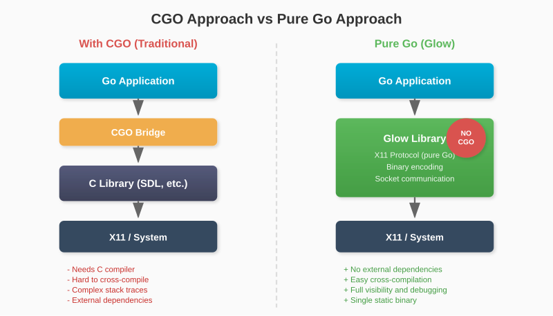
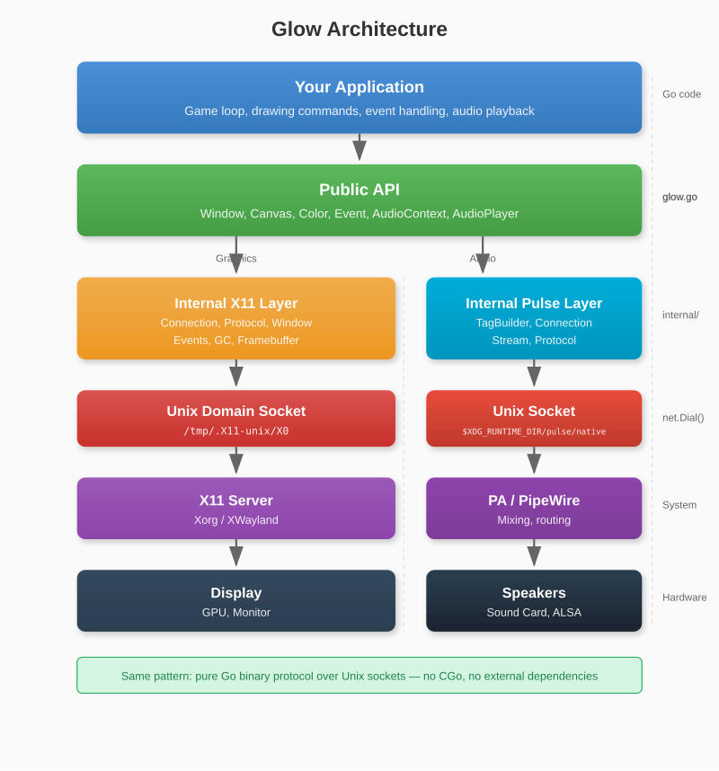
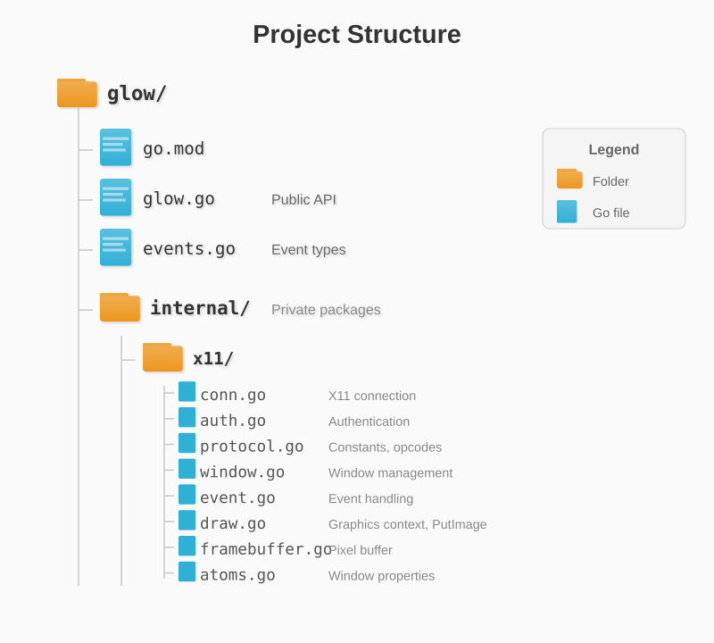

# Chapter 1: Introduction

## 1.1 What We're Building

In this book, we'll build **Glow**, a 2D graphics library for Linux. When we're done, you'll be able to write programs like this:

```go
package main

import "github.com/AchrafSoltani/glow"

func main() {
    win, _ := glow.NewWindow("Hello Glow", 800, 600)
    defer win.Close()

    canvas := win.Canvas()
    running := true

    for running {
        for e := win.PollEvent(); e != nil; e = win.PollEvent() {
            if e.Type == glow.EventQuit {
                running = false
            }
        }

        canvas.Clear(glow.Black)
        canvas.FillCircle(400, 300, 50, glow.Red)
        win.Present()
    }
}
```

This simple program creates a window, draws a red circle, and responds to the close button. Behind these few lines of code lies a complex system: binary protocol encoding, socket communication, event parsing, and pixel manipulation.

By building this library ourselves, we'll understand exactly what happens when you call `NewWindow()` or `FillCircle()`.

## 1.2 Why Pure Go?

Most graphics libraries use **cgo** to call C code. SDL, GLFW, and raylib all have Go bindings that wrap their C implementations. This approach is pragmatic - these libraries are mature, optimized, and cross-platform.

But cgo has drawbacks:

- **Compilation complexity**: You need a C compiler and the library's development headers
- **Cross-compilation difficulty**: Building for different platforms becomes harder
- **Debugging challenges**: Stack traces cross the Go/C boundary
- **Deployment friction**: You may need to ship shared libraries

More importantly for our purposes, cgo hides the interesting parts. When you call `SDL_CreateWindow()`, you don't see the system calls, the protocol messages, or the data structures.



By using pure Go, we:

- Keep the entire implementation visible and debuggable
- Eliminate external dependencies
- Learn how graphics systems actually work
- Produce a single, statically-linked binary

Our library talks directly to the X11 server using Go's `net` package for sockets and `encoding/binary` for protocol encoding. No C code anywhere.

## 1.3 Architecture Overview

Here's how Glow is structured:



**The X11 Server** is a program that manages the display. It runs continuously, handling requests from client applications (like ours) to create windows, draw graphics, and deliver input events.

**The Unix Domain Socket** is how we communicate with the X server. It's a local socket (no network involved) that allows bidirectional communication.

**Our X11 Layer** encodes requests into the binary format X11 expects, sends them over the socket, and decodes the responses.

**The Public API** provides a clean interface that hides the X11 complexity from application developers.

## 1.4 Setting Up the Project

Let's create the project structure:

```bash
$ mkdir glow
$ cd glow
$ go mod init github.com/yourusername/glow
```

Create the directory structure:



The `internal/` directory is special in Go - packages inside it can only be imported by code in the parent module. This lets us keep the X11 implementation private while exposing a clean public API.

### Your First File

Create `internal/x11/protocol.go` with some constants we'll need:

```go
package x11

// X11 Protocol Version
const (
    ProtocolMajorVersion = 11
    ProtocolMinorVersion = 0
)

// Opcodes for X11 requests
const (
    OpCreateWindow  = 1
    OpDestroyWindow = 4
    OpMapWindow     = 8
    OpUnmapWindow   = 10
    OpInternAtom    = 16
    OpChangeProperty = 18
    OpCreateGC      = 55
    OpFreeGC        = 60
    OpPutImage      = 72
)

// Event types
const (
    EventKeyPress       = 2
    EventKeyRelease     = 3
    EventButtonPress    = 4
    EventButtonRelease  = 5
    EventMotionNotify   = 6
    EventExpose         = 12
    EventConfigureNotify = 22
    EventClientMessage  = 33
)
```

We'll add to this file as we discover more of the protocol.

### Verifying Your Setup

Create a simple test file to ensure everything compiles:

```go
// examples/hello/main.go
package main

import "fmt"

func main() {
    fmt.Println("Glow project initialized!")
}
```

Run it:

```bash
$ go run examples/hello/main.go
Glow project initialized!
```

With the project structure in place, we're ready to dive into the technical foundations. In the next chapter, we'll explore how Go handles binary data - essential knowledge for implementing the X11 protocol.

---

**Key Takeaways:**

- Glow is a pure Go graphics library that communicates directly with X11
- No cgo means simpler builds, easier debugging, and full visibility into the implementation
- The architecture layers a clean public API over internal X11 protocol handling
- X11 uses Unix domain sockets for local communication
