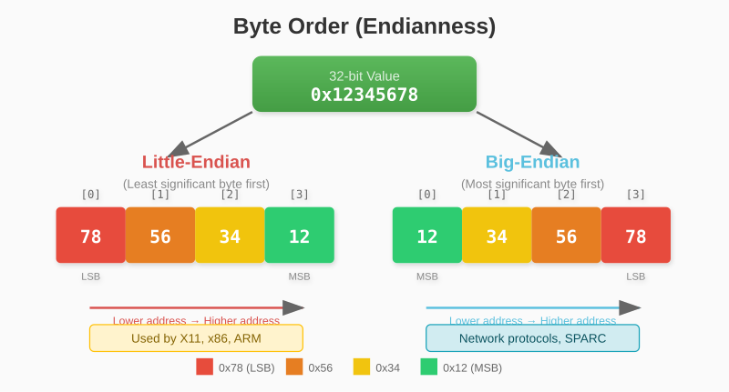
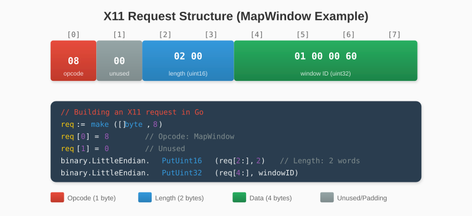
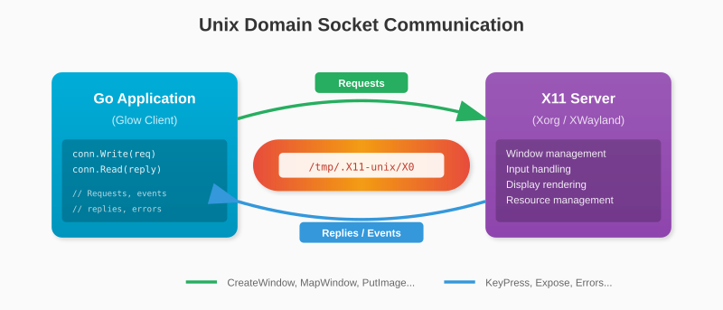

# Chapter 2: Go for Systems Programming

Before we can speak the X11 protocol, we need to master Go's tools for working with binary data. This chapter covers the essential techniques for encoding, decoding, and transmitting bytes.

## 2.1 Binary Data and Byte Slices

At the lowest level, all data is bytes. A string is bytes. An integer is bytes. A network packet is bytes. The X11 protocol is a stream of bytes with specific meanings at specific positions.

In Go, we work with bytes using the `[]byte` type - a slice of bytes:

```go
// Create a byte slice with 8 bytes, all zero
data := make([]byte, 8)

// Set individual bytes
data[0] = 0x48  // 'H'
data[1] = 0x65  // 'e'
data[2] = 0x6C  // 'l'
data[3] = 0x6C  // 'l'
data[4] = 0x6F  // 'o'

fmt.Println(string(data[:5]))  // "Hello"
```

Byte slices are the foundation of all our protocol work. We'll create them, fill them with encoded data, and send them over sockets.

### Hexadecimal Notation

Bytes are often written in hexadecimal (base 16). Each hex digit represents 4 bits, so two hex digits represent one byte:

```
Binary:      0101 1010
Hexadecimal: 5    A
Decimal:     90

In Go: 0x5A == 90
```

We'll use hex notation frequently because it maps cleanly to bytes and is standard in protocol documentation.

## 2.2 The encoding/binary Package

Go's `encoding/binary` package is our primary tool for converting between Go types and byte sequences.

### Writing Integers to Bytes

To put a `uint32` into a byte slice:

```go
import "encoding/binary"

data := make([]byte, 4)
binary.LittleEndian.PutUint32(data, 0x12345678)

fmt.Printf("% X\n", data)  // 78 56 34 12
```

Notice the byte order: the value `0x12345678` becomes `78 56 34 12`. The least significant byte (`78`) comes first. This is **little-endian** order, which X11 uses on most systems.

The package provides methods for different integer sizes:

```go
binary.LittleEndian.PutUint16(data, value)  // 2 bytes
binary.LittleEndian.PutUint32(data, value)  // 4 bytes
binary.LittleEndian.PutUint64(data, value)  // 8 bytes
```

### Reading Integers from Bytes

To extract a `uint32` from a byte slice:

```go
data := []byte{0x78, 0x56, 0x34, 0x12}
value := binary.LittleEndian.Uint32(data)

fmt.Printf("0x%X\n", value)  // 0x12345678
```

### Working with Slices

These functions operate on slice positions, not the entire slice:

```go
data := make([]byte, 12)

// Write at different offsets
binary.LittleEndian.PutUint32(data[0:], 0xAAAAAAAA)
binary.LittleEndian.PutUint32(data[4:], 0xBBBBBBBB)
binary.LittleEndian.PutUint32(data[8:], 0xCCCCCCCC)

// The slice notation [n:] means "from position n to the end"
```

This pattern appears constantly in protocol code: create a byte slice, then write values at specific offsets.

## 2.3 Endianness Explained

Endianness determines the order of bytes when storing multi-byte values.



X11 supports both, but requests that the client declare its byte order at connection time. Modern x86 and ARM systems are little-endian, so we'll use `binary.LittleEndian` throughout.

> **Note**: The first byte we send to the X server is either `'l'` (0x6C) for little-endian or `'B'` (0x42) for big-endian. This tells the server how to interpret all subsequent data.

## 2.4 Working with Buffers

When building X11 requests, we often know the exact size needed:



For variable-length requests, calculate the size first:

```go
func buildRequest(data []byte) []byte {
    // Header is 24 bytes, data follows
    totalLen := 24 + len(data)

    // Pad to 4-byte boundary
    padding := (4 - (totalLen % 4)) % 4
    totalLen += padding

    req := make([]byte, totalLen)
    // ... fill in the header and data
    return req
}
```

### Padding

X11 requires all requests to be a multiple of 4 bytes. The padding formula handles this:

```go
padding := (4 - (length % 4)) % 4
```

If `length` is 10:
- `10 % 4 = 2` (remainder)
- `4 - 2 = 2` (bytes needed to reach next multiple of 4)
- `2 % 4 = 2` (padding bytes to add)

If `length` is 12:
- `12 % 4 = 0` (already aligned)
- `4 - 0 = 4`
- `4 % 4 = 0` (no padding needed)

## 2.5 Network Sockets in Go

X11 communication happens over Unix domain sockets. These are like TCP sockets but for local communication only - no network involved.



### Connecting to a Unix Socket

```go
import "net"

conn, err := net.Dial("unix", "/tmp/.X11-unix/X0")
if err != nil {
    return err
}
defer conn.Close()
```

The path `/tmp/.X11-unix/X0` is the socket for display `:0`. Display `:1` would use `X1`, and so on.

### Writing Data

```go
data := []byte{0x6C, 0x00, 0x0B, 0x00}  // Start of X11 handshake
n, err := conn.Write(data)
if err != nil {
    return err
}
// n contains the number of bytes written
```

`Write` may write fewer bytes than requested (though this is rare for small writes). For large data, you might need to loop:

```go
func writeAll(conn net.Conn, data []byte) error {
    for len(data) > 0 {
        n, err := conn.Write(data)
        if err != nil {
            return err
        }
        data = data[n:]
    }
    return nil
}
```

### Reading Data

```go
buf := make([]byte, 1024)
n, err := conn.Read(buf)
if err != nil {
    return err
}
// buf[:n] contains the data read
```

For X11, we often need to read an exact number of bytes:

```go
import "io"

buf := make([]byte, 32)  // X11 events are exactly 32 bytes
_, err := io.ReadFull(conn, buf)
if err != nil {
    return err
}
```

`io.ReadFull` keeps reading until the buffer is full or an error occurs. This is essential for reading fixed-size protocol structures.

### The Connection Type

Our X11 connection wrapper will look like this:

```go
type Connection struct {
    conn net.Conn  // The underlying socket

    // Information from the server
    RootWindow  uint32
    RootDepth   uint8
    ScreenWidth uint16
    // ... more fields
}

func Connect() (*Connection, error) {
    conn, err := net.Dial("unix", "/tmp/.X11-unix/X0")
    if err != nil {
        return nil, err
    }

    c := &Connection{conn: conn}

    // Perform handshake...

    return c, nil
}
```

### Bidirectional Communication

X11 uses a single socket for both directions:

- **Client → Server**: Requests (create window, draw, etc.)
- **Server → Client**: Replies, events, and errors

This means we need to be careful about when we read. If we send a request that generates a reply, we must read that reply before doing anything else that reads from the socket.

For events, we'll use a goroutine to continuously read from the socket and queue events for the main thread to process.

---

**Key Takeaways:**

- `[]byte` is the foundation of protocol work in Go
- `encoding/binary` converts between integers and bytes
- X11 uses little-endian byte order (on most systems)
- All X11 requests must be padded to 4-byte boundaries
- Unix domain sockets provide local, bidirectional communication
- `io.ReadFull` ensures we read exactly the bytes we expect

With these tools in hand, we're ready to explore the X11 protocol itself.
