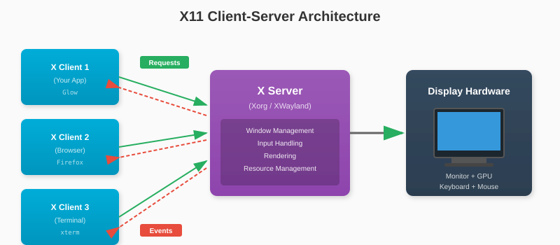
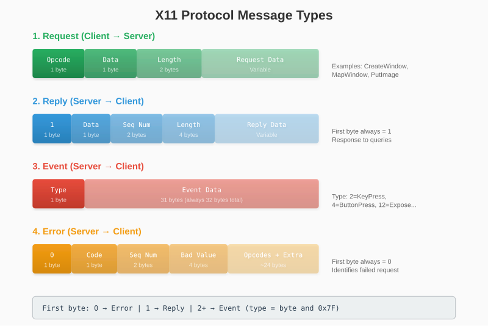
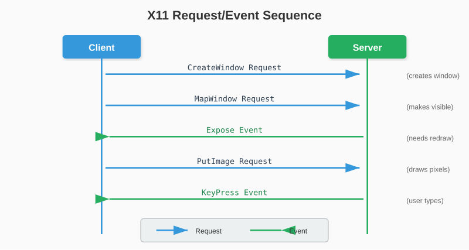

# Chapter 3: Understanding X11

X11, also known as the X Window System, has powered Unix graphics for over 35 years. Before we write any code, let's understand its architecture and protocol design.

## 3.1 A Brief History

The X Window System was developed at MIT in 1984. The "X" came from being the successor to a system called "W" (for "Window"). The "11" refers to version 11 of the protocol, released in 1987 - the version still in use today.

X11's longevity comes from its flexible, network-transparent design. The same protocol that displays windows on your local monitor can display them across a network on a remote machine.

While modern Linux systems are transitioning to Wayland, X11 remains widely used. Even on Wayland systems, XWayland provides X11 compatibility. The concepts you learn here apply broadly to graphics system design.

## 3.2 The Client-Server Model

X11 uses a client-server architecture that may seem backwards at first:

- **The X Server** runs on the machine with the display. It owns the screen, keyboard, and mouse.
- **X Clients** are applications that want to display windows. They connect to the server and send requests.



The terminology can be confusing because in web development, "server" usually means the remote machine. In X11, the server is local - it serves access to your display.

This design enables:

- **Multiple clients**: Many applications share one display
- **Network transparency**: Clients can run on remote machines
- **Display management**: The server handles window stacking, focus, and input routing

## 3.3 Protocol Structure

X11 communication consists of four message types:



**Requests** ask the server to do something. **Replies** return requested data. **Events** notify about user input and window changes. **Errors** indicate failed requests.

### Distinguishing Message Types

When reading from the socket, check the first byte:

```go
firstByte := buf[0]

if firstByte == 0 {
    // Error response
} else if firstByte == 1 {
    // Reply to a request
} else {
    // Event (type = firstByte & 0x7F)
}
```

The `& 0x7F` masks off the high bit, which indicates whether the event was sent by another client via `SendEvent`.

## 3.4 Requests, Replies, Events, and Errors

Let's trace through a typical interaction:



**Important**: X11 is asynchronous. After sending CreateWindow, we don't wait for confirmation - we continue sending requests. The server processes them in order. If something fails, we'll eventually receive an error.

This asynchronous design improves performance (no round-trip latency per request) but means errors arrive later than you might expect.

## 3.5 Resource IDs

X11 uses 32-bit IDs to identify resources like windows, graphics contexts, and pixmaps.

During connection, the server provides:
- **Resource ID Base**: Starting point for our IDs
- **Resource ID Mask**: Bits we can use

We generate IDs by combining these:

```go
func (c *Connection) GenerateID() uint32 {
    id := c.nextID
    c.nextID++
    return (id & c.ResourceIDMask) | c.ResourceIDBase
}
```

For example, with base `0x04000000` and mask `0x001FFFFF`:
- First ID: `0x04000000`
- Second ID: `0x04000001`
- Third ID: `0x04000002`

The base ensures our IDs don't conflict with other clients or the server's own resources.

### Resource Lifecycle

Resources must be explicitly destroyed:

```go
// Create
windowID, _ := conn.CreateWindow(...)

// Use
conn.MapWindow(windowID)

// Destroy when done
conn.DestroyWindow(windowID)
```

Failing to destroy resources causes leaks in the X server. When a client disconnects, the server cleans up its resources, but proper cleanup is good practice.

---

**Key Takeaways:**

- X11 uses a client-server model where the server owns the display
- Four message types: requests, replies, events, errors
- All messages have a defined binary structure
- Communication is asynchronous - errors arrive later
- Resources are identified by 32-bit IDs that clients generate
- The protocol has remained stable since 1987

Now that we understand the protocol's structure, let's connect to the X server.
