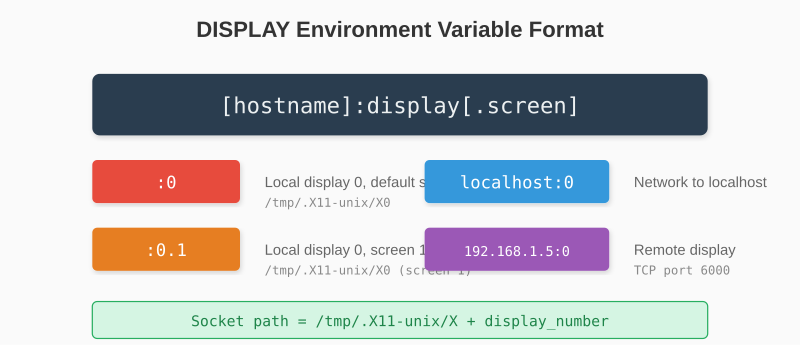
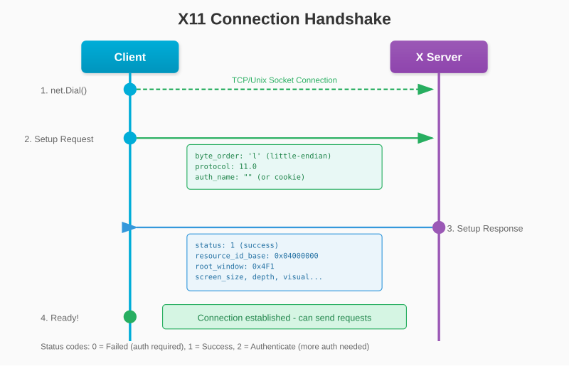
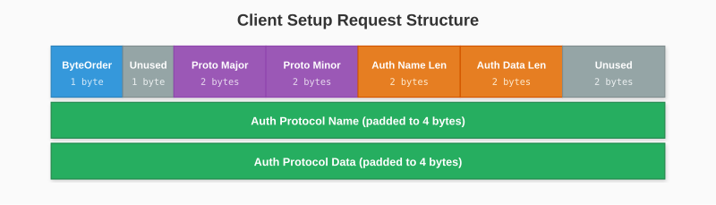

# Chapter 4: Connecting to the X Server

With our understanding of the X11 protocol, let's establish our first connection. This chapter implements the handshake that initiates communication with the X server.

## 4.1 Finding the Display

The `DISPLAY` environment variable tells applications which X server to use:

```bash
$ echo $DISPLAY
:0
```

The format is `[host]:display[.screen]`:
- `:0` - Local display 0, screen 0
- `:0.1` - Local display 0, screen 1
- `localhost:0` - Network connection to localhost
- `192.168.1.100:0` - Remote display



For local connections (no host or `localhost`), we use Unix domain sockets. For remote connections, we'd use TCP (which we won't cover).

Let's parse the display string:

```go
func parseDisplay() (displayNum string, err error) {
    display := os.Getenv("DISPLAY")
    if display == "" {
        display = ":0"  // Default
    }

    // Find the colon
    idx := strings.Index(display, ":")
    if idx == -1 {
        return "", fmt.Errorf("invalid DISPLAY: %s", display)
    }

    // Extract display number (ignore screen)
    rest := display[idx+1:]
    if dotIdx := strings.Index(rest, "."); dotIdx != -1 {
        rest = rest[:dotIdx]
    }

    return rest, nil
}
```

## 4.2 Unix Domain Sockets

Unix domain sockets provide inter-process communication on the same machine. They appear as files in the filesystem but behave like network sockets.

X11 servers listen on `/tmp/.X11-unix/Xn` where `n` is the display number:

```go
displayNum, _ := parseDisplay()
socketPath := fmt.Sprintf("/tmp/.X11-unix/X%s", displayNum)

conn, err := net.Dial("unix", socketPath)
if err != nil {
    return nil, fmt.Errorf("failed to connect to X11: %w", err)
}
```

This gives us a `net.Conn` - a bidirectional byte stream to the X server.

## 4.3 The Connection Handshake

Before any X11 requests, we must complete a handshake. The client sends setup information, and the server responds with display details.



### Client Setup Request

The initial message declares our byte order and protocol version:



Without authentication (we'll add that in Chapter 5):

```go
func (c *Connection) handshake() error {
    // Build setup request (12 bytes minimum)
    setup := make([]byte, 12)

    setup[0] = 'l'  // Little-endian byte order
    setup[1] = 0    // Unused
    binary.LittleEndian.PutUint16(setup[2:], 11)  // Protocol major: 11
    binary.LittleEndian.PutUint16(setup[4:], 0)   // Protocol minor: 0
    binary.LittleEndian.PutUint16(setup[6:], 0)   // Auth name length: 0
    binary.LittleEndian.PutUint16(setup[8:], 0)   // Auth data length: 0
    binary.LittleEndian.PutUint16(setup[10:], 0)  // Unused

    _, err := c.conn.Write(setup)
    if err != nil {
        return fmt.Errorf("failed to send setup: %w", err)
    }

    return c.readSetupResponse()
}
```

### Server Response

The server responds with one of three statuses:

```go
func (c *Connection) readSetupResponse() error {
    // Read initial 8 bytes
    header := make([]byte, 8)
    if _, err := io.ReadFull(c.conn, header); err != nil {
        return err
    }

    status := header[0]

    switch status {
    case 0:  // Failed
        return c.handleSetupFailed(header)
    case 1:  // Success
        return c.handleSetupSuccess(header)
    case 2:  // Authenticate
        return errors.New("server requires authentication")
    default:
        return fmt.Errorf("unknown status: %d", status)
    }
}
```

**Status 0 (Failed)**: The server rejected us. This usually means authentication is required.

```go
func (c *Connection) handleSetupFailed(header []byte) error {
    reasonLen := header[1]
    // Read additional data...
    reason := make([]byte, reasonLen)
    c.conn.Read(reason)
    return fmt.Errorf("connection refused: %s", string(reason))
}
```

**Status 2 (Authenticate)**: The server wants more authentication. We'll handle this in Chapter 5.

**Status 1 (Success)**: We're in! Now we parse the setup information.

## 4.4 Parsing the Setup Response

On success, the server sends detailed information about the display. This is a complex structure, but we only need a few fields.

The header we already read contains:
- Byte 0: Status (1 for success)
- Bytes 6-7: Additional data length (in 4-byte units)

```go
func (c *Connection) handleSetupSuccess(header []byte) error {
    // Additional data length is in 4-byte units
    additionalLen := binary.LittleEndian.Uint16(header[6:]) * 4

    // Read the rest
    data := make([]byte, additionalLen)
    if _, err := io.ReadFull(c.conn, data); err != nil {
        return err
    }

    // Parse fixed fields
    c.ResourceIDBase = binary.LittleEndian.Uint32(data[4:8])
    c.ResourceIDMask = binary.LittleEndian.Uint32(data[8:12])

    // Vendor string and format info
    vendorLen := binary.LittleEndian.Uint16(data[16:18])
    numFormats := data[21]
    numScreens := data[20]

    if numScreens == 0 {
        return errors.New("no screens available")
    }

    // Calculate offset to screen info
    vendorPadded := (vendorLen + 3) &^ 3  // Round up to 4
    formatSize := uint16(numFormats) * 8
    screenOffset := 32 + vendorPadded + formatSize

    // Parse first screen
    return c.parseScreen(data[screenOffset:])
}
```

## 4.5 Extracting Screen Information

The screen structure contains essential rendering information:

```go
func (c *Connection) parseScreen(screen []byte) error {
    c.RootWindow = binary.LittleEndian.Uint32(screen[0:4])
    c.ScreenWidth = binary.LittleEndian.Uint16(screen[20:22])
    c.ScreenHeight = binary.LittleEndian.Uint16(screen[22:24])
    c.RootDepth = screen[38]
    c.RootVisual = binary.LittleEndian.Uint32(screen[32:36])

    // Initialize ID generator
    c.nextID = c.ResourceIDBase

    return nil
}
```

Key fields:

- **RootWindow**: The ID of the root window (the desktop background)
- **ScreenWidth/Height**: Display dimensions in pixels
- **RootDepth**: Color depth (usually 24 for true color)
- **RootVisual**: The visual type ID (describes pixel format)

### The Complete Connection Type

Putting it together:

```go
type Connection struct {
    conn net.Conn

    // From server setup
    ResourceIDBase uint32
    ResourceIDMask uint32
    RootWindow     uint32
    RootVisual     uint32
    RootDepth      uint8
    ScreenWidth    uint16
    ScreenHeight   uint16

    // ID generation
    nextID uint32
}

func Connect() (*Connection, error) {
    displayNum, err := parseDisplay()
    if err != nil {
        return nil, err
    }

    socketPath := fmt.Sprintf("/tmp/.X11-unix/X%s", displayNum)
    conn, err := net.Dial("unix", socketPath)
    if err != nil {
        return nil, fmt.Errorf("failed to connect: %w", err)
    }

    c := &Connection{conn: conn}

    if err := c.handshake(); err != nil {
        conn.Close()
        return nil, err
    }

    return c, nil
}

func (c *Connection) Close() error {
    return c.conn.Close()
}
```

### Testing the Connection

Let's verify it works:

```go
// examples/connect/main.go
package main

import (
    "fmt"
    "log"

    "github.com/yourusername/glow/internal/x11"
)

func main() {
    conn, err := x11.Connect()
    if err != nil {
        log.Fatal(err)
    }
    defer conn.Close()

    fmt.Println("Connected to X11!")
    fmt.Printf("Screen: %dx%d\n", conn.ScreenWidth, conn.ScreenHeight)
    fmt.Printf("Root Depth: %d\n", conn.RootDepth)
    fmt.Printf("Root Window: 0x%X\n", conn.RootWindow)
}
```

```bash
$ go run examples/connect/main.go
Connected to X11!
Screen: 1920x1080
Root Depth: 24
Root Window: 0x4F1
```

If you see "connection refused" or "authentication required", don't worry - we'll handle authentication in the next chapter.

---

**Key Takeaways:**

- The `DISPLAY` environment variable identifies which X server to use
- Local connections use Unix domain sockets at `/tmp/.X11-unix/Xn`
- The handshake declares byte order and protocol version
- The server responds with display capabilities and resource ID ranges
- We extract essential info: root window, screen size, color depth

Our connection is open, but most X servers require authentication. Let's add that next.
