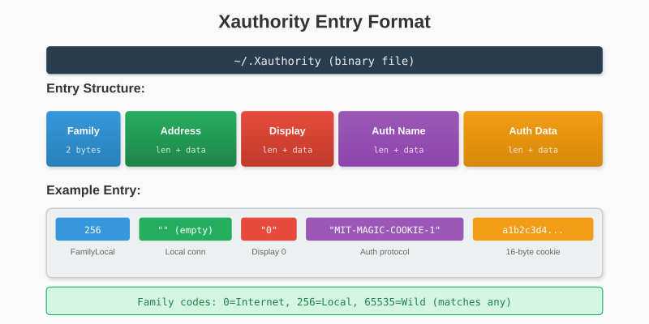
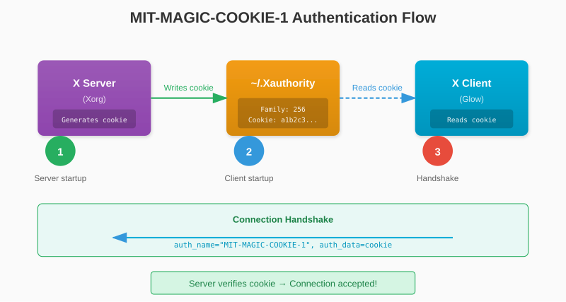

# Chapter 5: Authentication

Most X servers require authentication before accepting connections. Without it, any program could connect and spy on your keystrokes or capture your screen. This chapter implements the standard authentication mechanism.

## 5.1 Why Authentication?

In the early days of X11, authentication was optional. The server would accept any local connection. This made sense when computers were single-user and physically secured.

Today, authentication prevents:

- **Keystroke logging**: Malicious programs reading your passwords
- **Screen capture**: Unauthorized screenshots
- **Input injection**: Programs sending fake keyboard/mouse events
- **Window manipulation**: Hiding or moving other applications' windows

The most common authentication method is **MIT-MAGIC-COOKIE-1**, a simple shared-secret scheme.

## 5.2 The Xauthority File

X11 stores authentication credentials in `~/.Xauthority`. This binary file contains entries mapping displays to authentication cookies.

Each entry has:



- **Family**: Connection type (256 = local, 0 = Internet, etc.)
- **Address**: Hostname or empty for local
- **Display**: Display number as string ("0", "1", etc.)
- **Auth Name**: Protocol name ("MIT-MAGIC-COOKIE-1")
- **Auth Data**: The actual cookie (16 bytes for MIT-MAGIC-COOKIE-1)

### Entry Structure in Detail

Each variable field is preceded by a 2-byte big-endian length:

```go
type AuthEntry struct {
    Family  uint16
    Address string
    Display string
    Name    string
    Data    []byte
}
```

## 5.3 MIT-MAGIC-COOKIE-1

This is the simplest and most common X11 authentication:

1. The X server generates a random 16-byte cookie at startup
2. The cookie is written to `~/.Xauthority`
3. Clients read the cookie and send it during connection
4. The server compares cookies - if they match, access is granted



It's called "magic cookie" because knowing the cookie grants access - no cryptographic handshake, just possession of the secret.

> **Security Note**: This scheme protects against casual snooping but not against root or someone with access to your home directory. For stronger security, X11 supports other mechanisms like MIT-KERBEROS-5.

## 5.4 Parsing Xauthority Entries

Let's implement the parser:

```go
// internal/x11/auth.go
package x11

import (
    "encoding/binary"
    "io"
    "os"
    "path/filepath"
)

type AuthEntry struct {
    Family  uint16
    Address string
    Display string
    Name    string
    Data    []byte
}

func ReadXauthority() ([]AuthEntry, error) {
    // Find the file
    path := os.Getenv("XAUTHORITY")
    if path == "" {
        home, err := os.UserHomeDir()
        if err != nil {
            return nil, err
        }
        path = filepath.Join(home, ".Xauthority")
    }

    file, err := os.Open(path)
    if err != nil {
        return nil, err
    }
    defer file.Close()

    return parseXauthority(file)
}
```

The parsing function reads entries until EOF:

```go
func parseXauthority(r io.Reader) ([]AuthEntry, error) {
    var entries []AuthEntry

    for {
        entry, err := readAuthEntry(r)
        if err == io.EOF {
            break
        }
        if err != nil {
            return nil, err
        }
        entries = append(entries, entry)
    }

    return entries, nil
}
```

Each entry is read field by field:

```go
func readAuthEntry(r io.Reader) (AuthEntry, error) {
    var entry AuthEntry

    // Family (2 bytes, big-endian)
    family := make([]byte, 2)
    if _, err := io.ReadFull(r, family); err != nil {
        return entry, err
    }
    entry.Family = binary.BigEndian.Uint16(family)

    // Address
    addr, err := readString(r)
    if err != nil {
        return entry, err
    }
    entry.Address = addr

    // Display number
    display, err := readString(r)
    if err != nil {
        return entry, err
    }
    entry.Display = display

    // Auth name
    name, err := readString(r)
    if err != nil {
        return entry, err
    }
    entry.Name = name

    // Auth data
    data, err := readBytes(r)
    if err != nil {
        return entry, err
    }
    entry.Data = data

    return entry, nil
}
```

Helper functions for reading length-prefixed data:

```go
func readString(r io.Reader) (string, error) {
    data, err := readBytes(r)
    if err != nil {
        return "", err
    }
    return string(data), nil
}

func readBytes(r io.Reader) ([]byte, error) {
    // Length is 2 bytes, big-endian
    lenBuf := make([]byte, 2)
    if _, err := io.ReadFull(r, lenBuf); err != nil {
        return nil, err
    }
    length := binary.BigEndian.Uint16(lenBuf)

    if length == 0 {
        return nil, nil
    }

    data := make([]byte, length)
    if _, err := io.ReadFull(r, data); err != nil {
        return nil, err
    }
    return data, nil
}
```

## 5.5 Sending Credentials

Now we need to find the right entry and include it in our connection:

```go
func FindAuth(entries []AuthEntry, displayNum string) *AuthEntry {
    for i := range entries {
        entry := &entries[i]

        // Match display number
        if entry.Display != displayNum {
            continue
        }

        // We only support MIT-MAGIC-COOKIE-1
        if entry.Name != "MIT-MAGIC-COOKIE-1" {
            continue
        }

        // Match local connections
        // Family 256 = FamilyLocal, 65535 = FamilyWild
        if entry.Family == 256 || entry.Family == 65535 {
            return entry
        }
    }
    return nil
}
```

Update the handshake to include authentication:

```go
func (c *Connection) handshake() error {
    // Try to get authentication
    var authName, authData []byte

    entries, err := ReadXauthority()
    if err == nil {
        if auth := FindAuth(entries, "0"); auth != nil {
            authName = []byte(auth.Name)
            authData = auth.Data
        }
    }
    // If no auth found, proceed without (may work on some systems)

    // Calculate padding
    authNamePad := (4 - (len(authName) % 4)) % 4
    authDataPad := (4 - (len(authData) % 4)) % 4

    // Build setup request
    setupLen := 12 + len(authName) + authNamePad + len(authData) + authDataPad
    setup := make([]byte, setupLen)

    setup[0] = 'l'  // Little-endian
    setup[1] = 0    // Unused
    binary.LittleEndian.PutUint16(setup[2:], 11)  // Protocol major
    binary.LittleEndian.PutUint16(setup[4:], 0)   // Protocol minor
    binary.LittleEndian.PutUint16(setup[6:], uint16(len(authName)))
    binary.LittleEndian.PutUint16(setup[8:], uint16(len(authData)))
    binary.LittleEndian.PutUint16(setup[10:], 0)  // Unused

    // Copy auth name (with padding)
    copy(setup[12:], authName)

    // Copy auth data (with padding)
    authDataOffset := 12 + len(authName) + authNamePad
    copy(setup[authDataOffset:], authData)

    if _, err := c.conn.Write(setup); err != nil {
        return fmt.Errorf("failed to send setup: %w", err)
    }

    return c.readSetupResponse()
}
```

### Debugging Authentication Issues

If connection fails, add some diagnostics:

```go
func (c *Connection) handshake() error {
    entries, err := ReadXauthority()
    if err != nil {
        fmt.Fprintf(os.Stderr, "Warning: could not read Xauthority: %v\n", err)
    } else {
        fmt.Fprintf(os.Stderr, "Found %d Xauthority entries\n", len(entries))
        for _, e := range entries {
            fmt.Fprintf(os.Stderr, "  Family=%d Display=%s Name=%s\n",
                e.Family, e.Display, e.Name)
        }
    }
    // ... rest of handshake
}
```

### Complete Auth Module

Here's the complete `auth.go`:

```go
package x11

import (
    "encoding/binary"
    "io"
    "os"
    "path/filepath"
)

type AuthEntry struct {
    Family  uint16
    Address string
    Display string
    Name    string
    Data    []byte
}

func ReadXauthority() ([]AuthEntry, error) {
    path := os.Getenv("XAUTHORITY")
    if path == "" {
        home, err := os.UserHomeDir()
        if err != nil {
            return nil, err
        }
        path = filepath.Join(home, ".Xauthority")
    }

    file, err := os.Open(path)
    if err != nil {
        return nil, err
    }
    defer file.Close()

    var entries []AuthEntry
    for {
        entry, err := readAuthEntry(file)
        if err == io.EOF {
            break
        }
        if err != nil {
            return nil, err
        }
        entries = append(entries, entry)
    }

    return entries, nil
}

func readAuthEntry(r io.Reader) (AuthEntry, error) {
    var entry AuthEntry

    // Family (big-endian)
    family := make([]byte, 2)
    if _, err := io.ReadFull(r, family); err != nil {
        return entry, err
    }
    entry.Family = binary.BigEndian.Uint16(family)

    // Address, Display, Name
    var err error
    entry.Address, err = readLenString(r)
    if err != nil {
        return entry, err
    }
    entry.Display, err = readLenString(r)
    if err != nil {
        return entry, err
    }
    entry.Name, err = readLenString(r)
    if err != nil {
        return entry, err
    }

    // Data
    entry.Data, err = readLenBytes(r)
    return entry, err
}

func readLenString(r io.Reader) (string, error) {
    b, err := readLenBytes(r)
    return string(b), err
}

func readLenBytes(r io.Reader) ([]byte, error) {
    lenBuf := make([]byte, 2)
    if _, err := io.ReadFull(r, lenBuf); err != nil {
        return nil, err
    }
    length := binary.BigEndian.Uint16(lenBuf)

    if length == 0 {
        return nil, nil
    }

    data := make([]byte, length)
    _, err := io.ReadFull(r, data)
    return data, err
}

func FindAuth(entries []AuthEntry, displayNum string) *AuthEntry {
    for i := range entries {
        e := &entries[i]
        if e.Display == displayNum && e.Name == "MIT-MAGIC-COOKIE-1" {
            if e.Family == 256 || e.Family == 65535 {
                return e
            }
        }
    }
    return nil
}
```

### Testing Authentication

Update the test program:

```go
func main() {
    conn, err := x11.Connect()
    if err != nil {
        log.Fatal(err)
    }
    defer conn.Close()

    fmt.Println("Connected to X11 with authentication!")
    fmt.Printf("Screen: %dx%d\n", conn.ScreenWidth, conn.ScreenHeight)
}
```

```bash
$ go run examples/connect/main.go
Connected to X11 with authentication!
Screen: 1920x1080
```

If you still get authentication errors:

1. Check `~/.Xauthority` exists and is readable
2. Verify the display number matches (`echo $DISPLAY`)
3. Try `xauth list` to see what entries exist
4. Some systems use different auth locations - check `XAUTHORITY` env var

---

**Key Takeaways:**

- X11 authentication prevents unauthorized access to your display
- MIT-MAGIC-COOKIE-1 is a simple shared-secret mechanism
- Credentials are stored in `~/.Xauthority` in a binary format
- The cookie is sent during the initial connection handshake
- Family 256 (local) and 65535 (wild) entries match local connections

With authentication working, we can now create windows!
