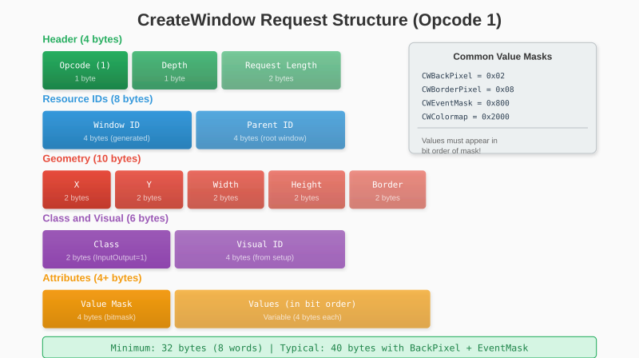
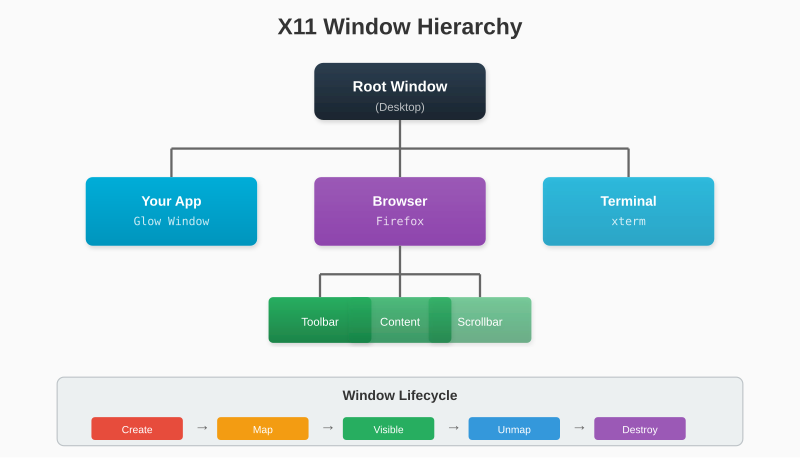

# Chapter 6: Creating Windows

We're connected to the X server. Now let's create something visible - a window. This chapter covers the CreateWindow request and window lifecycle management.

## 6.1 The CreateWindow Request

CreateWindow is one of the most complex X11 requests. It takes many parameters controlling the window's appearance and behavior.



Let's break down each field:

### Window ID

We generate this using our ID generator:

```go
windowID := c.GenerateID()
```

### Parent ID

All windows except the root have a parent. For top-level application windows, the parent is the root window:

```go
parentID := c.RootWindow
```

### Position and Size

- **X, Y**: Position relative to parent (for root children, this is screen position)
- **Width, Height**: Window dimensions in pixels
- **Border Width**: Thickness of the window border (usually 0 - decorations are handled by the window manager)

### Depth and Visual

- **Depth**: Color depth in bits (use `c.RootDepth` for compatibility)
- **Visual**: The visual type (use `c.RootVisual`)

### Window Class

Two options:
- `InputOutput` (1): Normal window that can display graphics
- `InputOnly` (2): Invisible window that only receives input

```go
const (
    WindowClassInputOutput = 1
    WindowClassInputOnly   = 2
)
```

## 6.2 Window Attributes and Masks

The value mask specifies which optional attributes we're setting. Each bit corresponds to an attribute:

```go
const (
    CWBackPixmap       = 1 << 0   // Background pixmap
    CWBackPixel        = 1 << 1   // Background color
    CWBorderPixmap     = 1 << 2   // Border pixmap
    CWBorderPixel      = 1 << 3   // Border color
    CWBitGravity       = 1 << 4   // How contents move on resize
    CWWinGravity       = 1 << 5   // How window moves on parent resize
    CWBackingStore     = 1 << 6   // Backing store hint
    CWBackingPlanes    = 1 << 7   // Planes to preserve
    CWBackingPixel     = 1 << 8   // Value for
    CWOverrideRedirect = 1 << 9   // Bypass window manager
    CWSaveUnder        = 1 << 10  // Save obscured areas
    CWEventMask        = 1 << 11  // Events we want to receive
    CWDontPropagate    = 1 << 12  // Events not to propagate
    CWColormap         = 1 << 13  // Colormap
    CWCursor           = 1 << 14  // Cursor shape
)
```

For our library, we typically set:

- **CWBackPixel**: Black background
- **CWEventMask**: Which events we want

### Event Masks

Event masks control which events the server sends us:

```go
const (
    KeyPressMask        = 1 << 0
    KeyReleaseMask      = 1 << 1
    ButtonPressMask     = 1 << 2
    ButtonReleaseMask   = 1 << 3
    EnterWindowMask     = 1 << 4
    LeaveWindowMask     = 1 << 5
    PointerMotionMask   = 1 << 6
    ExposureMask        = 1 << 15
    StructureNotifyMask = 1 << 17
    // ... and more
)
```

We want:
- `KeyPressMask`, `KeyReleaseMask`: Keyboard input
- `ButtonPressMask`, `ButtonReleaseMask`: Mouse clicks
- `PointerMotionMask`: Mouse movement
- `ExposureMask`: Window needs redrawing
- `StructureNotifyMask`: Window resized, moved, etc.

## 6.3 Implementing CreateWindow

```go
// internal/x11/window.go
package x11

import "encoding/binary"

func (c *Connection) CreateWindow(x, y int16, width, height uint16) (uint32, error) {
    windowID := c.GenerateID()

    // Events we want to receive
    eventMask := uint32(
        KeyPressMask |
        KeyReleaseMask |
        ButtonPressMask |
        ButtonReleaseMask |
        PointerMotionMask |
        ExposureMask |
        StructureNotifyMask,
    )

    // Attributes we're setting
    valueMask := uint32(CWBackPixel | CWEventMask)
    valueCount := 2  // Two values: background pixel and event mask

    // Request size: header (8 words) + values
    reqLen := 8 + valueCount
    req := make([]byte, reqLen*4)

    // Build the request
    req[0] = OpCreateWindow                                  // Opcode
    req[1] = c.RootDepth                                     // Depth
    binary.LittleEndian.PutUint16(req[2:], uint16(reqLen))   // Length
    binary.LittleEndian.PutUint32(req[4:], windowID)         // Window ID
    binary.LittleEndian.PutUint32(req[8:], c.RootWindow)     // Parent
    binary.LittleEndian.PutUint16(req[12:], uint16(x))       // X
    binary.LittleEndian.PutUint16(req[14:], uint16(y))       // Y
    binary.LittleEndian.PutUint16(req[16:], width)           // Width
    binary.LittleEndian.PutUint16(req[18:], height)          // Height
    binary.LittleEndian.PutUint16(req[20:], 0)               // Border width
    binary.LittleEndian.PutUint16(req[22:], WindowClassInputOutput)
    binary.LittleEndian.PutUint32(req[24:], c.RootVisual)    // Visual
    binary.LittleEndian.PutUint32(req[28:], valueMask)       // Value mask

    // Values must be in bit order of the mask
    binary.LittleEndian.PutUint32(req[32:], 0x000000)  // CWBackPixel: black
    binary.LittleEndian.PutUint32(req[36:], eventMask) // CWEventMask

    _, err := c.conn.Write(req)
    if err != nil {
        return 0, err
    }

    return windowID, nil
}
```

> **Important**: Values must appear in the order of their bits in the mask. Since `CWBackPixel` (bit 1) comes before `CWEventMask` (bit 11), the background color comes first.

## 6.4 Mapping and Unmapping

Creating a window doesn't make it visible. We must **map** it:

```go
func (c *Connection) MapWindow(windowID uint32) error {
    req := make([]byte, 8)
    req[0] = OpMapWindow
    req[1] = 0  // Unused
    binary.LittleEndian.PutUint16(req[2:], 2)  // Length: 2 words
    binary.LittleEndian.PutUint32(req[4:], windowID)

    _, err := c.conn.Write(req)
    return err
}
```

To hide a window without destroying it, **unmap** it:

```go
func (c *Connection) UnmapWindow(windowID uint32) error {
    req := make([]byte, 8)
    req[0] = OpUnmapWindow
    req[1] = 0
    binary.LittleEndian.PutUint16(req[2:], 2)
    binary.LittleEndian.PutUint32(req[4:], windowID)

    _, err := c.conn.Write(req)
    return err
}
```

## 6.5 Window Hierarchy

X11 windows form a tree:



Events can propagate up this tree. A click on a button might propagate to its parent application window.

For our library, we create simple windows as direct children of the root. Modern toolkits create complex hierarchies for widgets, but we'll keep things simple.

## 6.6 Destroying Windows

When done with a window, destroy it to free resources:

```go
func (c *Connection) DestroyWindow(windowID uint32) error {
    req := make([]byte, 8)
    req[0] = OpDestroyWindow
    req[1] = 0
    binary.LittleEndian.PutUint16(req[2:], 2)
    binary.LittleEndian.PutUint32(req[4:], windowID)

    _, err := c.conn.Write(req)
    return err
}
```

Destroying a window also destroys all its children and associated resources.

### Testing Window Creation

Let's create our first visible window:

```go
// examples/window/main.go
package main

import (
    "fmt"
    "log"
    "time"

    "github.com/yourusername/glow/internal/x11"
)

func main() {
    conn, err := x11.Connect()
    if err != nil {
        log.Fatal(err)
    }
    defer conn.Close()

    // Create a 400x300 window at position (100, 100)
    windowID, err := conn.CreateWindow(100, 100, 400, 300)
    if err != nil {
        log.Fatal(err)
    }
    fmt.Printf("Created window: 0x%X\n", windowID)

    // Make it visible
    err = conn.MapWindow(windowID)
    if err != nil {
        log.Fatal(err)
    }
    fmt.Println("Window mapped!")

    // Keep it open for 3 seconds
    time.Sleep(3 * time.Second)

    // Clean up
    conn.DestroyWindow(windowID)
    fmt.Println("Window destroyed")
}
```

Run it:

```bash
$ go run examples/window/main.go
Created window: 0x4000000
Window mapped!
Window destroyed
```

You should see a black 400x300 window appear for 3 seconds!

### What About Window Decorations?

You might notice our window has a title bar and borders. We didn't create those - the **window manager** added them.

Window managers (GNOME, KDE, i3, etc.) intercept top-level window creation and add decorations. They also handle:

- Window placement
- Minimizing, maximizing
- Alt+Tab switching
- The close button

In the next chapter, we'll learn to communicate with the window manager to set the window title and handle the close button.

---

**Key Takeaways:**

- CreateWindow takes many parameters: position, size, depth, visual, and attributes
- Value masks specify which attributes we're setting
- Event masks control which events we receive
- Windows must be mapped to become visible
- The window manager adds decorations to top-level windows
- Always destroy windows to free resources

Our window exists but can't do much. Let's add window properties next.
