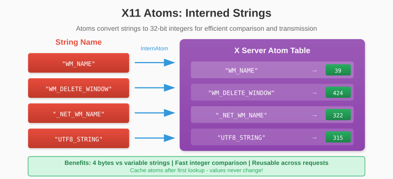
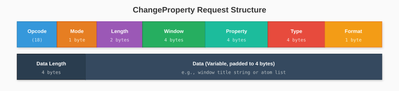
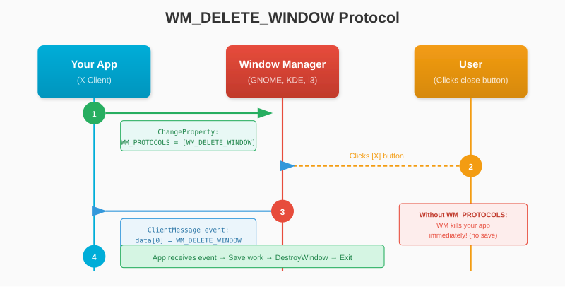

# Chapter 7: Window Properties

Our window appears, but it has no title and clicking the close button does nothing. This chapter covers X11 atoms and properties - the mechanism for communicating with the window manager.

## 7.1 Understanding Atoms

X11 uses **atoms** as efficient identifiers for strings. Instead of passing strings like "WM_NAME" in every request, we convert them to 32-bit integers once and reuse them.

Think of atoms as interned strings:



The server maintains a global atom table. Standard atoms have predefined values, but applications can create custom atoms too.

### Why Atoms?

1. **Efficiency**: 4 bytes vs. variable-length strings
2. **Comparison**: Integer comparison is faster than string comparison
3. **Standardization**: Well-known atoms have documented meanings

## 7.2 The InternAtom Request

To get an atom for a string, we send an InternAtom request:


- **OnlyIfExists**: If true, return None (0) if atom doesn't exist; if false, create it

This request generates a reply containing the atom value.

```go
type Atom uint32

func (c *Connection) InternAtom(name string, onlyIfExists bool) (Atom, error) {
    nameBytes := []byte(name)
    nameLen := len(nameBytes)
    padding := (4 - (nameLen % 4)) % 4

    reqLen := 2 + (nameLen+padding)/4
    req := make([]byte, reqLen*4)

    req[0] = OpInternAtom
    if onlyIfExists {
        req[1] = 1
    } else {
        req[1] = 0
    }
    binary.LittleEndian.PutUint16(req[2:], uint16(reqLen))
    binary.LittleEndian.PutUint16(req[4:], uint16(nameLen))
    // Bytes 6-7 unused
    copy(req[8:], nameBytes)

    if _, err := c.conn.Write(req); err != nil {
        return 0, err
    }

    // Read the reply
    return c.readInternAtomReply()
}

func (c *Connection) readInternAtomReply() (Atom, error) {
    reply := make([]byte, 32)
    if _, err := io.ReadFull(c.conn, reply); err != nil {
        return 0, err
    }

    // Check for error (first byte = 0)
    if reply[0] == 0 {
        return 0, fmt.Errorf("InternAtom error: code %d", reply[1])
    }

    // Atom is at bytes 8-11
    atom := Atom(binary.LittleEndian.Uint32(reply[8:12]))
    return atom, nil
}
```

### Caching Atoms

Since atom values don't change, we should cache them:

```go
type Connection struct {
    // ... other fields

    // Cached atoms
    atomWmProtocols    Atom
    atomWmDeleteWindow Atom
    atomNetWmName      Atom
    atomUtf8String     Atom
}

func (c *Connection) InitAtoms() error {
    var err error

    c.atomWmProtocols, err = c.InternAtom("WM_PROTOCOLS", false)
    if err != nil {
        return err
    }

    c.atomWmDeleteWindow, err = c.InternAtom("WM_DELETE_WINDOW", false)
    if err != nil {
        return err
    }

    c.atomNetWmName, err = c.InternAtom("_NET_WM_NAME", false)
    if err != nil {
        return err
    }

    c.atomUtf8String, err = c.InternAtom("UTF8_STRING", false)
    if err != nil {
        return err
    }

    return nil
}
```

Call `InitAtoms()` after the connection handshake.

## 7.3 Setting the Window Title

Window titles are set via properties. There are two ways:

1. **WM_NAME**: The classic method (Latin-1 encoding)
2. **_NET_WM_NAME**: The modern method (UTF-8 encoding)

We'll use `_NET_WM_NAME` for proper Unicode support.

### The ChangeProperty Request



- **Mode**: Replace (0), Prepend (1), or Append (2)
- **Property**: Atom identifying the property name
- **Type**: Atom identifying the data type
- **Format**: Bits per data element (8, 16, or 32)
- **Data Length**: Number of elements (not bytes!)

```go
func (c *Connection) SetWindowTitle(window uint32, title string) error {
    titleBytes := []byte(title)
    titleLen := len(titleBytes)
    padding := (4 - (titleLen % 4)) % 4

    reqLen := 6 + (titleLen+padding)/4
    req := make([]byte, reqLen*4)

    req[0] = OpChangeProperty
    req[1] = 0  // Mode: Replace
    binary.LittleEndian.PutUint16(req[2:], uint16(reqLen))
    binary.LittleEndian.PutUint32(req[4:], window)
    binary.LittleEndian.PutUint32(req[8:], uint32(c.atomNetWmName))   // Property
    binary.LittleEndian.PutUint32(req[12:], uint32(c.atomUtf8String)) // Type
    req[16] = 8  // Format: 8 bits per element
    // Bytes 17-19 unused
    binary.LittleEndian.PutUint32(req[20:], uint32(titleLen))  // Data length
    copy(req[24:], titleBytes)

    _, err := c.conn.Write(req)
    return err
}
```

## 7.4 The Close Button Protocol

When you click a window's close button, the window manager needs to tell your application. This uses the WM_PROTOCOLS mechanism.



### How It Works

1. We tell the window manager we support `WM_DELETE_WINDOW`
2. When the user clicks close, we receive a `ClientMessage` event
3. We check if it's a delete request and respond appropriately

### Enabling the Close Button

```go
func (c *Connection) EnableCloseButton(window uint32) error {
    // Set WM_PROTOCOLS to include WM_DELETE_WINDOW
    data := make([]byte, 4)
    binary.LittleEndian.PutUint32(data, uint32(c.atomWmDeleteWindow))

    reqLen := 6 + 1  // 6 header words + 1 data word
    req := make([]byte, reqLen*4)

    req[0] = OpChangeProperty
    req[1] = 0  // Replace
    binary.LittleEndian.PutUint16(req[2:], uint16(reqLen))
    binary.LittleEndian.PutUint32(req[4:], window)
    binary.LittleEndian.PutUint32(req[8:], uint32(c.atomWmProtocols))
    binary.LittleEndian.PutUint32(req[12:], 4)  // Type: ATOM
    req[16] = 32  // Format: 32 bits
    binary.LittleEndian.PutUint32(req[20:], 1)  // One atom
    copy(req[24:], data)

    _, err := c.conn.Write(req)
    return err
}
```

### Detecting the Close Event

When the close button is clicked, we receive a ClientMessage event:

```go
type ClientMessageEvent struct {
    Window      uint32
    Format      uint8
    MessageType Atom
    Data        [20]byte
}

func IsDeleteWindowEvent(e ClientMessageEvent, deleteAtom Atom) bool {
    if e.Format != 32 {
        return false
    }
    // First 4 bytes of data contain the protocol atom
    dataAtom := binary.LittleEndian.Uint32(e.Data[:4])
    return Atom(dataAtom) == deleteAtom
}
```

We'll implement full event parsing in the next chapter.

## 7.5 EWMH and ICCCM Basics

X11 window managers follow two specifications:

### ICCCM (Inter-Client Communication Conventions Manual)

The original specification from 1988. Defines:
- WM_NAME, WM_CLASS, WM_HINTS
- WM_PROTOCOLS (including WM_DELETE_WINDOW)
- Session management

### EWMH (Extended Window Manager Hints)

Modern extensions for desktop environments. Defines:
- _NET_WM_NAME (UTF-8 titles)
- _NET_WM_STATE (maximized, fullscreen, etc.)
- _NET_WM_WINDOW_TYPE (normal, dialog, toolbar)
- Taskbar integration

For basic applications, we need:
- `_NET_WM_NAME`: Set the title
- `WM_PROTOCOLS` + `WM_DELETE_WINDOW`: Handle close button

### Complete Window Setup

Here's the full window creation with title and close button:

```go
func (c *Connection) CreateWindowFull(title string, x, y int16,
    width, height uint16) (uint32, error) {

    // Create the window
    windowID, err := c.CreateWindow(x, y, width, height)
    if err != nil {
        return 0, err
    }

    // Set the title
    if err := c.SetWindowTitle(windowID, title); err != nil {
        c.DestroyWindow(windowID)
        return 0, err
    }

    // Enable close button
    if err := c.EnableCloseButton(windowID); err != nil {
        c.DestroyWindow(windowID)
        return 0, err
    }

    return windowID, nil
}
```

### Testing

```go
func main() {
    conn, err := x11.Connect()
    if err != nil {
        log.Fatal(err)
    }
    defer conn.Close()

    windowID, err := conn.CreateWindow(100, 100, 400, 300)
    if err != nil {
        log.Fatal(err)
    }

    conn.SetWindowTitle(windowID, "Hello from Glow!")
    conn.EnableCloseButton(windowID)
    conn.MapWindow(windowID)

    fmt.Println("Window created with title. Close button enabled.")
    fmt.Println("Press Ctrl+C to exit...")

    // Keep running (we'll add proper event handling next)
    select {}
}
```

The window now shows "Hello from Glow!" in the title bar!

---

**Key Takeaways:**

- Atoms are integer identifiers for strings, used throughout X11
- InternAtom converts strings to atoms (cache them for efficiency)
- Window titles use the `_NET_WM_NAME` property with UTF-8 encoding
- Close button handling requires WM_PROTOCOLS with WM_DELETE_WINDOW
- ICCCM and EWMH define standard conventions for window managers

Our windows have titles and can be closed properly (once we handle events). Speaking of which, let's tackle the event system next.
