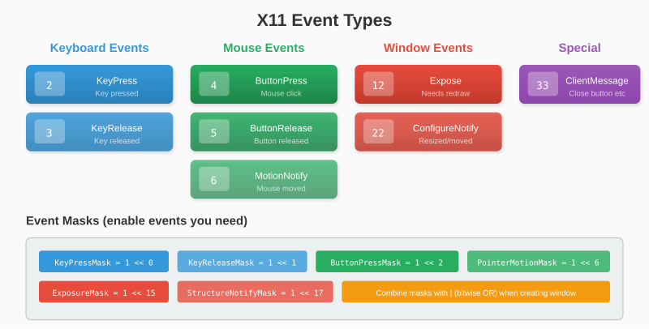
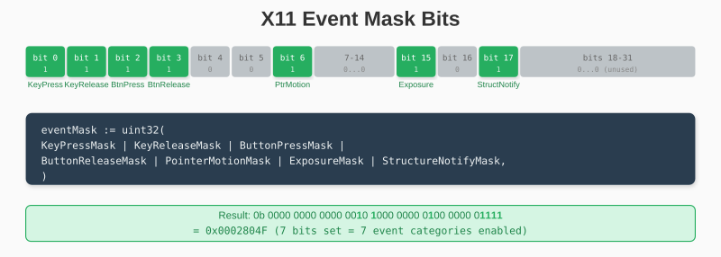
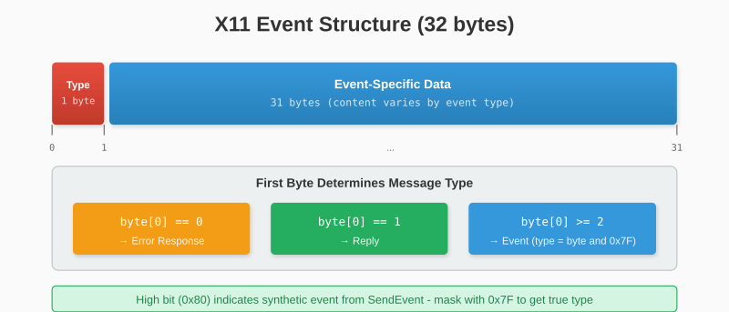
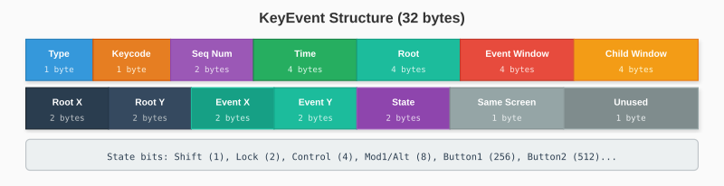

# Chapter 8: The Event System

Windows exist to interact with users. This chapter implements event handling - reading and parsing the stream of input events from the X server.

## 8.1 Event Types Overview

X11 defines over 30 event types. Here are the ones we care about:



We requested these events when creating the window (via the event mask). The server only sends events we asked for.

## 8.2 Event Masks Revisited

Recall from window creation:

```go
eventMask := uint32(
    KeyPressMask |        // 1 << 0
    KeyReleaseMask |      // 1 << 1
    ButtonPressMask |     // 1 << 2
    ButtonReleaseMask |   // 1 << 3
    PointerMotionMask |   // 1 << 6
    ExposureMask |        // 1 << 15
    StructureNotifyMask,  // 1 << 17
)
```



Each mask bit enables a category of events:

- **KeyPressMask/KeyReleaseMask**: Keyboard input
- **ButtonPressMask/ButtonReleaseMask**: Mouse button events
- **PointerMotionMask**: Mouse movement (can generate many events!)
- **ExposureMask**: Window exposed and needs redrawing
- **StructureNotifyMask**: Window geometry changes

> **Performance Tip**: Don't enable `PointerMotionMask` unless you need continuous mouse tracking. It generates events for every pixel of movement.

## 8.3 Reading Events from the Socket

All X11 events are exactly 32 bytes. This makes reading straightforward:



```go
func (c *Connection) NextEvent() (Event, error) {
    buf := make([]byte, 32)
    _, err := io.ReadFull(c.conn, buf)
    if err != nil {
        return nil, err
    }

    return c.parseEvent(buf)
}
```

The first byte identifies the event type:

```go
func (c *Connection) parseEvent(buf []byte) (Event, error) {
    // High bit indicates synthetic event (from SendEvent)
    eventType := int(buf[0] & 0x7F)

    switch eventType {
    case 0:
        return c.parseError(buf)
    case 1:
        return c.parseReply(buf)
    case EventKeyPress, EventKeyRelease:
        return c.parseKeyEvent(buf, eventType)
    case EventButtonPress, EventButtonRelease:
        return c.parseButtonEvent(buf, eventType)
    case EventMotionNotify:
        return c.parseMotionEvent(buf)
    case EventExpose:
        return c.parseExposeEvent(buf)
    case EventConfigureNotify:
        return c.parseConfigureEvent(buf)
    case EventClientMessage:
        return c.parseClientMessage(buf)
    default:
        return UnknownEvent{Type: eventType, Data: buf}, nil
    }
}
```

## 8.4 Parsing Event Data

Each event type has a specific structure. Let's define our event types:

```go
// Event is the interface for all events
type Event interface {
    Type() int
}
```

### Error Responses

When something goes wrong, byte 0 is 0:

```go
type ErrorEvent struct {
    ErrorCode   uint8
    SequenceNum uint16
    BadValue    uint32
    MinorOpcode uint16
    MajorOpcode uint8
}

func (e ErrorEvent) Type() int { return 0 }

func (c *Connection) parseError(buf []byte) (Event, error) {
    return ErrorEvent{
        ErrorCode:   buf[1],
        SequenceNum: binary.LittleEndian.Uint16(buf[2:4]),
        BadValue:    binary.LittleEndian.Uint32(buf[4:8]),
        MinorOpcode: binary.LittleEndian.Uint16(buf[8:10]),
        MajorOpcode: buf[10],
    }, nil
}
```

## 8.5 Keyboard Events

Keyboard events carry the key code and modifier state:



```go
type KeyEvent struct {
    EventType int
    Keycode   uint8
    State     uint16  // Modifier keys (Shift, Ctrl, etc.)
    X, Y      int16   // Position relative to window
    RootX     int16   // Position relative to root
    RootY     int16
}

func (e KeyEvent) Type() int { return e.EventType }

func (c *Connection) parseKeyEvent(buf []byte, eventType int) (Event, error) {
    return KeyEvent{
        EventType: eventType,
        Keycode:   buf[1],
        State:     binary.LittleEndian.Uint16(buf[28:30]),
        X:         int16(binary.LittleEndian.Uint16(buf[24:26])),
        Y:         int16(binary.LittleEndian.Uint16(buf[26:28])),
        RootX:     int16(binary.LittleEndian.Uint16(buf[20:22])),
        RootY:     int16(binary.LittleEndian.Uint16(buf[22:24])),
    }, nil
}
```

### Key Codes vs. Key Symbols

The `Keycode` is a hardware-specific number. The same physical key produces the same keycode regardless of keyboard layout.

Common keycodes (may vary by system):

```go
const (
    KeyEscape = 9
    KeySpace  = 65
    KeyEnter  = 36

    Key1 = 10
    Key2 = 11
    // ...

    KeyA = 38
    KeyB = 56
    KeyC = 54
    // ...

    KeyUp    = 111
    KeyDown  = 116
    KeyLeft  = 113
    KeyRight = 114
)
```

For proper keyboard handling, you'd use XKB (X Keyboard Extension) to convert keycodes to key symbols. For games, raw keycodes often suffice.

### Modifier State

The `State` field contains modifier key flags:

```go
const (
    ShiftMask   = 1 << 0
    LockMask    = 1 << 1  // Caps Lock
    ControlMask = 1 << 2
    Mod1Mask    = 1 << 3  // Usually Alt
    Mod2Mask    = 1 << 4  // Usually Num Lock
    Mod3Mask    = 1 << 5
    Mod4Mask    = 1 << 6  // Usually Super/Windows
    Mod5Mask    = 1 << 7
)
```

Check modifiers:

```go
if event.State & ShiftMask != 0 {
    // Shift is held
}
```

## 8.6 Mouse Events

Button events have a similar structure to key events:

```go
type ButtonEvent struct {
    EventType int
    Button    uint8   // 1=left, 2=middle, 3=right, 4=wheel up, 5=wheel down
    State     uint16
    X, Y      int16
    RootX     int16
    RootY     int16
}

func (e ButtonEvent) Type() int { return e.EventType }

func (c *Connection) parseButtonEvent(buf []byte, eventType int) (Event, error) {
    return ButtonEvent{
        EventType: eventType,
        Button:    buf[1],
        State:     binary.LittleEndian.Uint16(buf[28:30]),
        X:         int16(binary.LittleEndian.Uint16(buf[24:26])),
        Y:         int16(binary.LittleEndian.Uint16(buf[26:28])),
        RootX:     int16(binary.LittleEndian.Uint16(buf[20:22])),
        RootY:     int16(binary.LittleEndian.Uint16(buf[22:24])),
    }, nil
}
```

### Mouse Motion

Motion events report mouse position:

```go
type MotionEvent struct {
    X, Y  int16
    RootX int16
    RootY int16
    State uint16  // Which buttons are held
}

func (e MotionEvent) Type() int { return EventMotionNotify }

func (c *Connection) parseMotionEvent(buf []byte) (Event, error) {
    return MotionEvent{
        X:     int16(binary.LittleEndian.Uint16(buf[24:26])),
        Y:     int16(binary.LittleEndian.Uint16(buf[26:28])),
        RootX: int16(binary.LittleEndian.Uint16(buf[20:22])),
        RootY: int16(binary.LittleEndian.Uint16(buf[22:24])),
        State: binary.LittleEndian.Uint16(buf[28:30]),
    }, nil
}
```

## 8.7 Window Events

### Expose Events

Expose tells us part of the window needs redrawing:

```go
type ExposeEvent struct {
    Window uint32
    X, Y   uint16
    Width  uint16
    Height uint16
    Count  uint16  // Number of following Expose events
}

func (e ExposeEvent) Type() int { return EventExpose }

func (c *Connection) parseExposeEvent(buf []byte) (Event, error) {
    return ExposeEvent{
        Window: binary.LittleEndian.Uint32(buf[4:8]),
        X:      binary.LittleEndian.Uint16(buf[8:10]),
        Y:      binary.LittleEndian.Uint16(buf[10:12]),
        Width:  binary.LittleEndian.Uint16(buf[12:14]),
        Height: binary.LittleEndian.Uint16(buf[14:16]),
        Count:  binary.LittleEndian.Uint16(buf[16:18]),
    }, nil
}
```

When `Count > 0`, more Expose events follow. You might wait until `Count == 0` before redrawing to avoid redundant work.

### Configure Events

ConfigureNotify reports window geometry changes:

```go
type ConfigureEvent struct {
    Window uint32
    X, Y   int16
    Width  uint16
    Height uint16
}

func (e ConfigureEvent) Type() int { return EventConfigureNotify }

func (c *Connection) parseConfigureEvent(buf []byte) (Event, error) {
    return ConfigureEvent{
        Window: binary.LittleEndian.Uint32(buf[4:8]),
        X:      int16(binary.LittleEndian.Uint16(buf[16:18])),
        Y:      int16(binary.LittleEndian.Uint16(buf[18:20])),
        Width:  binary.LittleEndian.Uint16(buf[20:22]),
        Height: binary.LittleEndian.Uint16(buf[22:24]),
    }, nil
}
```

### Client Messages

These carry inter-client communication, including close button clicks:

```go
type ClientMessageEvent struct {
    Window      uint32
    Format      uint8
    MessageType uint32
    Data        [20]byte
}

func (e ClientMessageEvent) Type() int { return EventClientMessage }

func (c *Connection) parseClientMessage(buf []byte) (Event, error) {
    e := ClientMessageEvent{
        Window:      binary.LittleEndian.Uint32(buf[4:8]),
        Format:      buf[1],
        MessageType: binary.LittleEndian.Uint32(buf[8:12]),
    }
    copy(e.Data[:], buf[12:32])
    return e, nil
}
```

### Checking for Close Button

```go
func IsDeleteWindowEvent(e ClientMessageEvent, wmProtocols, wmDeleteWindow Atom) bool {
    if Atom(e.MessageType) != wmProtocols {
        return false
    }
    if e.Format != 32 {
        return false
    }
    protocol := Atom(binary.LittleEndian.Uint32(e.Data[:4]))
    return protocol == wmDeleteWindow
}
```

### Complete Event Loop

```go
func main() {
    conn, _ := x11.Connect()
    defer conn.Close()

    windowID, _ := conn.CreateWindow(100, 100, 400, 300)
    conn.SetWindowTitle(windowID, "Event Demo")
    conn.EnableCloseButton(windowID)
    conn.MapWindow(windowID)

    running := true
    for running {
        event, err := conn.NextEvent()
        if err != nil {
            break
        }

        switch e := event.(type) {
        case x11.KeyEvent:
            if e.EventType == x11.EventKeyPress {
                fmt.Printf("Key pressed: %d\n", e.Keycode)
                if e.Keycode == x11.KeyEscape {
                    running = false
                }
            }

        case x11.ButtonEvent:
            fmt.Printf("Button %d at (%d, %d)\n", e.Button, e.X, e.Y)

        case x11.MotionEvent:
            fmt.Printf("Mouse at (%d, %d)\n", e.X, e.Y)

        case x11.ExposeEvent:
            fmt.Println("Window needs redraw")

        case x11.ClientMessageEvent:
            if x11.IsDeleteWindowEvent(e, conn.AtomWmProtocols(),
                conn.AtomWmDeleteWindow()) {
                fmt.Println("Close button clicked")
                running = false
            }
        }
    }

    conn.DestroyWindow(windowID)
}
```

---

**Key Takeaways:**

- All X11 events are 32 bytes with the type in byte 0
- Key events provide hardware keycodes and modifier state
- Button events include position and which button
- Motion events report mouse position continuously
- Expose events signal when to redraw
- ClientMessage carries close button notifications
- `NextEvent()` blocks until an event arrives

The event loop works, but it's blocking. For games and responsive applications, we need non-blocking event handling. That's next.
