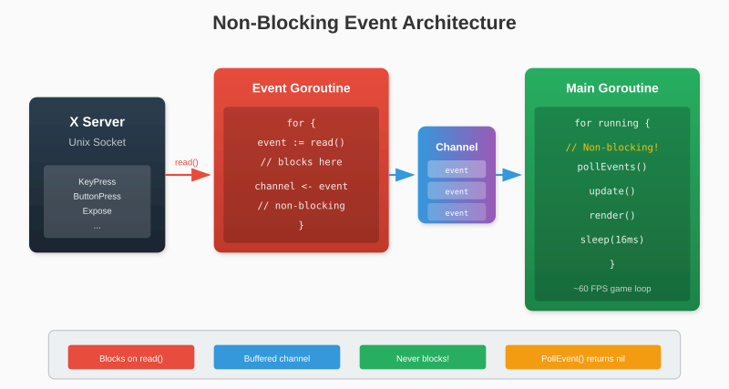

# Chapter 9: Non-Blocking Events

Our event loop blocks on `NextEvent()`, waiting for user input. But games need to update continuously - physics simulations, animations, and AI don't stop while waiting for keypresses. This chapter implements non-blocking event handling using Go's concurrency primitives.

## 9.1 The Problem with Blocking

Consider a simple game loop:

```go
for running {
    event := conn.NextEvent()  // BLOCKS here!
    handleEvent(event)
    updateGame()
    render()
}
```

If the user doesn't press anything, `NextEvent()` waits forever. The game freezes.

We need two things happening simultaneously:
1. Reading events from the X server
2. Running the game loop

## 9.2 Goroutines and Channels

Go's goroutines let us run concurrent tasks. Channels provide safe communication between them.



The event goroutine continuously reads from the socket and sends events to a channel. The main goroutine checks the channel without blocking.

## 9.3 Building an Event Queue

First, let's add an event channel to our Window type:

```go
type Window struct {
    conn     *Connection
    windowID uint32
    gcID     uint32

    // Event handling
    eventChan chan Event
    quitChan  chan struct{}

    closed bool
}
```

- `eventChan`: Buffered channel for incoming events
- `quitChan`: Signals the event goroutine to stop

### Starting the Event Goroutine

```go
func NewWindow(conn *Connection, title string, width, height int) (*Window, error) {
    windowID, err := conn.CreateWindow(100, 100, uint16(width), uint16(height))
    if err != nil {
        return nil, err
    }

    conn.SetWindowTitle(windowID, title)
    conn.EnableCloseButton(windowID)

    gcID, err := conn.CreateGC(windowID)
    if err != nil {
        conn.DestroyWindow(windowID)
        return nil, err
    }

    conn.MapWindow(windowID)

    w := &Window{
        conn:      conn,
        windowID:  windowID,
        gcID:      gcID,
        eventChan: make(chan Event, 256),  // Buffer 256 events
        quitChan:  make(chan struct{}),
    }

    // Start event reader
    go w.pollEvents()

    return w, nil
}
```

### The Event Goroutine

```go
func (w *Window) pollEvents() {
    for {
        select {
        case <-w.quitChan:
            return  // Stop when window closes

        default:
            event, err := w.conn.NextEvent()
            if err != nil {
                continue  // Connection error, keep trying
            }

            // Try to send, but don't block if channel is full
            select {
            case w.eventChan <- event:
                // Event queued
            case <-w.quitChan:
                return
            default:
                // Channel full, drop event (shouldn't happen often)
            }
        }
    }
}
```

> **Note**: The inner `select` with `default` prevents blocking if the event channel is full. Dropping events is better than deadlocking.

## 9.4 Polling vs Waiting

Now we implement two methods for the main goroutine:

### PollEvent (Non-Blocking)

Returns immediately with an event or nil:

```go
func (w *Window) PollEvent() Event {
    select {
    case e := <-w.eventChan:
        return e
    default:
        return nil  // No events waiting
    }
}
```

### WaitEvent (Blocking)

Blocks until an event arrives:

```go
func (w *Window) WaitEvent() Event {
    return <-w.eventChan
}
```

### Game Loop Pattern

```go
for running {
    // Process all pending events
    for {
        event := win.PollEvent()
        if event == nil {
            break  // No more events
        }
        handleEvent(event)
    }

    // Update game state
    updateGame(deltaTime)

    // Render
    render()

    // Cap frame rate
    time.Sleep(16 * time.Millisecond)  // ~60 FPS
}
```

This pattern:
1. Drains all pending events (responsive input)
2. Updates game logic
3. Renders the frame
4. Sleeps to maintain frame rate

## 9.5 Thread Safety Considerations

### Socket Access

Our event goroutine reads from the socket while the main goroutine writes (sending draw commands). Is this safe?

On Unix, concurrent read and write on the same socket is safe - they use different buffers. However, concurrent writes or concurrent reads would be unsafe.

Since only the event goroutine reads and only the main goroutine writes, we're fine.

### Shared State

If events modify shared state, we'd need synchronization:

```go
type Window struct {
    // ...
    mu     sync.Mutex
    width  int
    height int
}

func (w *Window) pollEvents() {
    // ...
    if e, ok := event.(ConfigureEvent); ok {
        w.mu.Lock()
        w.width = int(e.Width)
        w.height = int(e.Height)
        w.mu.Unlock()
    }
    // ...
}

func (w *Window) Width() int {
    w.mu.Lock()
    defer w.mu.Unlock()
    return w.width
}
```

For our library, we'll keep it simple: events are immutable, and dimension queries happen infrequently.

### Closing the Window

Properly shutting down requires coordination:

```go
func (w *Window) Close() {
    if w.closed {
        return
    }
    w.closed = true

    // Signal event goroutine to stop
    close(w.quitChan)

    // Clean up X11 resources
    w.conn.FreeGC(w.gcID)
    w.conn.DestroyWindow(w.windowID)
}
```

The `close(w.quitChan)` causes all receives on `quitChan` to return immediately, signaling the goroutine to exit.

### Complete Implementation

```go
// internal/window.go
package x11

type Window struct {
    conn     *Connection
    windowID uint32
    gcID     uint32
    width    int
    height   int

    eventChan chan Event
    quitChan  chan struct{}
    closed    bool
}

func NewWindow(conn *Connection, title string, width, height int) (*Window, error) {
    windowID, err := conn.CreateWindow(100, 100, uint16(width), uint16(height))
    if err != nil {
        return nil, err
    }

    if err := conn.SetWindowTitle(windowID, title); err != nil {
        conn.DestroyWindow(windowID)
        return nil, err
    }

    if err := conn.EnableCloseButton(windowID); err != nil {
        conn.DestroyWindow(windowID)
        return nil, err
    }

    gcID, err := conn.CreateGC(windowID)
    if err != nil {
        conn.DestroyWindow(windowID)
        return nil, err
    }

    if err := conn.MapWindow(windowID); err != nil {
        conn.FreeGC(gcID)
        conn.DestroyWindow(windowID)
        return nil, err
    }

    w := &Window{
        conn:      conn,
        windowID:  windowID,
        gcID:      gcID,
        width:     width,
        height:    height,
        eventChan: make(chan Event, 256),
        quitChan:  make(chan struct{}),
    }

    go w.pollEvents()

    return w, nil
}

func (w *Window) pollEvents() {
    for {
        select {
        case <-w.quitChan:
            return
        default:
            event, err := w.conn.NextEvent()
            if err != nil {
                continue
            }

            select {
            case w.eventChan <- event:
            case <-w.quitChan:
                return
            default:
                // Drop event if buffer full
            }
        }
    }
}

func (w *Window) PollEvent() Event {
    select {
    case e := <-w.eventChan:
        return e
    default:
        return nil
    }
}

func (w *Window) WaitEvent() Event {
    return <-w.eventChan
}

func (w *Window) Close() {
    if w.closed {
        return
    }
    w.closed = true

    close(w.quitChan)
    w.conn.FreeGC(w.gcID)
    w.conn.DestroyWindow(w.windowID)
}

func (w *Window) Width() int  { return w.width }
func (w *Window) Height() int { return w.height }
```

### Example: Responsive Input

```go
func main() {
    conn, _ := x11.Connect()
    defer conn.Close()

    win, _ := x11.NewWindow(conn, "Non-Blocking Demo", 400, 300)
    defer win.Close()

    running := true
    lastTime := time.Now()

    for running {
        // Handle all pending events
        for {
            event := win.PollEvent()
            if event == nil {
                break
            }

            switch e := event.(type) {
            case x11.KeyEvent:
                if e.EventType == x11.EventKeyPress {
                    fmt.Printf("Key: %d\n", e.Keycode)
                    if e.Keycode == x11.KeyEscape {
                        running = false
                    }
                }
            case x11.ClientMessageEvent:
                if x11.IsDeleteWindowEvent(e, ...) {
                    running = false
                }
            }
        }

        // Update (even without input)
        now := time.Now()
        dt := now.Sub(lastTime).Seconds()
        lastTime = now

        fmt.Printf("Frame time: %.2fms\n", dt*1000)

        // Maintain ~60 FPS
        time.Sleep(16 * time.Millisecond)
    }
}
```

The game loop runs continuously, processing events when available but never blocking.

---

**Key Takeaways:**

- Blocking event reads freeze the application
- A goroutine reads events into a buffered channel
- `PollEvent()` returns immediately (non-blocking)
- `WaitEvent()` blocks until an event arrives
- Proper shutdown requires signaling the goroutine via a quit channel
- Concurrent socket read/write is safe; concurrent reads or writes are not

With responsive event handling, we're ready to draw graphics. Next chapter: the Graphics Context.
