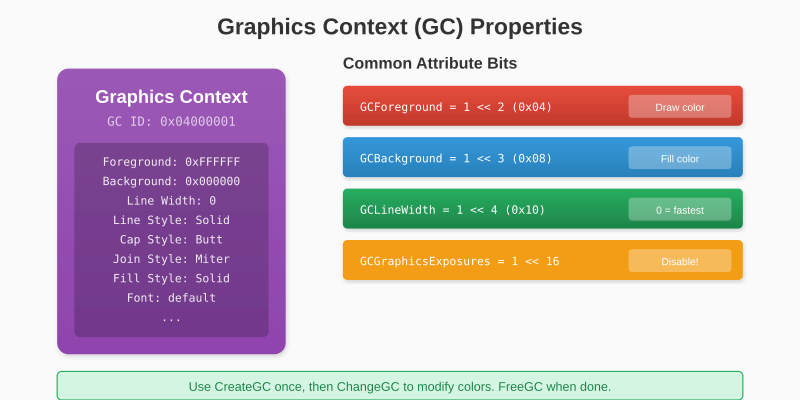
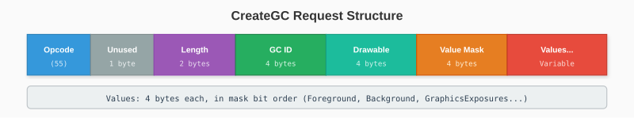
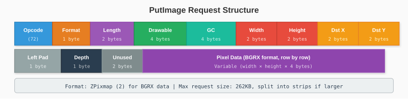
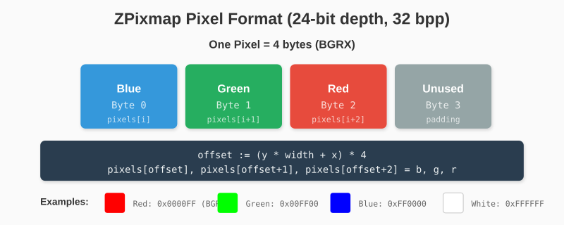

# Chapter 10: The Graphics Context

We can create windows and handle events. Now it's time to draw. This chapter introduces the Graphics Context (GC) - X11's mechanism for managing drawing state.

## 10.1 What is a GC?

A Graphics Context stores drawing parameters: foreground color, background color, line width, font, and many other properties. Instead of passing these with every draw operation, you create a GC once and reference it.

Think of a GC like a painter's palette - it holds the current brush, color, and style. You switch palettes to change how things are drawn.



## 10.2 Creating a Graphics Context

The CreateGC request:



- **GC ID**: We generate this
- **Drawable**: Window or pixmap the GC is compatible with
- **Value Mask**: Which properties we're setting
- **Values**: Property values in mask bit order

```go
func (c *Connection) CreateGC(drawable uint32) (uint32, error) {
    gcID := c.GenerateID()

    // Set foreground, background, and disable graphics exposures
    valueMask := uint32(GCForeground | GCBackground | GCGraphicsExposures)
    valueCount := 3

    reqLen := 4 + valueCount
    req := make([]byte, reqLen*4)

    req[0] = OpCreateGC
    req[1] = 0
    binary.LittleEndian.PutUint16(req[2:], uint16(reqLen))
    binary.LittleEndian.PutUint32(req[4:], gcID)
    binary.LittleEndian.PutUint32(req[8:], drawable)
    binary.LittleEndian.PutUint32(req[12:], valueMask)

    // Values in mask bit order
    binary.LittleEndian.PutUint32(req[16:], 0xFFFFFF)  // Foreground: white
    binary.LittleEndian.PutUint32(req[20:], 0x000000)  // Background: black
    binary.LittleEndian.PutUint32(req[24:], 0)         // GraphicsExposures: off

    if _, err := c.conn.Write(req); err != nil {
        return 0, err
    }

    return gcID, nil
}
```

## 10.3 GC Attributes

Here are the attribute bits and their meanings:

```go
const (
    GCFunction          = 1 << 0   // Drawing operation (copy, xor, etc.)
    GCPlaneMask         = 1 << 1   // Which bit planes to modify
    GCForeground        = 1 << 2   // Foreground color
    GCBackground        = 1 << 3   // Background color
    GCLineWidth         = 1 << 4   // Line thickness (0 = fastest)
    GCLineStyle         = 1 << 5   // Solid, dashed, double-dashed
    GCCapStyle          = 1 << 6   // How lines end
    GCJoinStyle         = 1 << 7   // How lines connect
    GCFillStyle         = 1 << 8   // Solid, tiled, stippled
    GCFillRule          = 1 << 9   // Even-odd or winding
    GCTile              = 1 << 10  // Tile pixmap for fills
    GCStipple           = 1 << 11  // Stipple bitmap
    GCTileStipXOrigin   = 1 << 12  // Tile/stipple X origin
    GCTileStipYOrigin   = 1 << 13  // Tile/stipple Y origin
    GCFont              = 1 << 14  // Font for text
    GCSubwindowMode     = 1 << 15  // Clip to subwindows?
    GCGraphicsExposures = 1 << 16  // Send Expose on copy?
    GCClipXOrigin       = 1 << 17  // Clip mask X origin
    GCClipYOrigin       = 1 << 18  // Clip mask Y origin
    GCClipMask          = 1 << 19  // Clip mask pixmap
    GCDashOffset        = 1 << 20  // Dash pattern start
    GCDashList          = 1 << 21  // Dash pattern
    GCArcMode           = 1 << 22  // Pie slice or chord
)
```

For software rendering, we mainly care about `GCForeground` and `GCBackground`. We disable `GCGraphicsExposures` to avoid receiving Expose events when copying pixels.

## 10.4 Foreground and Background Colors

Colors in X11 are 24-bit RGB values packed into 32 bits:

```
0x00RRGGBB

Examples:
  White: 0xFFFFFF
  Black: 0x000000
  Red:   0xFF0000
  Green: 0x00FF00
  Blue:  0x0000FF
```

To change the foreground color, use ChangeGC:

```go
func (c *Connection) ChangeGC(gc uint32, foreground uint32) error {
    req := make([]byte, 16)

    req[0] = OpChangeGC
    req[1] = 0
    binary.LittleEndian.PutUint16(req[2:], 4)  // Length
    binary.LittleEndian.PutUint32(req[4:], gc)
    binary.LittleEndian.PutUint32(req[8:], GCForeground)  // Mask
    binary.LittleEndian.PutUint32(req[12:], foreground)   // Value

    _, err := c.conn.Write(req)
    return err
}
```

## 10.5 Freeing Resources

Always free GCs when done:

```go
func (c *Connection) FreeGC(gcID uint32) error {
    req := make([]byte, 8)
    req[0] = OpFreeGC
    req[1] = 0
    binary.LittleEndian.PutUint16(req[2:], 2)
    binary.LittleEndian.PutUint32(req[4:], gcID)

    _, err := c.conn.Write(req)
    return err
}
```

## 10.6 The PutImage Request

PutImage is how we send pixel data to a window. It's the foundation of software rendering.



### Image Formats

X11 supports three formats:

- **Bitmap (0)**: 1-bit images
- **XYPixmap (1)**: Planar format (rarely used)
- **ZPixmap (2)**: Packed pixels - what we use

ZPixmap stores pixels as contiguous bytes, which matches how modern hardware and our framebuffer work.

### Pixel Byte Order

For 24-bit depth with 32 bits per pixel (most common):



This BGRX format matches what X11 expects on little-endian systems.

```go
func setPixel(pixels []byte, width, x, y int, r, g, b uint8) {
    offset := (y*width + x) * 4
    pixels[offset] = b      // Blue
    pixels[offset+1] = g    // Green
    pixels[offset+2] = r    // Red
    pixels[offset+3] = 0    // Padding
}
```

## 10.7 Implementing PutImage

Here's the basic implementation:

```go
func (c *Connection) PutImage(drawable, gc uint32, width, height uint16,
    dstX, dstY int16, depth uint8, data []byte) error {

    dataLen := len(data)
    padding := (4 - (dataLen % 4)) % 4

    reqLen := 6 + (dataLen+padding)/4
    req := make([]byte, reqLen*4)

    req[0] = OpPutImage
    req[1] = ImageFormatZPixmap
    binary.LittleEndian.PutUint16(req[2:], uint16(reqLen))
    binary.LittleEndian.PutUint32(req[4:], drawable)
    binary.LittleEndian.PutUint32(req[8:], gc)
    binary.LittleEndian.PutUint16(req[12:], width)
    binary.LittleEndian.PutUint16(req[14:], height)
    binary.LittleEndian.PutUint16(req[16:], uint16(dstX))
    binary.LittleEndian.PutUint16(req[18:], uint16(dstY))
    req[20] = 0      // Left pad
    req[21] = depth
    // Bytes 22-23 unused

    copy(req[24:], data)

    _, err := c.conn.Write(req)
    return err
}
```

## 10.8 The Request Size Limit

**Critical Issue**: X11 requests have a 16-bit length field, limiting each request to 65535 × 4 = 262,140 bytes.

For an 800×600 window at 4 bytes per pixel:
```
800 × 600 × 4 = 1,920,000 bytes
```

This exceeds the limit by 7×!

### Solution: Split into Strips

Send the image in horizontal strips:

```go
func (c *Connection) PutImage(drawable, gc uint32, width, height uint16,
    dstX, dstY int16, depth uint8, data []byte) error {

    bytesPerPixel := 4
    rowBytes := int(width) * bytesPerPixel

    // Max ~262KB per request, minus 24-byte header
    maxDataBytes := 262140 - 24

    rowsPerRequest := maxDataBytes / rowBytes
    if rowsPerRequest > int(height) {
        rowsPerRequest = int(height)
    }

    // Send in strips
    for y := 0; y < int(height); y += rowsPerRequest {
        stripHeight := rowsPerRequest
        if y+stripHeight > int(height) {
            stripHeight = int(height) - y
        }

        stripData := data[y*rowBytes : (y+stripHeight)*rowBytes]

        err := c.putImageStrip(drawable, gc, width, uint16(stripHeight),
            dstX, dstY+int16(y), depth, stripData)
        if err != nil {
            return err
        }
    }

    return nil
}
```

For 800×600:
- Row size: 800 × 4 = 3,200 bytes
- Max rows per request: 262,116 / 3,200 ≈ 81 rows
- Number of requests: 600 / 81 ≈ 8 requests

This splitting is invisible to the caller - they still pass the full image.

## 10.9 Testing Drawing

```go
func main() {
    conn, _ := x11.Connect()
    defer conn.Close()

    windowID, _ := conn.CreateWindow(100, 100, 400, 300)
    conn.SetWindowTitle(windowID, "Drawing Test")
    conn.MapWindow(windowID)

    gcID, _ := conn.CreateGC(windowID)
    defer conn.FreeGC(gcID)

    // Create pixel buffer
    width, height := 400, 300
    pixels := make([]byte, width*height*4)

    // Fill with red
    for y := 0; y < height; y++ {
        for x := 0; x < width; x++ {
            offset := (y*width + x) * 4
            pixels[offset] = 0     // Blue
            pixels[offset+1] = 0   // Green
            pixels[offset+2] = 255 // Red
            pixels[offset+3] = 0
        }
    }

    // Send to window
    conn.PutImage(windowID, gcID, uint16(width), uint16(height),
        0, 0, conn.RootDepth, pixels)

    fmt.Println("Red window displayed. Press Ctrl+C to exit.")
    select {}  // Wait forever
}
```

You should see a solid red window!

---

**Key Takeaways:**

- Graphics Contexts store drawing state (colors, line styles, etc.)
- CreateGC creates a new context; FreeGC releases it
- PutImage sends pixel data using ZPixmap format
- Pixels are BGRX (Blue, Green, Red, padding) on little-endian systems
- Large images must be split into strips due to request size limits
- The 262KB limit applies to all X11 requests

With PutImage working, we can display any pixels we want. Next, we'll build a proper framebuffer with drawing primitives.
