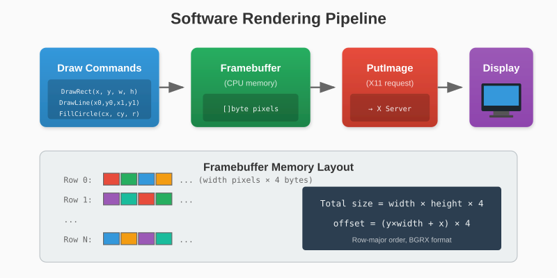
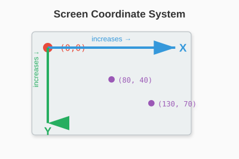

# Chapter 11: The Framebuffer

We can send pixels to X11, but we need a convenient way to manipulate them. This chapter builds a framebuffer - an in-memory pixel array with drawing operations.

## 11.1 Software Rendering Basics

**Software rendering** means the CPU calculates every pixel. This contrasts with **hardware rendering** where the GPU does the work.

Software rendering is:
- **Simpler**: No GPU API to learn
- **Portable**: Works everywhere
- **Flexible**: Full control over every pixel
- **Slower**: CPU can't match GPU parallelism

For 2D games and applications at reasonable resolutions, software rendering is plenty fast.

### The Rendering Pipeline



## 11.2 Designing the Framebuffer

Our framebuffer needs:
- A byte array for pixels
- Width and height
- Methods for pixel manipulation

```go
// internal/x11/framebuffer.go
package x11

type Framebuffer struct {
    Width  int
    Height int
    Pixels []byte  // BGRX format, 4 bytes per pixel
}

func NewFramebuffer(width, height int) *Framebuffer {
    return &Framebuffer{
        Width:  width,
        Height: height,
        Pixels: make([]byte, width*height*4),
    }
}
```

The pixel array is `width × height × 4` bytes, stored in row-major order (row 0 first, then row 1, etc.).

## 11.3 Setting Pixels

The fundamental operation:

```go
func (fb *Framebuffer) SetPixel(x, y int, r, g, b uint8) {
    // Bounds checking
    if x < 0 || x >= fb.Width || y < 0 || y >= fb.Height {
        return
    }

    offset := (y*fb.Width + x) * 4
    fb.Pixels[offset] = b      // Blue
    fb.Pixels[offset+1] = g    // Green
    fb.Pixels[offset+2] = r    // Red
    fb.Pixels[offset+3] = 0    // Padding
}
```

And reading pixels:

```go
func (fb *Framebuffer) GetPixel(x, y int) (r, g, b uint8) {
    if x < 0 || x >= fb.Width || y < 0 || y >= fb.Height {
        return 0, 0, 0
    }

    offset := (y*fb.Width + x) * 4
    return fb.Pixels[offset+2], fb.Pixels[offset+1], fb.Pixels[offset]
}
```

> **Note**: We store BGR but expose RGB in the API. Users think in RGB; the conversion happens internally.

## 11.4 Clearing the Screen

Fill the entire framebuffer with a color:

```go
func (fb *Framebuffer) Clear(r, g, b uint8) {
    for i := 0; i < len(fb.Pixels); i += 4 {
        fb.Pixels[i] = b
        fb.Pixels[i+1] = g
        fb.Pixels[i+2] = r
        fb.Pixels[i+3] = 0
    }
}
```

### Optimized Clear

For solid colors, we can be clever:

```go
func (fb *Framebuffer) Clear(r, g, b uint8) {
    // Build a single pixel
    pixel := []byte{b, g, r, 0}

    // Copy it to the first 4 bytes
    copy(fb.Pixels[0:4], pixel)

    // Double the filled region each iteration
    for filled := 4; filled < len(fb.Pixels); filled *= 2 {
        copy(fb.Pixels[filled:], fb.Pixels[:filled])
    }
}
```

This exploits `copy`'s efficiency - it uses optimized memory operations internally.

## 11.5 Coordinate Systems

Our framebuffer uses screen coordinates:
- Origin (0, 0) is top-left
- X increases rightward
- Y increases downward



This matches most graphics systems and is intuitive for 2D.

## 11.6 Drawing Rectangles

Filled rectangle:

```go
func (fb *Framebuffer) DrawRect(x, y, width, height int, r, g, b uint8) {
    for dy := 0; dy < height; dy++ {
        for dx := 0; dx < width; dx++ {
            fb.SetPixel(x+dx, y+dy, r, g, b)
        }
    }
}
```

This is correct but slow - `SetPixel` does bounds checking for every pixel.

### Optimized Rectangle

```go
func (fb *Framebuffer) DrawRect(x, y, width, height int, r, g, b uint8) {
    // Clip to framebuffer bounds
    x0 := max(x, 0)
    y0 := max(y, 0)
    x1 := min(x+width, fb.Width)
    y1 := min(y+height, fb.Height)

    if x0 >= x1 || y0 >= y1 {
        return  // Completely outside
    }

    // Fill rows
    for py := y0; py < y1; py++ {
        rowStart := (py*fb.Width + x0) * 4
        for px := x0; px < x1; px++ {
            offset := rowStart + (px-x0)*4
            fb.Pixels[offset] = b
            fb.Pixels[offset+1] = g
            fb.Pixels[offset+2] = r
            fb.Pixels[offset+3] = 0
        }
    }
}
```

Clipping once at the start eliminates per-pixel bounds checks.

### Rectangle Outline

```go
func (fb *Framebuffer) DrawRectOutline(x, y, width, height int, r, g, b uint8) {
    // Top edge
    for dx := 0; dx < width; dx++ {
        fb.SetPixel(x+dx, y, r, g, b)
    }
    // Bottom edge
    for dx := 0; dx < width; dx++ {
        fb.SetPixel(x+dx, y+height-1, r, g, b)
    }
    // Left edge
    for dy := 0; dy < height; dy++ {
        fb.SetPixel(x, y+dy, r, g, b)
    }
    // Right edge
    for dy := 0; dy < height; dy++ {
        fb.SetPixel(x+width-1, y+dy, r, g, b)
    }
}
```

## 11.7 Drawing Lines - Bresenham's Algorithm

Drawing a line between two points seems simple, but doing it efficiently for all slopes requires care. Bresenham's algorithm is the classic solution.

The key insight: we only need to decide whether to step in Y when we step in X (or vice versa).

```go
func (fb *Framebuffer) DrawLine(x0, y0, x1, y1 int, r, g, b uint8) {
    dx := abs(x1 - x0)
    dy := -abs(y1 - y0)

    sx := 1
    if x0 > x1 {
        sx = -1
    }
    sy := 1
    if y0 > y1 {
        sy = -1
    }

    err := dx + dy

    for {
        fb.SetPixel(x0, y0, r, g, b)

        if x0 == x1 && y0 == y1 {
            break
        }

        e2 := 2 * err

        if e2 >= dy {
            err += dy
            x0 += sx
        }
        if e2 <= dx {
            err += dx
            y0 += sy
        }
    }
}

func abs(x int) int {
    if x < 0 {
        return -x
    }
    return x
}
```

This works for all line orientations and produces visually pleasing results.

## 11.8 Drawing Circles - Midpoint Algorithm

The midpoint circle algorithm draws circles using only integer arithmetic:

```go
func (fb *Framebuffer) DrawCircle(cx, cy, radius int, r, g, b uint8) {
    x := radius
    y := 0
    err := 0

    for x >= y {
        // Draw 8 octants
        fb.SetPixel(cx+x, cy+y, r, g, b)
        fb.SetPixel(cx+y, cy+x, r, g, b)
        fb.SetPixel(cx-y, cy+x, r, g, b)
        fb.SetPixel(cx-x, cy+y, r, g, b)
        fb.SetPixel(cx-x, cy-y, r, g, b)
        fb.SetPixel(cx-y, cy-x, r, g, b)
        fb.SetPixel(cx+y, cy-x, r, g, b)
        fb.SetPixel(cx+x, cy-y, r, g, b)

        y++
        err += 1 + 2*y

        if 2*(err-x) + 1 > 0 {
            x--
            err += 1 - 2*x
        }
    }
}
```

By exploiting 8-way symmetry, we only compute one octant and mirror it.

### Filled Circle

```go
func (fb *Framebuffer) FillCircle(cx, cy, radius int, r, g, b uint8) {
    for y := -radius; y <= radius; y++ {
        for x := -radius; x <= radius; x++ {
            if x*x+y*y <= radius*radius {
                fb.SetPixel(cx+x, cy+y, r, g, b)
            }
        }
    }
}
```

This brute-force approach checks every pixel in the bounding box. For small circles, it's fast enough.

## 11.9 Drawing Triangles

Triangle outline using three lines:

```go
func (fb *Framebuffer) DrawTriangle(x0, y0, x1, y1, x2, y2 int, r, g, b uint8) {
    fb.DrawLine(x0, y0, x1, y1, r, g, b)
    fb.DrawLine(x1, y1, x2, y2, r, g, b)
    fb.DrawLine(x2, y2, x0, y0, r, g, b)
}
```

Filled triangles are more complex (scanline rasterization). We'll skip that for now.

## 11.10 Complete Framebuffer

```go
package x11

type Framebuffer struct {
    Width  int
    Height int
    Pixels []byte
}

func NewFramebuffer(width, height int) *Framebuffer {
    return &Framebuffer{
        Width:  width,
        Height: height,
        Pixels: make([]byte, width*height*4),
    }
}

func (fb *Framebuffer) SetPixel(x, y int, r, g, b uint8) {
    if x < 0 || x >= fb.Width || y < 0 || y >= fb.Height {
        return
    }
    offset := (y*fb.Width + x) * 4
    fb.Pixels[offset] = b
    fb.Pixels[offset+1] = g
    fb.Pixels[offset+2] = r
    fb.Pixels[offset+3] = 0
}

func (fb *Framebuffer) GetPixel(x, y int) (r, g, b uint8) {
    if x < 0 || x >= fb.Width || y < 0 || y >= fb.Height {
        return 0, 0, 0
    }
    offset := (y*fb.Width + x) * 4
    return fb.Pixels[offset+2], fb.Pixels[offset+1], fb.Pixels[offset]
}

func (fb *Framebuffer) Clear(r, g, b uint8) {
    for i := 0; i < len(fb.Pixels); i += 4 {
        fb.Pixels[i] = b
        fb.Pixels[i+1] = g
        fb.Pixels[i+2] = r
        fb.Pixels[i+3] = 0
    }
}

func (fb *Framebuffer) DrawRect(x, y, width, height int, r, g, b uint8) {
    for dy := 0; dy < height; dy++ {
        for dx := 0; dx < width; dx++ {
            fb.SetPixel(x+dx, y+dy, r, g, b)
        }
    }
}

func (fb *Framebuffer) DrawRectOutline(x, y, width, height int, r, g, b uint8) {
    for dx := 0; dx < width; dx++ {
        fb.SetPixel(x+dx, y, r, g, b)
        fb.SetPixel(x+dx, y+height-1, r, g, b)
    }
    for dy := 0; dy < height; dy++ {
        fb.SetPixel(x, y+dy, r, g, b)
        fb.SetPixel(x+width-1, y+dy, r, g, b)
    }
}

func (fb *Framebuffer) DrawLine(x0, y0, x1, y1 int, r, g, b uint8) {
    // Bresenham's algorithm
    dx := abs(x1 - x0)
    dy := -abs(y1 - y0)
    sx, sy := 1, 1
    if x0 > x1 { sx = -1 }
    if y0 > y1 { sy = -1 }
    err := dx + dy

    for {
        fb.SetPixel(x0, y0, r, g, b)
        if x0 == x1 && y0 == y1 { break }
        e2 := 2 * err
        if e2 >= dy { err += dy; x0 += sx }
        if e2 <= dx { err += dx; y0 += sy }
    }
}

func (fb *Framebuffer) DrawCircle(cx, cy, radius int, r, g, b uint8) {
    x, y, err := radius, 0, 0
    for x >= y {
        fb.SetPixel(cx+x, cy+y, r, g, b)
        fb.SetPixel(cx+y, cy+x, r, g, b)
        fb.SetPixel(cx-y, cy+x, r, g, b)
        fb.SetPixel(cx-x, cy+y, r, g, b)
        fb.SetPixel(cx-x, cy-y, r, g, b)
        fb.SetPixel(cx-y, cy-x, r, g, b)
        fb.SetPixel(cx+y, cy-x, r, g, b)
        fb.SetPixel(cx+x, cy-y, r, g, b)
        y++
        err += 1 + 2*y
        if 2*(err-x)+1 > 0 { x--; err += 1 - 2*x }
    }
}

func (fb *Framebuffer) FillCircle(cx, cy, radius int, r, g, b uint8) {
    for y := -radius; y <= radius; y++ {
        for x := -radius; x <= radius; x++ {
            if x*x+y*y <= radius*radius {
                fb.SetPixel(cx+x, cy+y, r, g, b)
            }
        }
    }
}

func (fb *Framebuffer) DrawTriangle(x0, y0, x1, y1, x2, y2 int, r, g, b uint8) {
    fb.DrawLine(x0, y0, x1, y1, r, g, b)
    fb.DrawLine(x1, y1, x2, y2, r, g, b)
    fb.DrawLine(x2, y2, x0, y0, r, g, b)
}

func abs(x int) int {
    if x < 0 { return -x }
    return x
}
```

---

**Key Takeaways:**

- A framebuffer is an in-memory pixel array
- Pixels are stored as BGRX (4 bytes each)
- Bounds checking prevents memory corruption
- Bresenham's algorithm draws efficient lines
- The midpoint algorithm draws circles with integer math
- Clipping at the start is faster than per-pixel checks

We have drawing primitives! Next, let's wrap everything in a clean public API.
