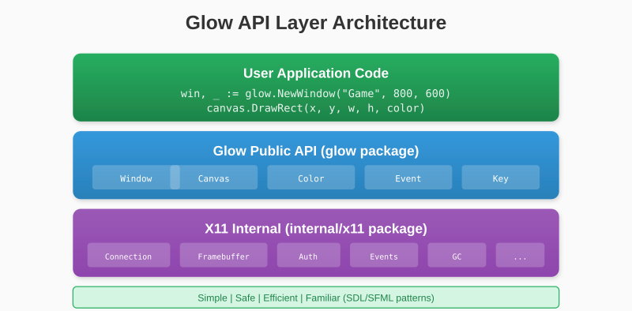
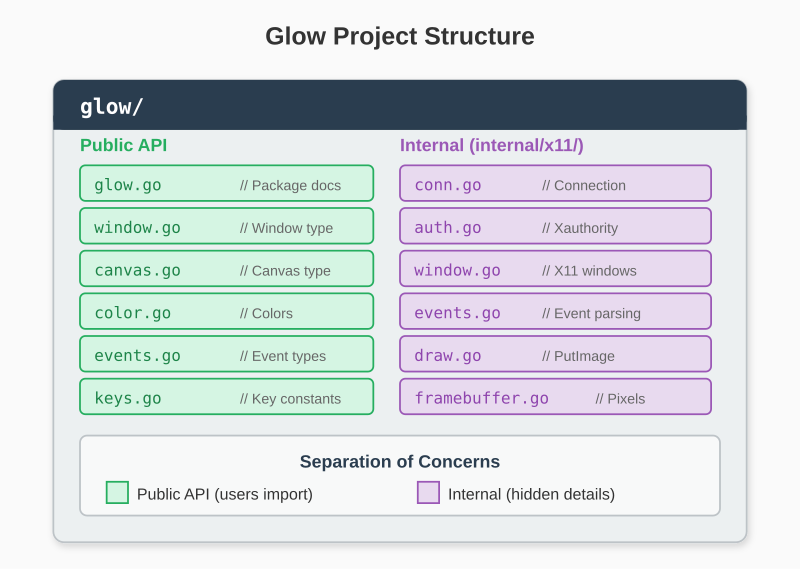

# Chapter 12: The Public API

We've built all the pieces: connection handling, window creation, event processing, and a framebuffer. Now we design a clean public API that hides the X11 complexity.

## 12.1 API Design Philosophy

Our goals:
- **Simple**: Basic usage should be obvious
- **Safe**: Hard to misuse
- **Efficient**: No unnecessary allocations
- **Familiar**: Similar to SDL/SFML patterns

### What Users Want

```go
// This is what users want to write
func main() {
    win, _ := glow.NewWindow("My Game", 800, 600)
    defer win.Close()

    canvas := win.Canvas()

    for win.IsOpen() {
        for event := win.PollEvent(); event != nil; event = win.PollEvent() {
            // Handle events
        }

        canvas.Clear(glow.Black)
        canvas.DrawRect(100, 100, 50, 50, glow.Red)
        win.Display()
    }
}
```

Clean, readable, no X11 knowledge required.



## 12.2 The Color Type

Colors are fundamental. Let's make them pleasant to use:

```go
// glow/color.go
package glow

type Color struct {
    R, G, B, A uint8
}

// Predefined colors
var (
    Black       = Color{0, 0, 0, 255}
    White       = Color{255, 255, 255, 255}
    Red         = Color{255, 0, 0, 255}
    Green       = Color{0, 255, 0, 255}
    Blue        = Color{0, 0, 255, 255}
    Yellow      = Color{255, 255, 0, 255}
    Cyan        = Color{0, 255, 255, 255}
    Magenta     = Color{255, 0, 255, 255}
    Transparent = Color{0, 0, 0, 0}
)

// RGB creates an opaque color
func RGB(r, g, b uint8) Color {
    return Color{r, g, b, 255}
}

// RGBA creates a color with alpha
func RGBA(r, g, b, a uint8) Color {
    return Color{r, g, b, a}
}

// Hex creates a color from a hex value (0xRRGGBB)
func Hex(hex uint32) Color {
    return Color{
        R: uint8((hex >> 16) & 0xFF),
        G: uint8((hex >> 8) & 0xFF),
        B: uint8(hex & 0xFF),
        A: 255,
    }
}
```

### Color Methods

```go
// Blend blends two colors using alpha
func (c Color) Blend(other Color) Color {
    if other.A == 255 {
        return other
    }
    if other.A == 0 {
        return c
    }

    // Simple alpha blending
    alpha := float32(other.A) / 255.0
    invAlpha := 1.0 - alpha

    return Color{
        R: uint8(float32(c.R)*invAlpha + float32(other.R)*alpha),
        G: uint8(float32(c.G)*invAlpha + float32(other.G)*alpha),
        B: uint8(float32(c.B)*invAlpha + float32(other.B)*alpha),
        A: 255,
    }
}

// Darker returns a darker version of the color
func (c Color) Darker(factor float32) Color {
    return Color{
        R: uint8(float32(c.R) * (1 - factor)),
        G: uint8(float32(c.G) * (1 - factor)),
        B: uint8(float32(c.B) * (1 - factor)),
        A: c.A,
    }
}

// Lighter returns a lighter version of the color
func (c Color) Lighter(factor float32) Color {
    return Color{
        R: uint8(float32(c.R) + (255-float32(c.R))*factor),
        G: uint8(float32(c.G) + (255-float32(c.G))*factor),
        B: uint8(float32(c.B) + (255-float32(c.B))*factor),
        A: c.A,
    }
}
```

## 12.3 The Canvas Type

The Canvas wraps our framebuffer with a friendly API:

```go
// glow/canvas.go
package glow

import "github.com/AchrafSoltani/glow/internal/x11"

type Canvas struct {
    fb     *x11.Framebuffer
    width  int
    height int
}

func newCanvas(width, height int) *Canvas {
    return &Canvas{
        fb:     x11.NewFramebuffer(width, height),
        width:  width,
        height: height,
    }
}

func (c *Canvas) Width() int  { return c.width }
func (c *Canvas) Height() int { return c.height }

// Pixels returns the raw pixel data (for advanced use)
func (c *Canvas) Pixels() []byte {
    return c.fb.Pixels
}
```

### Drawing Methods

```go
func (c *Canvas) Clear(color Color) {
    c.fb.Clear(color.R, color.G, color.B)
}

func (c *Canvas) SetPixel(x, y int, color Color) {
    c.fb.SetPixel(x, y, color.R, color.G, color.B)
}

func (c *Canvas) GetPixel(x, y int) Color {
    r, g, b := c.fb.GetPixel(x, y)
    return Color{r, g, b, 255}
}

func (c *Canvas) DrawRect(x, y, width, height int, color Color) {
    c.fb.DrawRect(x, y, width, height, color.R, color.G, color.B)
}

func (c *Canvas) DrawRectOutline(x, y, width, height int, color Color) {
    c.fb.DrawRectOutline(x, y, width, height, color.R, color.G, color.B)
}

func (c *Canvas) DrawLine(x0, y0, x1, y1 int, color Color) {
    c.fb.DrawLine(x0, y0, x1, y1, color.R, color.G, color.B)
}

func (c *Canvas) DrawCircle(cx, cy, radius int, color Color) {
    c.fb.DrawCircle(cx, cy, radius, color.R, color.G, color.B)
}

func (c *Canvas) FillCircle(cx, cy, radius int, color Color) {
    c.fb.FillCircle(cx, cy, radius, color.R, color.G, color.B)
}

func (c *Canvas) DrawTriangle(x0, y0, x1, y1, x2, y2 int, color Color) {
    c.fb.DrawTriangle(x0, y0, x1, y1, x2, y2, color.R, color.G, color.B)
}
```

### Resize Support

When the window resizes, we need a new framebuffer:

```go
func (c *Canvas) Resize(width, height int) {
    if width == c.width && height == c.height {
        return
    }

    c.fb = x11.NewFramebuffer(width, height)
    c.width = width
    c.height = height
}
```

## 12.4 The Window Type

The Window is the main entry point:

```go
// glow/window.go
package glow

import (
    "github.com/AchrafSoltani/glow/internal/x11"
)

type Window struct {
    conn   *x11.Connection
    window *x11.Window
    canvas *Canvas

    open   bool
    width  int
    height int
}

func NewWindow(title string, width, height int) (*Window, error) {
    conn, err := x11.Connect()
    if err != nil {
        return nil, err
    }

    window, err := x11.NewWindow(conn, title, width, height)
    if err != nil {
        conn.Close()
        return nil, err
    }

    return &Window{
        conn:   conn,
        window: window,
        canvas: newCanvas(width, height),
        open:   true,
        width:  width,
        height: height,
    }, nil
}
```

### Window Methods

```go
func (w *Window) Close() {
    if !w.open {
        return
    }
    w.open = false
    w.window.Close()
    w.conn.Close()
}

func (w *Window) IsOpen() bool {
    return w.open
}

func (w *Window) Width() int {
    return w.width
}

func (w *Window) Height() int {
    return w.height
}

func (w *Window) Canvas() *Canvas {
    return w.canvas
}

func (w *Window) SetTitle(title string) {
    w.conn.SetWindowTitle(w.window.ID(), title)
}
```

### Display Method

The crucial method that sends our framebuffer to the screen:

```go
func (w *Window) Display() error {
    return w.conn.PutImage(
        w.window.ID(),
        w.window.GC(),
        uint16(w.canvas.width),
        uint16(w.canvas.height),
        0, 0,
        w.conn.RootDepth,
        w.canvas.Pixels(),
    )
}
```

## 12.5 Event Types

We define our own event types, independent of X11:

```go
// glow/events.go
package glow

type Event interface {
    isEvent()  // Marker method
}

// KeyEvent for keyboard input
type KeyEvent struct {
    Key     Key
    Pressed bool
    Shift   bool
    Ctrl    bool
    Alt     bool
}

func (KeyEvent) isEvent() {}

// MouseButtonEvent for mouse clicks
type MouseButtonEvent struct {
    Button  MouseButton
    Pressed bool
    X, Y    int
}

func (MouseButtonEvent) isEvent() {}

// MouseMoveEvent for mouse movement
type MouseMoveEvent struct {
    X, Y int
}

func (MouseMoveEvent) isEvent() {}

// ResizeEvent when window size changes
type ResizeEvent struct {
    Width, Height int
}

func (ResizeEvent) isEvent() {}

// CloseEvent when close button is clicked
type CloseEvent struct{}

func (CloseEvent) isEvent() {}
```

### Key Constants

```go
type Key int

const (
    KeyUnknown Key = iota
    KeyEscape
    KeyEnter
    KeySpace
    KeyBackspace
    KeyTab

    KeyLeft
    KeyRight
    KeyUp
    KeyDown

    KeyA
    KeyB
    KeyC
    // ... through KeyZ

    Key0
    Key1
    // ... through Key9

    KeyF1
    KeyF2
    // ... through KeyF12
)
```

### Mouse Button Constants

```go
type MouseButton int

const (
    MouseLeft MouseButton = iota + 1
    MouseMiddle
    MouseRight
    MouseWheelUp
    MouseWheelDown
)
```

## 12.6 Event Polling

Convert X11 events to our event types:

```go
func (w *Window) PollEvent() Event {
    x11Event := w.window.PollEvent()
    if x11Event == nil {
        return nil
    }

    return w.convertEvent(x11Event)
}

func (w *Window) convertEvent(e x11.Event) Event {
    switch ev := e.(type) {
    case x11.KeyEvent:
        return KeyEvent{
            Key:     convertKeycode(ev.Keycode),
            Pressed: ev.EventType == x11.EventKeyPress,
            Shift:   ev.State&x11.ShiftMask != 0,
            Ctrl:    ev.State&x11.ControlMask != 0,
            Alt:     ev.State&x11.Mod1Mask != 0,
        }

    case x11.ButtonEvent:
        return MouseButtonEvent{
            Button:  MouseButton(ev.Button),
            Pressed: ev.EventType == x11.EventButtonPress,
            X:       int(ev.X),
            Y:       int(ev.Y),
        }

    case x11.MotionEvent:
        return MouseMoveEvent{
            X: int(ev.X),
            Y: int(ev.Y),
        }

    case x11.ConfigureEvent:
        if int(ev.Width) != w.width || int(ev.Height) != w.height {
            w.width = int(ev.Width)
            w.height = int(ev.Height)
            w.canvas.Resize(w.width, w.height)
            return ResizeEvent{
                Width:  w.width,
                Height: w.height,
            }
        }
        return nil

    case x11.ClientMessageEvent:
        if x11.IsDeleteWindowEvent(ev, w.conn.AtomWmProtocols(),
            w.conn.AtomWmDeleteWindow()) {
            w.open = false
            return CloseEvent{}
        }

    case x11.ExposeEvent:
        // Trigger redraw by returning nil
        // The main loop will redraw anyway
        return nil
    }

    return nil
}
```

### Keycode Conversion

```go
func convertKeycode(code uint8) Key {
    switch code {
    case 9:
        return KeyEscape
    case 36:
        return KeyEnter
    case 65:
        return KeySpace
    case 22:
        return KeyBackspace
    case 23:
        return KeyTab
    case 111:
        return KeyUp
    case 116:
        return KeyDown
    case 113:
        return KeyLeft
    case 114:
        return KeyRight
    case 38:
        return KeyA
    case 56:
        return KeyB
    // ... more keys
    default:
        return KeyUnknown
    }
}
```

## 12.7 Complete Window Implementation

```go
package glow

import (
    "github.com/AchrafSoltani/glow/internal/x11"
)

type Window struct {
    conn   *x11.Connection
    window *x11.Window
    canvas *Canvas

    open   bool
    width  int
    height int
}

func NewWindow(title string, width, height int) (*Window, error) {
    conn, err := x11.Connect()
    if err != nil {
        return nil, err
    }

    window, err := x11.NewWindow(conn, title, width, height)
    if err != nil {
        conn.Close()
        return nil, err
    }

    return &Window{
        conn:   conn,
        window: window,
        canvas: newCanvas(width, height),
        open:   true,
        width:  width,
        height: height,
    }, nil
}

func (w *Window) Close() {
    if !w.open {
        return
    }
    w.open = false
    w.window.Close()
    w.conn.Close()
}

func (w *Window) IsOpen() bool {
    return w.open
}

func (w *Window) Width() int  { return w.width }
func (w *Window) Height() int { return w.height }

func (w *Window) Canvas() *Canvas {
    return w.canvas
}

func (w *Window) SetTitle(title string) {
    w.conn.SetWindowTitle(w.window.ID(), title)
}

func (w *Window) Display() error {
    return w.conn.PutImage(
        w.window.ID(),
        w.window.GC(),
        uint16(w.canvas.width),
        uint16(w.canvas.height),
        0, 0,
        w.conn.RootDepth,
        w.canvas.Pixels(),
    )
}

func (w *Window) PollEvent() Event {
    x11Event := w.window.PollEvent()
    if x11Event == nil {
        return nil
    }
    return w.convertEvent(x11Event)
}

func (w *Window) WaitEvent() Event {
    x11Event := w.window.WaitEvent()
    return w.convertEvent(x11Event)
}

func (w *Window) convertEvent(e x11.Event) Event {
    // ... conversion logic from above
}
```

## 12.8 Usage Example

Here's how our API looks in practice:

```go
package main

import (
    "github.com/AchrafSoltani/glow"
)

func main() {
    win, err := glow.NewWindow("Glow Example", 800, 600)
    if err != nil {
        panic(err)
    }
    defer win.Close()

    canvas := win.Canvas()
    x, y := 400, 300

    for win.IsOpen() {
        // Handle events
        for event := win.PollEvent(); event != nil; event = win.PollEvent() {
            switch e := event.(type) {
            case glow.KeyEvent:
                if e.Pressed {
                    switch e.Key {
                    case glow.KeyEscape:
                        win.Close()
                    case glow.KeyLeft:
                        x -= 10
                    case glow.KeyRight:
                        x += 10
                    case glow.KeyUp:
                        y -= 10
                    case glow.KeyDown:
                        y += 10
                    }
                }
            case glow.CloseEvent:
                win.Close()
            }
        }

        // Draw
        canvas.Clear(glow.Black)
        canvas.FillCircle(x, y, 30, glow.Red)
        canvas.DrawCircle(x, y, 30, glow.White)

        win.Display()
    }
}
```

Clean, simple, no X11 knowledge required.

## 12.9 Package Structure

Final package layout:



The `internal` package is hidden from users - they only see the clean public API.

---

**Key Takeaways:**

- Hide complexity in `internal/` packages
- Provide friendly types (Color, Canvas, Window)
- Convert between internal and public event types
- Use constants for common values (colors, keys)
- Keep the API surface small and focused
- Match familiar patterns from SDL/SFML

Our library is complete! Users can create windows, draw graphics, and handle input with just a few lines of code. Next, let's build some real applications.
