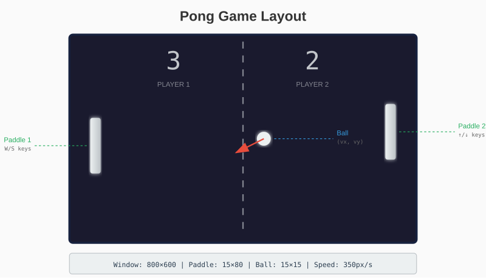

# Chapter 13: Building Pong

Theory becomes real when you build something. This chapter creates the classic game Pong - two paddles, a ball, and simple physics. It's the perfect first project for our graphics library.

## 13.1 Game Design

Pong is simple but complete:
- Two paddles (one per player, or player vs AI)
- A ball that bounces
- Score tracking
- Win condition



## 13.2 Game Constants

```go
package main

import (
    "time"
    "github.com/AchrafSoltani/glow"
)

const (
    windowWidth  = 800
    windowHeight = 600

    paddleWidth  = 15
    paddleHeight = 80
    paddleSpeed  = 400  // pixels per second
    paddleMargin = 30   // distance from edge

    ballSize  = 15
    ballSpeed = 350  // initial speed

    winScore = 5
)
```

## 13.3 Game State

```go
type Game struct {
    // Paddles
    paddle1Y float64
    paddle2Y float64

    // Ball
    ballX, ballY   float64
    ballVX, ballVY float64

    // Scores
    score1, score2 int

    // State
    paused    bool
    gameOver  bool
    winner    int
}

func NewGame() *Game {
    g := &Game{}
    g.Reset()
    return g
}

func (g *Game) Reset() {
    // Center paddles vertically
    g.paddle1Y = float64(windowHeight-paddleHeight) / 2
    g.paddle2Y = float64(windowHeight-paddleHeight) / 2

    // Reset ball to center
    g.ResetBall(1)  // Serve toward player 2

    g.paused = false
    g.gameOver = false
}

func (g *Game) ResetBall(direction int) {
    g.ballX = float64(windowWidth) / 2
    g.ballY = float64(windowHeight) / 2

    // Random-ish angle (45 degrees)
    g.ballVX = float64(direction) * ballSpeed * 0.7
    g.ballVY = ballSpeed * 0.7

    // Alternate vertical direction based on scores
    if (g.score1+g.score2)%2 == 1 {
        g.ballVY = -g.ballVY
    }
}
```

## 13.4 Input Handling

```go
type Input struct {
    // Player 1 (W/S keys)
    p1Up, p1Down bool

    // Player 2 (Up/Down arrows)
    p2Up, p2Down bool

    // Controls
    pause, quit bool
    restart     bool
}

func (g *Game) HandleEvent(event glow.Event, input *Input) {
    switch e := event.(type) {
    case glow.KeyEvent:
        pressed := e.Pressed

        switch e.Key {
        // Player 1
        case glow.KeyW:
            input.p1Up = pressed
        case glow.KeyS:
            input.p1Down = pressed

        // Player 2
        case glow.KeyUp:
            input.p2Up = pressed
        case glow.KeyDown:
            input.p2Down = pressed

        // Controls
        case glow.KeySpace:
            if pressed {
                input.pause = true
            }
        case glow.KeyR:
            if pressed {
                input.restart = true
            }
        case glow.KeyEscape:
            input.quit = true
        }

    case glow.CloseEvent:
        input.quit = true
    }
}
```

## 13.5 Game Logic

### Update Method

```go
func (g *Game) Update(dt float64, input *Input) {
    // Handle pause toggle
    if input.pause {
        g.paused = !g.paused
        input.pause = false
    }

    // Handle restart
    if input.restart {
        g.score1 = 0
        g.score2 = 0
        g.Reset()
        input.restart = false
        return
    }

    if g.paused || g.gameOver {
        return
    }

    // Move paddles
    g.updatePaddles(dt, input)

    // Move ball
    g.updateBall(dt)

    // Check scoring
    g.checkScore()
}
```

### Paddle Movement

```go
func (g *Game) updatePaddles(dt float64, input *Input) {
    // Player 1
    if input.p1Up {
        g.paddle1Y -= paddleSpeed * dt
    }
    if input.p1Down {
        g.paddle1Y += paddleSpeed * dt
    }

    // Player 2
    if input.p2Up {
        g.paddle2Y -= paddleSpeed * dt
    }
    if input.p2Down {
        g.paddle2Y += paddleSpeed * dt
    }

    // Clamp to screen bounds
    g.paddle1Y = clamp(g.paddle1Y, 0, float64(windowHeight-paddleHeight))
    g.paddle2Y = clamp(g.paddle2Y, 0, float64(windowHeight-paddleHeight))
}

func clamp(v, min, max float64) float64 {
    if v < min {
        return min
    }
    if v > max {
        return max
    }
    return v
}
```

### Ball Physics

```go
func (g *Game) updateBall(dt float64) {
    // Move ball
    g.ballX += g.ballVX * dt
    g.ballY += g.ballVY * dt

    // Bounce off top and bottom
    if g.ballY <= 0 {
        g.ballY = 0
        g.ballVY = -g.ballVY
    }
    if g.ballY >= float64(windowHeight-ballSize) {
        g.ballY = float64(windowHeight - ballSize)
        g.ballVY = -g.ballVY
    }

    // Check paddle collisions
    g.checkPaddleCollision()
}
```

### Paddle Collision

```go
func (g *Game) checkPaddleCollision() {
    // Paddle 1 (left side)
    paddle1X := float64(paddleMargin)
    if g.ballX <= paddle1X+paddleWidth &&
        g.ballX+ballSize >= paddle1X &&
        g.ballY+ballSize >= g.paddle1Y &&
        g.ballY <= g.paddle1Y+paddleHeight {

        g.ballX = paddle1X + paddleWidth
        g.ballVX = -g.ballVX

        // Add spin based on where ball hit paddle
        g.addSpin(g.paddle1Y)
        g.speedUp()
    }

    // Paddle 2 (right side)
    paddle2X := float64(windowWidth - paddleMargin - paddleWidth)
    if g.ballX+ballSize >= paddle2X &&
        g.ballX <= paddle2X+paddleWidth &&
        g.ballY+ballSize >= g.paddle2Y &&
        g.ballY <= g.paddle2Y+paddleHeight {

        g.ballX = paddle2X - ballSize
        g.ballVX = -g.ballVX

        g.addSpin(g.paddle2Y)
        g.speedUp()
    }
}

func (g *Game) addSpin(paddleY float64) {
    // Ball position relative to paddle center
    paddleCenter := paddleY + paddleHeight/2
    ballCenter := g.ballY + ballSize/2
    offset := (ballCenter - paddleCenter) / (paddleHeight / 2)

    // Adjust vertical velocity based on hit position
    g.ballVY += offset * 150
}

func (g *Game) speedUp() {
    // Increase speed slightly on each hit
    g.ballVX *= 1.05
    g.ballVY *= 1.02
}
```

### Scoring

```go
func (g *Game) checkScore() {
    // Ball passed left edge - Player 2 scores
    if g.ballX < 0 {
        g.score2++
        if g.score2 >= winScore {
            g.gameOver = true
            g.winner = 2
        } else {
            g.ResetBall(1)  // Serve toward player 2
        }
    }

    // Ball passed right edge - Player 1 scores
    if g.ballX > float64(windowWidth) {
        g.score1++
        if g.score1 >= winScore {
            g.gameOver = true
            g.winner = 1
        } else {
            g.ResetBall(-1)  // Serve toward player 1
        }
    }
}
```

## 13.6 Rendering

```go
func (g *Game) Draw(canvas *glow.Canvas) {
    // Background
    canvas.Clear(glow.RGB(20, 20, 30))

    // Center line
    drawDashedLine(canvas, windowWidth/2, 0, windowWidth/2, windowHeight,
        glow.RGB(60, 60, 70))

    // Paddles
    paddle1X := paddleMargin
    paddle2X := windowWidth - paddleMargin - paddleWidth

    canvas.DrawRect(paddle1X, int(g.paddle1Y), paddleWidth, paddleHeight,
        glow.White)
    canvas.DrawRect(paddle2X, int(g.paddle2Y), paddleWidth, paddleHeight,
        glow.White)

    // Ball
    canvas.DrawRect(int(g.ballX), int(g.ballY), ballSize, ballSize,
        glow.RGB(255, 200, 100))

    // Scores
    drawScore(canvas, g.score1, windowWidth/4, 50)
    drawScore(canvas, g.score2, 3*windowWidth/4, 50)

    // Pause/Game Over overlay
    if g.paused {
        drawCenteredText(canvas, "PAUSED", windowHeight/2)
    }
    if g.gameOver {
        drawCenteredText(canvas, "GAME OVER", windowHeight/2-30)
        if g.winner == 1 {
            drawCenteredText(canvas, "Player 1 Wins!", windowHeight/2+30)
        } else {
            drawCenteredText(canvas, "Player 2 Wins!", windowHeight/2+30)
        }
    }
}

func drawDashedLine(canvas *glow.Canvas, x0, y0, x1, y1 int, color glow.Color) {
    dashLen := 20
    gapLen := 10
    y := y0
    drawing := true

    for y < y1 {
        if drawing {
            endY := y + dashLen
            if endY > y1 {
                endY = y1
            }
            canvas.DrawLine(x0, y, x1, endY, color)
            y = endY
        } else {
            y += gapLen
        }
        drawing = !drawing
    }
}
```

### Drawing Numbers

Without a font system, we draw numbers using rectangles:

```go
func drawScore(canvas *glow.Canvas, score int, x, y int) {
    // Simple 7-segment style digits
    digitWidth := 30
    digitHeight := 50
    thickness := 6

    drawDigit(canvas, score, x-digitWidth/2, y, digitWidth, digitHeight, thickness)
}

func drawDigit(canvas *glow.Canvas, digit int, x, y, w, h, t int) {
    color := glow.White

    // Define which segments are on for each digit
    // Segments: top, topLeft, topRight, middle, bottomLeft, bottomRight, bottom
    segments := [][]bool{
        {true, true, true, false, true, true, true},     // 0
        {false, false, true, false, false, true, false}, // 1
        {true, false, true, true, true, false, true},    // 2
        {true, false, true, true, false, true, true},    // 3
        {false, true, true, true, false, true, false},   // 4
        {true, true, false, true, false, true, true},    // 5
        {true, true, false, true, true, true, true},     // 6
        {true, false, true, false, false, true, false},  // 7
        {true, true, true, true, true, true, true},      // 8
        {true, true, true, true, false, true, true},     // 9
    }

    if digit < 0 || digit > 9 {
        return
    }

    seg := segments[digit]
    midY := y + h/2

    // Top
    if seg[0] {
        canvas.DrawRect(x, y, w, t, color)
    }
    // Top Left
    if seg[1] {
        canvas.DrawRect(x, y, t, h/2, color)
    }
    // Top Right
    if seg[2] {
        canvas.DrawRect(x+w-t, y, t, h/2, color)
    }
    // Middle
    if seg[3] {
        canvas.DrawRect(x, midY-t/2, w, t, color)
    }
    // Bottom Left
    if seg[4] {
        canvas.DrawRect(x, midY, t, h/2, color)
    }
    // Bottom Right
    if seg[5] {
        canvas.DrawRect(x+w-t, midY, t, h/2, color)
    }
    // Bottom
    if seg[6] {
        canvas.DrawRect(x, y+h-t, w, t, color)
    }
}

func drawCenteredText(canvas *glow.Canvas, text string, y int) {
    // Placeholder - draw a rectangle indicating text area
    textWidth := len(text) * 15
    x := (windowWidth - textWidth) / 2
    canvas.DrawRect(x, y-10, textWidth, 20, glow.RGB(100, 100, 100))
}
```

## 13.7 Main Loop

```go
func main() {
    win, err := glow.NewWindow("Pong", windowWidth, windowHeight)
    if err != nil {
        panic(err)
    }
    defer win.Close()

    game := NewGame()
    input := &Input{}
    canvas := win.Canvas()

    lastTime := time.Now()

    for win.IsOpen() {
        // Calculate delta time
        now := time.Now()
        dt := now.Sub(lastTime).Seconds()
        lastTime = now

        // Handle events
        for event := win.PollEvent(); event != nil; event = win.PollEvent() {
            game.HandleEvent(event, input)
        }

        if input.quit {
            break
        }

        // Update
        game.Update(dt, input)

        // Draw
        game.Draw(canvas)
        win.Display()

        // Cap frame rate
        time.Sleep(time.Millisecond * 16)
    }
}
```

## 13.8 Adding AI

For single-player mode, add a simple AI:

```go
func (g *Game) updateAI(dt float64) {
    // AI controls paddle 2
    // Simple strategy: follow the ball

    ballCenter := g.ballY + ballSize/2
    paddleCenter := g.paddle2Y + paddleHeight/2

    // Add some "reaction" delay by limiting speed
    aiSpeed := paddleSpeed * 0.7

    if ballCenter < paddleCenter-10 {
        g.paddle2Y -= aiSpeed * dt
    } else if ballCenter > paddleCenter+10 {
        g.paddle2Y += aiSpeed * dt
    }

    // Clamp
    g.paddle2Y = clamp(g.paddle2Y, 0, float64(windowHeight-paddleHeight))
}
```

Call `g.updateAI(dt)` instead of processing player 2 input for single-player mode.

## 13.9 Polish

### Ball Trail Effect

```go
type BallTrail struct {
    positions [][2]float64
    maxLen    int
}

func (t *BallTrail) Add(x, y float64) {
    t.positions = append(t.positions, [2]float64{x, y})
    if len(t.positions) > t.maxLen {
        t.positions = t.positions[1:]
    }
}

func (t *BallTrail) Draw(canvas *glow.Canvas) {
    for i, pos := range t.positions {
        alpha := float64(i) / float64(len(t.positions))
        gray := uint8(100 * alpha)
        size := int(float64(ballSize) * alpha)
        canvas.DrawRect(int(pos[0]), int(pos[1]), size, size,
            glow.RGB(gray, gray, gray))
    }
}
```

### Screen Shake

```go
type ScreenShake struct {
    intensity float64
    duration  float64
    elapsed   float64
}

func (s *ScreenShake) Trigger(intensity, duration float64) {
    s.intensity = intensity
    s.duration = duration
    s.elapsed = 0
}

func (s *ScreenShake) Update(dt float64) (offsetX, offsetY int) {
    if s.elapsed >= s.duration {
        return 0, 0
    }

    s.elapsed += dt
    remaining := 1.0 - s.elapsed/s.duration
    magnitude := s.intensity * remaining

    offsetX = int((rand.Float64()*2 - 1) * magnitude)
    offsetY = int((rand.Float64()*2 - 1) * magnitude)
    return
}
```

Trigger shake on score.

---

**Key Takeaways:**

- Separate game logic (Update) from rendering (Draw)
- Use delta time for frame-rate independent physics
- Input state tracks which keys are currently held
- Simple AI can make single-player engaging
- Visual polish (trails, shake) adds juice with minimal code

Pong demonstrates the core game loop pattern. Next, we'll build something more creative: a paint application.
