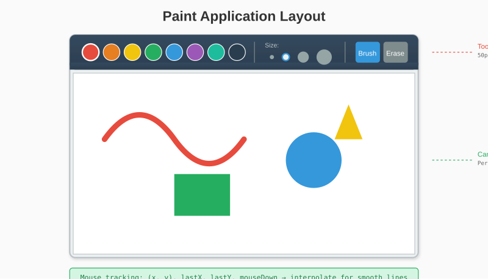

# Chapter 14: Building Paint

Games aren't the only application for graphics libraries. This chapter builds a simple paint program - demonstrating mouse input, tool systems, and persistent canvas state.

## 14.1 Application Design

Our paint program features:
- Freehand drawing with the mouse
- Multiple brush sizes
- Color picker
- Clear canvas button
- Eraser tool



## 14.2 Application Structure

```go
package main

import (
    "github.com/AchrafSoltani/glow"
)

const (
    windowWidth  = 800
    windowHeight = 600
    toolbarHeight = 50
)

type Tool int

const (
    ToolBrush Tool = iota
    ToolEraser
)

type App struct {
    // Canvas state (persistent between frames)
    canvasPixels []glow.Color

    // Current tool
    tool       Tool
    brushSize  int
    brushColor glow.Color

    // Mouse state
    mouseX, mouseY   int
    lastX, lastY     int
    mouseDown        bool
    hasLastPosition  bool

    // UI state
    colors    []glow.Color
    sizes     []int
}
```

## 14.3 Initialization

```go
func NewApp() *App {
    app := &App{
        canvasPixels: make([]glow.Color, windowWidth*(windowHeight-toolbarHeight)),
        tool:         ToolBrush,
        brushSize:    8,
        brushColor:   glow.Black,
        sizes:        []int{2, 5, 8, 15, 25},
    }

    // Color palette
    app.colors = []glow.Color{
        glow.Black,
        glow.White,
        glow.Red,
        glow.RGB(255, 127, 0),  // Orange
        glow.Yellow,
        glow.Green,
        glow.Cyan,
        glow.Blue,
        glow.Magenta,
        glow.RGB(139, 69, 19),  // Brown
    }

    // Initialize canvas to white
    app.Clear()

    return app
}

func (app *App) Clear() {
    for i := range app.canvasPixels {
        app.canvasPixels[i] = glow.White
    }
}
```

## 14.4 Event Handling

```go
func (app *App) HandleEvent(event glow.Event) bool {
    switch e := event.(type) {
    case glow.MouseButtonEvent:
        if e.Button == glow.MouseLeft {
            app.mouseDown = e.Pressed

            if e.Pressed {
                // Check UI clicks
                if e.Y < toolbarHeight {
                    app.handleToolbarClick(e.X, e.Y)
                } else {
                    // Start drawing
                    app.mouseX = e.X
                    app.mouseY = e.Y
                    app.lastX = e.X
                    app.lastY = e.Y
                    app.hasLastPosition = true
                    app.drawAt(e.X, e.Y)
                }
            } else {
                app.hasLastPosition = false
            }
        }

    case glow.MouseMoveEvent:
        app.mouseX = e.X
        app.mouseY = e.Y

        if app.mouseDown && e.Y >= toolbarHeight {
            app.drawLine(app.lastX, app.lastY, e.X, e.Y)
            app.lastX = e.X
            app.lastY = e.Y
        }

    case glow.KeyEvent:
        if e.Pressed {
            switch e.Key {
            case glow.KeyEscape:
                return false  // Quit
            case glow.KeyC:
                app.Clear()
            case glow.KeyE:
                app.tool = ToolEraser
            case glow.KeyB:
                app.tool = ToolBrush
            case glow.Key1:
                app.brushSize = app.sizes[0]
            case glow.Key2:
                app.brushSize = app.sizes[1]
            case glow.Key3:
                app.brushSize = app.sizes[2]
            case glow.Key4:
                app.brushSize = app.sizes[3]
            case glow.Key5:
                app.brushSize = app.sizes[4]
            }
        }

    case glow.CloseEvent:
        return false
    }

    return true
}
```

## 14.5 Toolbar Interaction

```go
func (app *App) handleToolbarClick(x, y int) {
    // Color buttons (first section)
    colorButtonSize := 30
    colorStartX := 10

    for i, color := range app.colors {
        bx := colorStartX + i*(colorButtonSize+5)
        if x >= bx && x < bx+colorButtonSize {
            app.brushColor = color
            app.tool = ToolBrush
            return
        }
    }

    // Size buttons
    sizeStartX := colorStartX + len(app.colors)*(colorButtonSize+5) + 30
    sizeButtonSize := 25

    for i, size := range app.sizes {
        bx := sizeStartX + i*(sizeButtonSize+5)
        if x >= bx && x < bx+sizeButtonSize {
            app.brushSize = size
            return
        }
    }

    // Clear button
    clearX := windowWidth - 60
    if x >= clearX && x < clearX+50 {
        app.Clear()
        return
    }

    // Eraser button
    eraserX := clearX - 60
    if x >= eraserX && x < eraserX+50 {
        app.tool = ToolEraser
    }
}
```

## 14.6 Drawing on the Canvas

The key insight: we draw to our persistent `canvasPixels` array, not directly to the window canvas.

```go
func (app *App) drawAt(x, y int) {
    color := app.brushColor
    if app.tool == ToolEraser {
        color = glow.White
    }

    // Adjust y for toolbar
    canvasY := y - toolbarHeight

    // Draw a filled circle
    radius := app.brushSize / 2
    for dy := -radius; dy <= radius; dy++ {
        for dx := -radius; dx <= radius; dx++ {
            if dx*dx+dy*dy <= radius*radius {
                app.setCanvasPixel(x+dx, canvasY+dy, color)
            }
        }
    }
}

func (app *App) setCanvasPixel(x, y int, color glow.Color) {
    canvasWidth := windowWidth
    canvasHeight := windowHeight - toolbarHeight

    if x < 0 || x >= canvasWidth || y < 0 || y >= canvasHeight {
        return
    }

    app.canvasPixels[y*canvasWidth+x] = color
}

func (app *App) drawLine(x0, y0, x1, y1 int) {
    // Bresenham's algorithm for smooth lines
    dx := abs(x1 - x0)
    dy := -abs(y1 - y0)

    sx := 1
    if x0 > x1 {
        sx = -1
    }
    sy := 1
    if y0 > y1 {
        sy = -1
    }

    err := dx + dy

    for {
        app.drawAt(x0, y0)

        if x0 == x1 && y0 == y1 {
            break
        }

        e2 := 2 * err
        if e2 >= dy {
            err += dy
            x0 += sx
        }
        if e2 <= dx {
            err += dx
            y0 += sy
        }
    }
}

func abs(x int) int {
    if x < 0 {
        return -x
    }
    return x
}
```

## 14.7 Rendering

```go
func (app *App) Draw(canvas *glow.Canvas) {
    // Draw toolbar
    app.drawToolbar(canvas)

    // Draw canvas area
    app.drawCanvas(canvas)
}

func (app *App) drawToolbar(canvas *glow.Canvas) {
    // Background
    canvas.DrawRect(0, 0, windowWidth, toolbarHeight, glow.RGB(50, 50, 50))

    // Color buttons
    colorButtonSize := 30
    colorStartX := 10
    colorY := (toolbarHeight - colorButtonSize) / 2

    for i, color := range app.colors {
        bx := colorStartX + i*(colorButtonSize+5)

        // Button background
        canvas.DrawRect(bx-2, colorY-2, colorButtonSize+4, colorButtonSize+4,
            glow.RGB(80, 80, 80))

        // Color fill
        canvas.DrawRect(bx, colorY, colorButtonSize, colorButtonSize, color)

        // Selection indicator
        if app.tool == ToolBrush && color == app.brushColor {
            canvas.DrawRectOutline(bx-3, colorY-3, colorButtonSize+6, colorButtonSize+6,
                glow.White)
        }
    }

    // Size indicators
    sizeStartX := colorStartX + len(app.colors)*(colorButtonSize+5) + 30

    for i, size := range app.sizes {
        bx := sizeStartX + i*30
        by := toolbarHeight / 2

        // Draw circle representing size
        radius := size / 2
        if radius < 2 {
            radius = 2
        }
        if radius > 12 {
            radius = 12
        }

        color := glow.RGB(150, 150, 150)
        if size == app.brushSize {
            color = glow.White
        }

        canvas.FillCircle(bx+12, by, radius, color)
    }

    // Eraser button
    eraserX := windowWidth - 120
    eraserColor := glow.RGB(100, 100, 100)
    if app.tool == ToolEraser {
        eraserColor = glow.RGB(150, 150, 150)
    }
    canvas.DrawRect(eraserX, colorY, 50, colorButtonSize, eraserColor)
    // Draw "E" for eraser
    canvas.DrawRect(eraserX+15, colorY+5, 20, 3, glow.White)
    canvas.DrawRect(eraserX+15, colorY+12, 15, 3, glow.White)
    canvas.DrawRect(eraserX+15, colorY+19, 20, 3, glow.White)
    canvas.DrawRect(eraserX+15, colorY+5, 3, 17, glow.White)

    // Clear button
    clearX := windowWidth - 60
    canvas.DrawRect(clearX, colorY, 50, colorButtonSize, glow.RGB(180, 60, 60))
    // Draw "X" for clear
    canvas.DrawLine(clearX+15, colorY+8, clearX+35, colorY+22, glow.White)
    canvas.DrawLine(clearX+35, colorY+8, clearX+15, colorY+22, glow.White)
}

func (app *App) drawCanvas(canvas *glow.Canvas) {
    canvasWidth := windowWidth
    canvasHeight := windowHeight - toolbarHeight

    // Copy our persistent canvas to the window canvas
    for y := 0; y < canvasHeight; y++ {
        for x := 0; x < canvasWidth; x++ {
            color := app.canvasPixels[y*canvasWidth+x]
            canvas.SetPixel(x, y+toolbarHeight, color)
        }
    }

    // Draw brush preview cursor
    if app.mouseY >= toolbarHeight {
        previewColor := app.brushColor
        if app.tool == ToolEraser {
            previewColor = glow.RGB(200, 200, 200)
        }
        canvas.DrawCircle(app.mouseX, app.mouseY, app.brushSize/2, previewColor)
    }
}
```

## 14.8 Main Loop

```go
func main() {
    win, err := glow.NewWindow("Paint", windowWidth, windowHeight)
    if err != nil {
        panic(err)
    }
    defer win.Close()

    app := NewApp()
    canvas := win.Canvas()
    running := true

    for win.IsOpen() && running {
        // Handle events
        for event := win.PollEvent(); event != nil; event = win.PollEvent() {
            if !app.HandleEvent(event) {
                running = false
            }
        }

        // Draw
        app.Draw(canvas)
        win.Display()
    }
}
```

## 14.9 Optimizations

### Dirty Rectangle Tracking

Instead of copying all pixels every frame, track what changed:

```go
type DirtyRect struct {
    x, y, width, height int
    dirty               bool
}

func (app *App) setCanvasPixel(x, y int, color glow.Color) {
    // ... bounds check ...

    app.canvasPixels[y*canvasWidth+x] = color

    // Expand dirty region
    app.expandDirty(x, y)
}

func (app *App) expandDirty(x, y int) {
    if !app.dirtyRect.dirty {
        app.dirtyRect = DirtyRect{x, y, 1, 1, true}
        return
    }

    // Expand to include new point
    if x < app.dirtyRect.x {
        app.dirtyRect.width += app.dirtyRect.x - x
        app.dirtyRect.x = x
    }
    if y < app.dirtyRect.y {
        app.dirtyRect.height += app.dirtyRect.y - y
        app.dirtyRect.y = y
    }
    if x >= app.dirtyRect.x+app.dirtyRect.width {
        app.dirtyRect.width = x - app.dirtyRect.x + 1
    }
    if y >= app.dirtyRect.y+app.dirtyRect.height {
        app.dirtyRect.height = y - app.dirtyRect.y + 1
    }
}
```

### Double Buffering

Our setup already does this implicitly - we draw to a framebuffer, then send it all at once with `Display()`.

## 14.10 Enhancements

### Undo/Redo

```go
type CanvasState []glow.Color

func (app *App) saveState() {
    state := make(CanvasState, len(app.canvasPixels))
    copy(state, app.canvasPixels)
    app.undoStack = append(app.undoStack, state)

    // Limit stack size
    if len(app.undoStack) > 50 {
        app.undoStack = app.undoStack[1:]
    }

    // Clear redo stack on new action
    app.redoStack = nil
}

func (app *App) Undo() {
    if len(app.undoStack) == 0 {
        return
    }

    // Save current state for redo
    current := make(CanvasState, len(app.canvasPixels))
    copy(current, app.canvasPixels)
    app.redoStack = append(app.redoStack, current)

    // Restore previous state
    last := app.undoStack[len(app.undoStack)-1]
    app.undoStack = app.undoStack[:len(app.undoStack)-1]
    copy(app.canvasPixels, last)
}

func (app *App) Redo() {
    if len(app.redoStack) == 0 {
        return
    }

    // Save current for undo
    current := make(CanvasState, len(app.canvasPixels))
    copy(current, app.canvasPixels)
    app.undoStack = append(app.undoStack, current)

    // Restore redo state
    last := app.redoStack[len(app.redoStack)-1]
    app.redoStack = app.redoStack[:len(app.redoStack)-1]
    copy(app.canvasPixels, last)
}
```

Call `saveState()` when mouse button is pressed (before drawing starts).

### Fill Tool

```go
func (app *App) floodFill(startX, startY int, newColor glow.Color) {
    canvasWidth := windowWidth
    canvasHeight := windowHeight - toolbarHeight

    if startX < 0 || startX >= canvasWidth || startY < 0 || startY >= canvasHeight {
        return
    }

    targetColor := app.canvasPixels[startY*canvasWidth+startX]
    if targetColor == newColor {
        return
    }

    // Simple stack-based flood fill
    stack := [][2]int{{startX, startY}}

    for len(stack) > 0 {
        // Pop
        p := stack[len(stack)-1]
        stack = stack[:len(stack)-1]
        x, y := p[0], p[1]

        if x < 0 || x >= canvasWidth || y < 0 || y >= canvasHeight {
            continue
        }

        idx := y*canvasWidth + x
        if app.canvasPixels[idx] != targetColor {
            continue
        }

        app.canvasPixels[idx] = newColor

        // Add neighbors
        stack = append(stack, [2]int{x + 1, y})
        stack = append(stack, [2]int{x - 1, y})
        stack = append(stack, [2]int{x, y + 1})
        stack = append(stack, [2]int{x, y - 1})
    }
}
```

### Shape Tools

```go
func (app *App) drawRectTool(x0, y0, x1, y1 int, filled bool) {
    if x0 > x1 {
        x0, x1 = x1, x0
    }
    if y0 > y1 {
        y0, y1 = y1, y0
    }

    color := app.brushColor

    if filled {
        for y := y0; y <= y1; y++ {
            for x := x0; x <= x1; x++ {
                app.setCanvasPixel(x, y-toolbarHeight, color)
            }
        }
    } else {
        // Top and bottom
        for x := x0; x <= x1; x++ {
            app.setCanvasPixel(x, y0-toolbarHeight, color)
            app.setCanvasPixel(x, y1-toolbarHeight, color)
        }
        // Left and right
        for y := y0; y <= y1; y++ {
            app.setCanvasPixel(x0, y-toolbarHeight, color)
            app.setCanvasPixel(x1, y-toolbarHeight, color)
        }
    }
}
```

---

**Key Takeaways:**

- Separate persistent state (canvas pixels) from display state
- Interpolate between mouse positions for smooth lines
- UI elements are just regions that respond to clicks
- Undo/redo requires copying state, not just storing deltas
- Flood fill uses a simple stack-based algorithm
- Different tools share the same event handling, just with different effects

Paint demonstrates stateful applications where user actions accumulate. Next, we'll create something dynamic: a particle system.
