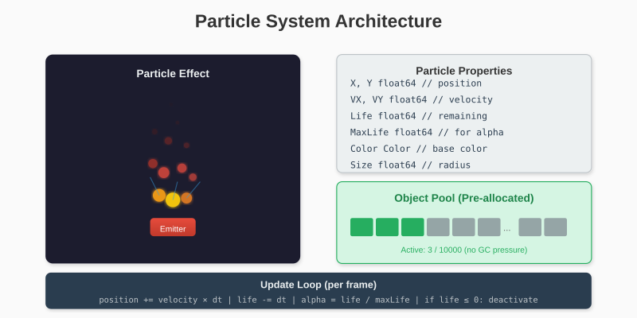

# Chapter 15: Building Particles

Particle systems create dynamic visual effects - fire, smoke, sparks, rain. This chapter builds a flexible particle system demonstrating object pooling, physics simulation, and visual effects.

## 15.1 What Are Particles?

A particle is a simple object with:
- Position (x, y)
- Velocity (vx, vy)
- Lifetime (how long until it disappears)
- Visual properties (color, size)

Thousands of particles together create complex effects.



## 15.2 Particle Structure

```go
package main

import (
    "math"
    "math/rand"
    "time"

    "github.com/AchrafSoltani/glow"
)

type Particle struct {
    // Position
    X, Y float64

    // Velocity
    VX, VY float64

    // Lifecycle
    Life    float64  // Remaining life (seconds)
    MaxLife float64  // Initial life (for calculating alpha)

    // Visual
    Color glow.Color
    Size  float64

    // State
    Active bool
}
```

## 15.3 Particle Pool

Creating and destroying thousands of particles per second would stress the garbage collector. Instead, we pre-allocate a pool:

```go
const MaxParticles = 10000

type ParticlePool struct {
    particles []Particle
    active    int
}

func NewParticlePool() *ParticlePool {
    return &ParticlePool{
        particles: make([]Particle, MaxParticles),
        active:    0,
    }
}

func (p *ParticlePool) Spawn() *Particle {
    // Find an inactive particle
    for i := range p.particles {
        if !p.particles[i].Active {
            p.particles[i].Active = true
            p.active++
            return &p.particles[i]
        }
    }
    return nil  // Pool exhausted
}

func (p *ParticlePool) Update(dt float64) {
    for i := range p.particles {
        if !p.particles[i].Active {
            continue
        }

        particle := &p.particles[i]

        // Update position
        particle.X += particle.VX * dt
        particle.Y += particle.VY * dt

        // Age the particle
        particle.Life -= dt

        if particle.Life <= 0 {
            particle.Active = false
            p.active--
        }
    }
}

func (p *ParticlePool) Draw(canvas *glow.Canvas) {
    for i := range p.particles {
        if !p.particles[i].Active {
            continue
        }

        particle := &p.particles[i]

        // Calculate alpha based on remaining life
        alpha := particle.Life / particle.MaxLife

        // Fade color
        color := glow.RGBA(
            particle.Color.R,
            particle.Color.G,
            particle.Color.B,
            uint8(255*alpha),
        )

        // Draw as a filled circle or rectangle
        size := int(particle.Size * alpha)
        if size < 1 {
            size = 1
        }

        canvas.FillCircle(int(particle.X), int(particle.Y), size, color)
    }
}

func (p *ParticlePool) ActiveCount() int {
    return p.active
}
```

## 15.4 Emitters

An emitter spawns particles with specific properties:

```go
type Emitter struct {
    // Position
    X, Y float64

    // Emission rate
    Rate        float64  // Particles per second
    accumulator float64

    // Particle properties
    SpeedMin, SpeedMax float64
    AngleMin, AngleMax float64  // Radians
    LifeMin, LifeMax   float64
    SizeMin, SizeMax   float64
    Colors             []glow.Color

    // Physics modifiers
    Gravity float64

    // State
    Active bool
}

func NewEmitter(x, y float64) *Emitter {
    return &Emitter{
        X:        x,
        Y:        y,
        Rate:     100,
        SpeedMin: 50,
        SpeedMax: 150,
        AngleMin: 0,
        AngleMax: 2 * math.Pi,
        LifeMin:  1.0,
        LifeMax:  2.0,
        SizeMin:  2,
        SizeMax:  6,
        Colors:   []glow.Color{glow.White},
        Active:   true,
    }
}

func (e *Emitter) Update(dt float64, pool *ParticlePool) {
    if !e.Active {
        return
    }

    // Accumulate time
    e.accumulator += dt

    // Spawn particles based on rate
    interval := 1.0 / e.Rate
    for e.accumulator >= interval {
        e.accumulator -= interval
        e.spawnParticle(pool)
    }
}

func (e *Emitter) spawnParticle(pool *ParticlePool) {
    particle := pool.Spawn()
    if particle == nil {
        return  // Pool full
    }

    // Random angle and speed
    angle := randRange(e.AngleMin, e.AngleMax)
    speed := randRange(e.SpeedMin, e.SpeedMax)

    particle.X = e.X
    particle.Y = e.Y
    particle.VX = math.Cos(angle) * speed
    particle.VY = math.Sin(angle) * speed

    particle.Life = randRange(e.LifeMin, e.LifeMax)
    particle.MaxLife = particle.Life
    particle.Size = randRange(e.SizeMin, e.SizeMax)

    // Random color from palette
    particle.Color = e.Colors[rand.Intn(len(e.Colors))]
}

func randRange(min, max float64) float64 {
    return min + rand.Float64()*(max-min)
}
```

## 15.5 Physics

Add gravity and other forces:

```go
func (p *ParticlePool) UpdateWithPhysics(dt float64, gravity float64) {
    for i := range p.particles {
        if !p.particles[i].Active {
            continue
        }

        particle := &p.particles[i]

        // Apply gravity
        particle.VY += gravity * dt

        // Update position
        particle.X += particle.VX * dt
        particle.Y += particle.VY * dt

        // Age
        particle.Life -= dt

        if particle.Life <= 0 {
            particle.Active = false
            p.active--
        }
    }
}
```

### Wind Effect

```go
func (p *ParticlePool) ApplyWind(windX, windY float64, dt float64) {
    for i := range p.particles {
        if !p.particles[i].Active {
            continue
        }

        particle := &p.particles[i]
        particle.VX += windX * dt
        particle.VY += windY * dt
    }
}
```

### Drag/Friction

```go
func (p *ParticlePool) ApplyDrag(drag float64, dt float64) {
    for i := range p.particles {
        if !p.particles[i].Active {
            continue
        }

        particle := &p.particles[i]
        factor := 1.0 - drag*dt
        particle.VX *= factor
        particle.VY *= factor
    }
}
```

## 15.6 Effect Presets

### Fire

```go
func NewFireEmitter(x, y float64) *Emitter {
    e := NewEmitter(x, y)
    e.Rate = 150
    e.SpeedMin = 30
    e.SpeedMax = 80
    e.AngleMin = -math.Pi/2 - math.Pi/6  // Upward spread
    e.AngleMax = -math.Pi/2 + math.Pi/6
    e.LifeMin = 0.5
    e.LifeMax = 1.5
    e.SizeMin = 3
    e.SizeMax = 8
    e.Colors = []glow.Color{
        glow.RGB(255, 100, 0),   // Orange
        glow.RGB(255, 200, 0),   // Yellow
        glow.RGB(255, 50, 0),    // Red-orange
        glow.RGB(255, 150, 50),  // Light orange
    }
    return e
}
```

### Smoke

```go
func NewSmokeEmitter(x, y float64) *Emitter {
    e := NewEmitter(x, y)
    e.Rate = 30
    e.SpeedMin = 20
    e.SpeedMax = 40
    e.AngleMin = -math.Pi/2 - math.Pi/8
    e.AngleMax = -math.Pi/2 + math.Pi/8
    e.LifeMin = 2.0
    e.LifeMax = 4.0
    e.SizeMin = 5
    e.SizeMax = 15
    e.Colors = []glow.Color{
        glow.RGB(80, 80, 80),
        glow.RGB(100, 100, 100),
        glow.RGB(120, 120, 120),
    }
    return e
}
```

### Sparks

```go
func NewSparkEmitter(x, y float64) *Emitter {
    e := NewEmitter(x, y)
    e.Rate = 50
    e.SpeedMin = 100
    e.SpeedMax = 300
    e.AngleMin = 0
    e.AngleMax = 2 * math.Pi  // All directions
    e.LifeMin = 0.3
    e.LifeMax = 0.8
    e.SizeMin = 1
    e.SizeMax = 3
    e.Colors = []glow.Color{
        glow.RGB(255, 255, 200),
        glow.RGB(255, 200, 100),
        glow.RGB(255, 255, 255),
    }
    return e
}
```

### Rain

```go
func SpawnRain(pool *ParticlePool, width int) {
    particle := pool.Spawn()
    if particle == nil {
        return
    }

    particle.X = float64(rand.Intn(width))
    particle.Y = 0
    particle.VX = rand.Float64()*20 - 10  // Slight horizontal drift
    particle.VY = 300 + rand.Float64()*100
    particle.Life = 3.0
    particle.MaxLife = 3.0
    particle.Size = 2
    particle.Color = glow.RGB(150, 180, 255)
}
```

## 15.7 Burst Effects

For explosions and impacts, emit many particles at once:

```go
func (e *Emitter) Burst(count int, pool *ParticlePool) {
    for i := 0; i < count; i++ {
        e.spawnParticle(pool)
    }
}

func CreateExplosion(x, y float64, pool *ParticlePool) {
    e := &Emitter{
        X:        x,
        Y:        y,
        SpeedMin: 100,
        SpeedMax: 400,
        AngleMin: 0,
        AngleMax: 2 * math.Pi,
        LifeMin:  0.5,
        LifeMax:  1.5,
        SizeMin:  2,
        SizeMax:  6,
        Colors: []glow.Color{
            glow.RGB(255, 200, 50),
            glow.RGB(255, 100, 0),
            glow.RGB(255, 50, 0),
        },
    }
    e.Burst(100, pool)
}
```

## 15.8 Interactive Demo

```go
const (
    windowWidth  = 800
    windowHeight = 600
)

type Demo struct {
    pool     *ParticlePool
    emitters []*Emitter

    // Current effect type
    effectType int
    gravity    float64
}

func NewDemo() *Demo {
    d := &Demo{
        pool:       NewParticlePool(),
        gravity:    200,
        effectType: 0,
    }
    return d
}

func (d *Demo) HandleEvent(event glow.Event) bool {
    switch e := event.(type) {
    case glow.MouseButtonEvent:
        if e.Pressed && e.Button == glow.MouseLeft {
            d.createEffect(float64(e.X), float64(e.Y))
        }

    case glow.MouseMoveEvent:
        // Update emitter positions if dragging
        for _, emitter := range d.emitters {
            if emitter.Active {
                emitter.X = float64(e.X)
                emitter.Y = float64(e.Y)
            }
        }

    case glow.KeyEvent:
        if e.Pressed {
            switch e.Key {
            case glow.KeyEscape:
                return false
            case glow.Key1:
                d.effectType = 0  // Fire
            case glow.Key2:
                d.effectType = 1  // Smoke
            case glow.Key3:
                d.effectType = 2  // Sparks
            case glow.Key4:
                d.effectType = 3  // Explosion
            case glow.KeySpace:
                // Clear all
                d.emitters = nil
                d.pool = NewParticlePool()
            }
        }

    case glow.CloseEvent:
        return false
    }

    return true
}

func (d *Demo) createEffect(x, y float64) {
    switch d.effectType {
    case 0:
        d.emitters = append(d.emitters, NewFireEmitter(x, y))
    case 1:
        d.emitters = append(d.emitters, NewSmokeEmitter(x, y))
    case 2:
        d.emitters = append(d.emitters, NewSparkEmitter(x, y))
    case 3:
        CreateExplosion(x, y, d.pool)
    }
}

func (d *Demo) Update(dt float64) {
    // Update emitters
    for _, emitter := range d.emitters {
        emitter.Update(dt, d.pool)
    }

    // Update particles with gravity
    d.pool.UpdateWithPhysics(dt, d.gravity)
}

func (d *Demo) Draw(canvas *glow.Canvas) {
    canvas.Clear(glow.RGB(20, 20, 30))

    // Draw particles
    d.pool.Draw(canvas)

    // Draw UI hints
    drawUI(canvas, d.effectType, d.pool.ActiveCount())
}

func drawUI(canvas *glow.Canvas, effect int, count int) {
    // Simple indicators in corners
    effects := []string{"Fire", "Smoke", "Sparks", "Explosion"}

    // Highlight current effect
    for i := 0; i < 4; i++ {
        color := glow.RGB(100, 100, 100)
        if i == effect {
            color = glow.White
        }

        x := 20 + i*80
        canvas.DrawRect(x, 20, 60, 20, color)
    }

    // Particle count indicator (visual bar)
    barWidth := count / 20
    if barWidth > 400 {
        barWidth = 400
    }
    canvas.DrawRect(20, windowHeight-30, barWidth, 10, glow.RGB(100, 200, 100))
}
```

## 15.9 Main Loop

```go
func main() {
    rand.Seed(time.Now().UnixNano())

    win, err := glow.NewWindow("Particles", windowWidth, windowHeight)
    if err != nil {
        panic(err)
    }
    defer win.Close()

    demo := NewDemo()
    canvas := win.Canvas()
    lastTime := time.Now()
    running := true

    for win.IsOpen() && running {
        // Delta time
        now := time.Now()
        dt := now.Sub(lastTime).Seconds()
        lastTime = now

        // Limit dt to prevent physics explosion
        if dt > 0.1 {
            dt = 0.1
        }

        // Events
        for event := win.PollEvent(); event != nil; event = win.PollEvent() {
            if !demo.HandleEvent(event) {
                running = false
            }
        }

        // Update
        demo.Update(dt)

        // Draw
        demo.Draw(canvas)
        win.Display()

        // Frame rate
        time.Sleep(time.Millisecond * 16)
    }
}
```

## 15.10 Advanced Techniques

### Color Interpolation

```go
func lerpColor(a, b glow.Color, t float64) glow.Color {
    return glow.RGBA(
        uint8(float64(a.R)+(float64(b.R)-float64(a.R))*t),
        uint8(float64(a.G)+(float64(b.G)-float64(a.G))*t),
        uint8(float64(a.B)+(float64(b.B)-float64(a.B))*t),
        uint8(float64(a.A)+(float64(b.A)-float64(a.A))*t),
    )
}

// Use in particle draw to transition from hot to cold colors
func (p *Particle) GetColor() glow.Color {
    t := 1.0 - p.Life/p.MaxLife  // 0 at birth, 1 at death
    return lerpColor(glow.RGB(255, 200, 50), glow.RGB(100, 50, 0), t)
}
```

### Trail Effect

```go
type TrailedParticle struct {
    Particle
    Trail [][2]float64
}

func (p *TrailedParticle) Update(dt float64) {
    // Store previous position
    p.Trail = append(p.Trail, [2]float64{p.X, p.Y})
    if len(p.Trail) > 10 {
        p.Trail = p.Trail[1:]
    }

    // Normal update
    p.X += p.VX * dt
    p.Y += p.VY * dt
    p.Life -= dt
}

func (p *TrailedParticle) Draw(canvas *glow.Canvas) {
    // Draw trail
    for i, pos := range p.Trail {
        alpha := float64(i) / float64(len(p.Trail))
        color := glow.RGBA(p.Color.R, p.Color.G, p.Color.B, uint8(128*alpha))
        canvas.SetPixel(int(pos[0]), int(pos[1]), color)
    }

    // Draw particle
    canvas.FillCircle(int(p.X), int(p.Y), int(p.Size), p.Color)
}
```

### Particle Collision

```go
func (p *Particle) CheckBounds(width, height int) {
    // Bounce off edges
    if p.X < 0 {
        p.X = 0
        p.VX = -p.VX * 0.8  // Energy loss
    }
    if p.X > float64(width) {
        p.X = float64(width)
        p.VX = -p.VX * 0.8
    }
    if p.Y > float64(height) {
        p.Y = float64(height)
        p.VY = -p.VY * 0.6
        p.VX *= 0.9  // Friction
    }
}
```

---

**Key Takeaways:**

- Object pooling prevents garbage collection pressure
- Emitters control spawn rate and particle properties
- Physics (gravity, drag, wind) add realism
- Presets make it easy to create different effects
- Interpolation creates smooth color transitions
- Burst mode enables one-shot effects like explosions

Particle systems demonstrate efficient object management and visual polish. With these three projects, you've seen games, tools, and visual effects built with our library.
