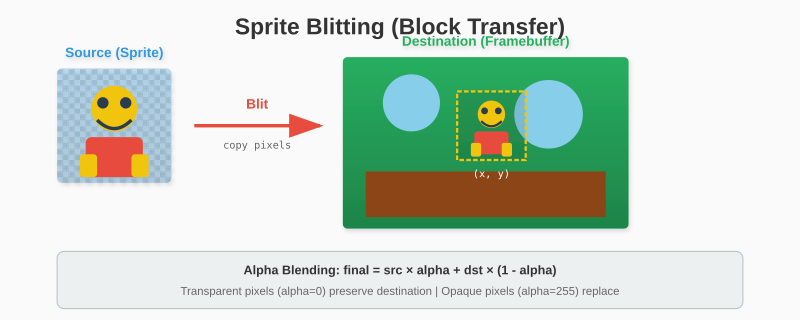
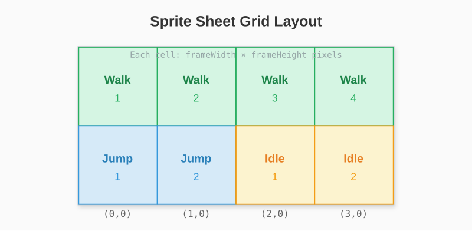

# Chapter 16: Sprites and Images

Drawing primitives is powerful, but games need textures and sprites. This chapter covers loading images, blitting (copying pixel regions), and sprite animation.

## 16.1 Loading Image Files

Go's standard library includes image decoders. We'll support PNG and use it as our primary format.

```go
package glow

import (
    "image"
    "image/png"
    "os"
)

type Image struct {
    Width  int
    Height int
    Pixels []Color
}

func LoadImage(path string) (*Image, error) {
    file, err := os.Open(path)
    if err != nil {
        return nil, err
    }
    defer file.Close()

    img, err := png.Decode(file)
    if err != nil {
        return nil, err
    }

    return imageFromGo(img), nil
}

func imageFromGo(img image.Image) *Image {
    bounds := img.Bounds()
    width := bounds.Dx()
    height := bounds.Dy()

    result := &Image{
        Width:  width,
        Height: height,
        Pixels: make([]Color, width*height),
    }

    for y := 0; y < height; y++ {
        for x := 0; x < width; x++ {
            r, g, b, a := img.At(bounds.Min.X+x, bounds.Min.Y+y).RGBA()
            // RGBA returns 16-bit values, convert to 8-bit
            result.Pixels[y*width+x] = RGBA(
                uint8(r>>8),
                uint8(g>>8),
                uint8(b>>8),
                uint8(a>>8),
            )
        }
    }

    return result
}
```

### Supporting Multiple Formats

```go
import (
    "image"
    _ "image/jpeg"  // Register JPEG decoder
    _ "image/png"   // Register PNG decoder
    "os"
)

func LoadImageAny(path string) (*Image, error) {
    file, err := os.Open(path)
    if err != nil {
        return nil, err
    }
    defer file.Close()

    // image.Decode auto-detects format
    img, _, err := image.Decode(file)
    if err != nil {
        return nil, err
    }

    return imageFromGo(img), nil
}
```

## 16.2 Blitting (Drawing Images)

Blit = Block Transfer. Copy pixels from source to destination.



### Simple Blit

```go
func (c *Canvas) DrawImage(img *Image, x, y int) {
    for sy := 0; sy < img.Height; sy++ {
        for sx := 0; sx < img.Width; sx++ {
            color := img.Pixels[sy*img.Width+sx]
            c.SetPixel(x+sx, y+sy, color)
        }
    }
}
```

### Blit with Alpha

Most sprites have transparency. We need alpha blending:

```go
func (c *Canvas) DrawImageAlpha(img *Image, x, y int) {
    for sy := 0; sy < img.Height; sy++ {
        for sx := 0; sx < img.Width; sx++ {
            srcColor := img.Pixels[sy*img.Width+sx]

            // Skip fully transparent pixels
            if srcColor.A == 0 {
                continue
            }

            // Fully opaque - no blending needed
            if srcColor.A == 255 {
                c.SetPixel(x+sx, y+sy, srcColor)
                continue
            }

            // Alpha blend
            dstColor := c.GetPixel(x+sx, y+sy)
            blended := blendColors(dstColor, srcColor)
            c.SetPixel(x+sx, y+sy, blended)
        }
    }
}

func blendColors(dst, src Color) Color {
    srcAlpha := float64(src.A) / 255.0
    dstAlpha := 1.0 - srcAlpha

    return Color{
        R: uint8(float64(dst.R)*dstAlpha + float64(src.R)*srcAlpha),
        G: uint8(float64(dst.G)*dstAlpha + float64(src.G)*srcAlpha),
        B: uint8(float64(dst.B)*dstAlpha + float64(src.B)*srcAlpha),
        A: 255,
    }
}
```

### Partial Blit (Source Rectangle)

Draw only part of an image (for sprite sheets):

```go
func (c *Canvas) DrawImageRect(img *Image, destX, destY int,
    srcX, srcY, srcW, srcH int) {

    for sy := 0; sy < srcH; sy++ {
        for sx := 0; sx < srcW; sx++ {
            // Source bounds check
            imgX := srcX + sx
            imgY := srcY + sy
            if imgX < 0 || imgX >= img.Width || imgY < 0 || imgY >= img.Height {
                continue
            }

            color := img.Pixels[imgY*img.Width+imgX]
            if color.A == 0 {
                continue
            }

            c.SetPixel(destX+sx, destY+sy, color)
        }
    }
}
```

## 16.3 Sprite Sheets

A sprite sheet packs multiple frames into one image:



```go
type SpriteSheet struct {
    Image      *Image
    FrameWidth  int
    FrameHeight int
    Columns     int
    Rows        int
}

func NewSpriteSheet(img *Image, frameWidth, frameHeight int) *SpriteSheet {
    return &SpriteSheet{
        Image:       img,
        FrameWidth:  frameWidth,
        FrameHeight: frameHeight,
        Columns:     img.Width / frameWidth,
        Rows:        img.Height / frameHeight,
    }
}

func (s *SpriteSheet) GetFrame(index int) (srcX, srcY, srcW, srcH int) {
    col := index % s.Columns
    row := index / s.Columns

    return col * s.FrameWidth,
           row * s.FrameHeight,
           s.FrameWidth,
           s.FrameHeight
}

func (s *SpriteSheet) DrawFrame(canvas *Canvas, index int, x, y int) {
    srcX, srcY, srcW, srcH := s.GetFrame(index)
    canvas.DrawImageRect(s.Image, x, y, srcX, srcY, srcW, srcH)
}
```

## 16.4 Animation

```go
type Animation struct {
    Sheet     *SpriteSheet
    Frames    []int     // Frame indices
    FrameTime float64   // Seconds per frame
    Loop      bool

    // State
    currentFrame int
    elapsed      float64
    finished     bool
}

func NewAnimation(sheet *SpriteSheet, frames []int, fps float64) *Animation {
    return &Animation{
        Sheet:     sheet,
        Frames:    frames,
        FrameTime: 1.0 / fps,
        Loop:      true,
    }
}

func (a *Animation) Update(dt float64) {
    if a.finished {
        return
    }

    a.elapsed += dt

    if a.elapsed >= a.FrameTime {
        a.elapsed -= a.FrameTime
        a.currentFrame++

        if a.currentFrame >= len(a.Frames) {
            if a.Loop {
                a.currentFrame = 0
            } else {
                a.currentFrame = len(a.Frames) - 1
                a.finished = true
            }
        }
    }
}

func (a *Animation) Draw(canvas *Canvas, x, y int) {
    frameIndex := a.Frames[a.currentFrame]
    a.Sheet.DrawFrame(canvas, frameIndex, x, y)
}

func (a *Animation) Reset() {
    a.currentFrame = 0
    a.elapsed = 0
    a.finished = false
}

func (a *Animation) IsFinished() bool {
    return a.finished
}
```

### Using Animations

```go
// Define animations
walkAnim := NewAnimation(sheet, []int{0, 1, 2, 3}, 10)  // 10 FPS
jumpAnim := NewAnimation(sheet, []int{4, 5}, 8)
jumpAnim.Loop = false  // Play once

// In game loop
func (player *Player) Update(dt float64) {
    player.currentAnim.Update(dt)
}

func (player *Player) Draw(canvas *Canvas) {
    player.currentAnim.Draw(canvas, int(player.X), int(player.Y))
}
```

## 16.5 Sprite Transformations

### Horizontal Flip

```go
func (c *Canvas) DrawImageFlipH(img *Image, x, y int) {
    for sy := 0; sy < img.Height; sy++ {
        for sx := 0; sx < img.Width; sx++ {
            // Read from right to left
            srcX := img.Width - 1 - sx
            color := img.Pixels[sy*img.Width+srcX]
            if color.A > 0 {
                c.SetPixel(x+sx, y+sy, color)
            }
        }
    }
}
```

### Vertical Flip

```go
func (c *Canvas) DrawImageFlipV(img *Image, x, y int) {
    for sy := 0; sy < img.Height; sy++ {
        srcY := img.Height - 1 - sy
        for sx := 0; sx < img.Width; sx++ {
            color := img.Pixels[srcY*img.Width+sx]
            if color.A > 0 {
                c.SetPixel(x+sx, y+sy, color)
            }
        }
    }
}
```

### Scaling

Simple nearest-neighbor scaling:

```go
func (c *Canvas) DrawImageScaled(img *Image, x, y, newWidth, newHeight int) {
    xRatio := float64(img.Width) / float64(newWidth)
    yRatio := float64(img.Height) / float64(newHeight)

    for dy := 0; dy < newHeight; dy++ {
        for dx := 0; dx < newWidth; dx++ {
            srcX := int(float64(dx) * xRatio)
            srcY := int(float64(dy) * yRatio)

            color := img.Pixels[srcY*img.Width+srcX]
            if color.A > 0 {
                c.SetPixel(x+dx, y+dy, color)
            }
        }
    }
}
```

### Bilinear Scaling (Smoother)

```go
func (c *Canvas) DrawImageScaledSmooth(img *Image, x, y, newWidth, newHeight int) {
    xRatio := float64(img.Width-1) / float64(newWidth)
    yRatio := float64(img.Height-1) / float64(newHeight)

    for dy := 0; dy < newHeight; dy++ {
        for dx := 0; dx < newWidth; dx++ {
            // Source position (floating point)
            srcX := float64(dx) * xRatio
            srcY := float64(dy) * yRatio

            // Integer parts
            x0 := int(srcX)
            y0 := int(srcY)
            x1 := min(x0+1, img.Width-1)
            y1 := min(y0+1, img.Height-1)

            // Fractional parts
            xFrac := srcX - float64(x0)
            yFrac := srcY - float64(y0)

            // Sample four pixels
            c00 := img.Pixels[y0*img.Width+x0]
            c10 := img.Pixels[y0*img.Width+x1]
            c01 := img.Pixels[y1*img.Width+x0]
            c11 := img.Pixels[y1*img.Width+x1]

            // Bilinear interpolation
            color := bilinear(c00, c10, c01, c11, xFrac, yFrac)
            if color.A > 0 {
                c.SetPixel(x+dx, y+dy, color)
            }
        }
    }
}

func bilinear(c00, c10, c01, c11 Color, xFrac, yFrac float64) Color {
    lerp := func(a, b uint8, t float64) uint8 {
        return uint8(float64(a)*(1-t) + float64(b)*t)
    }

    // Interpolate horizontally
    r0 := lerp(c00.R, c10.R, xFrac)
    g0 := lerp(c00.G, c10.G, xFrac)
    b0 := lerp(c00.B, c10.B, xFrac)
    a0 := lerp(c00.A, c10.A, xFrac)

    r1 := lerp(c01.R, c11.R, xFrac)
    g1 := lerp(c01.G, c11.G, xFrac)
    b1 := lerp(c01.B, c11.B, xFrac)
    a1 := lerp(c01.A, c11.A, xFrac)

    // Interpolate vertically
    return Color{
        R: lerp(r0, r1, yFrac),
        G: lerp(g0, g1, yFrac),
        B: lerp(b0, b1, yFrac),
        A: lerp(a0, a1, yFrac),
    }
}
```

## 16.6 The Sprite Type

Wrap everything in a convenient type:

```go
type Sprite struct {
    Image    *Image
    X, Y     float64
    Width    int
    Height   int
    ScaleX   float64
    ScaleY   float64
    FlipH    bool
    FlipV    bool
    Visible  bool
    Alpha    uint8
}

func NewSprite(img *Image) *Sprite {
    return &Sprite{
        Image:   img,
        Width:   img.Width,
        Height:  img.Height,
        ScaleX:  1.0,
        ScaleY:  1.0,
        Visible: true,
        Alpha:   255,
    }
}

func (s *Sprite) Draw(canvas *Canvas) {
    if !s.Visible || s.Alpha == 0 {
        return
    }

    destW := int(float64(s.Width) * s.ScaleX)
    destH := int(float64(s.Height) * s.ScaleY)

    for dy := 0; dy < destH; dy++ {
        for dx := 0; dx < destW; dx++ {
            // Calculate source position
            srcX := int(float64(dx) / s.ScaleX)
            srcY := int(float64(dy) / s.ScaleY)

            // Apply flips
            if s.FlipH {
                srcX = s.Width - 1 - srcX
            }
            if s.FlipV {
                srcY = s.Height - 1 - srcY
            }

            // Bounds check
            if srcX < 0 || srcX >= s.Image.Width ||
               srcY < 0 || srcY >= s.Image.Height {
                continue
            }

            color := s.Image.Pixels[srcY*s.Image.Width+srcX]

            // Apply sprite alpha
            if s.Alpha < 255 {
                color.A = uint8(int(color.A) * int(s.Alpha) / 255)
            }

            if color.A == 0 {
                continue
            }

            canvas.SetPixel(int(s.X)+dx, int(s.Y)+dy, color)
        }
    }
}
```

## 16.7 Animated Sprite

Combine Sprite with Animation:

```go
type AnimatedSprite struct {
    Sprite
    Animations map[string]*Animation
    Current    string
}

func NewAnimatedSprite(sheet *SpriteSheet) *AnimatedSprite {
    return &AnimatedSprite{
        Sprite: Sprite{
            Width:   sheet.FrameWidth,
            Height:  sheet.FrameHeight,
            ScaleX:  1.0,
            ScaleY:  1.0,
            Visible: true,
            Alpha:   255,
        },
        Animations: make(map[string]*Animation),
    }
}

func (s *AnimatedSprite) AddAnimation(name string, anim *Animation) {
    s.Animations[name] = anim
}

func (s *AnimatedSprite) Play(name string) {
    if s.Current == name {
        return  // Already playing
    }

    if anim, ok := s.Animations[name]; ok {
        s.Current = name
        anim.Reset()
    }
}

func (s *AnimatedSprite) Update(dt float64) {
    if anim, ok := s.Animations[s.Current]; ok {
        anim.Update(dt)
    }
}

func (s *AnimatedSprite) Draw(canvas *Canvas) {
    if !s.Visible {
        return
    }

    if anim, ok := s.Animations[s.Current]; ok {
        // Get current frame
        frameIndex := anim.Frames[anim.currentFrame]
        srcX, srcY, srcW, srcH := anim.Sheet.GetFrame(frameIndex)

        // Draw with sprite transformations
        for dy := 0; dy < srcH; dy++ {
            for dx := 0; dx < srcW; dx++ {
                imgX := srcX + dx
                imgY := srcY + dy

                if s.FlipH {
                    imgX = srcX + srcW - 1 - dx
                }

                color := anim.Sheet.Image.Pixels[imgY*anim.Sheet.Image.Width+imgX]
                if color.A > 0 {
                    canvas.SetPixel(int(s.X)+dx, int(s.Y)+dy, color)
                }
            }
        }
    }
}
```

## 16.8 Example: Character Controller

```go
type Player struct {
    *AnimatedSprite
    VX, VY     float64
    OnGround   bool
    FacingLeft bool
}

func NewPlayer(sheet *SpriteSheet) *Player {
    sprite := NewAnimatedSprite(sheet)

    // Add animations
    sprite.AddAnimation("idle", NewAnimation(sheet, []int{0, 1}, 2))
    sprite.AddAnimation("walk", NewAnimation(sheet, []int{2, 3, 4, 5}, 10))
    sprite.AddAnimation("jump", NewAnimation(sheet, []int{6}, 1))

    sprite.Play("idle")

    return &Player{
        AnimatedSprite: sprite,
    }
}

func (p *Player) Update(dt float64, input *Input) {
    // Horizontal movement
    p.VX = 0
    if input.Left {
        p.VX = -200
        p.FacingLeft = true
    }
    if input.Right {
        p.VX = 200
        p.FacingLeft = false
    }

    // Jumping
    if input.Jump && p.OnGround {
        p.VY = -400
        p.OnGround = false
    }

    // Gravity
    p.VY += 800 * dt

    // Apply velocity
    p.X += p.VX * dt
    p.Y += p.VY * dt

    // Ground check (simple)
    if p.Y > 400 {
        p.Y = 400
        p.VY = 0
        p.OnGround = true
    }

    // Animation selection
    if !p.OnGround {
        p.Play("jump")
    } else if p.VX != 0 {
        p.Play("walk")
    } else {
        p.Play("idle")
    }

    // Flip sprite based on direction
    p.FlipH = p.FacingLeft

    // Update animation
    p.AnimatedSprite.Update(dt)
}
```

---

**Key Takeaways:**

- Load images using Go's `image` package
- Alpha blending combines transparent sprites with backgrounds
- Sprite sheets pack multiple frames efficiently
- Animations sequence through frame indices over time
- Transformations (flip, scale) modify draw coordinates
- AnimatedSprite combines position, animations, and rendering

Sprites bring games to life. Next, we'll add text rendering with bitmap fonts.
