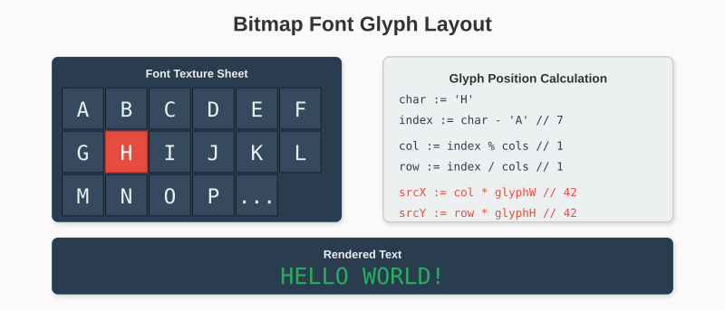

# Chapter 17: Bitmap Fonts

Text is essential for games - scores, menus, dialogue. This chapter implements bitmap fonts, where each character is a small image.

## 17.1 Font Basics

A bitmap font is a sprite sheet where each frame is a character:



## 17.2 Font Structure

```go
package glow

type BitmapFont struct {
    Image      *Image
    CharWidth  int
    CharHeight int
    Columns    int

    // Character mapping
    charset string  // Characters in order they appear in the image
}

func NewBitmapFont(img *Image, charWidth, charHeight int, charset string) *BitmapFont {
    return &BitmapFont{
        Image:      img,
        CharWidth:  charWidth,
        CharHeight: charHeight,
        Columns:    img.Width / charWidth,
        charset:    charset,
    }
}
```

### Standard Character Set

```go
const StandardCharset = "ABCDEFGHIJKLMNOPQRSTUVWXYZ" +
    "abcdefghijklmnopqrstuvwxyz" +
    "0123456789" +
    " .,!?:;'\"()-+*/=<>[]{}@#$%^&_\\|~`"
```

## 17.3 Character Lookup

```go
func (f *BitmapFont) charIndex(c rune) int {
    for i, char := range f.charset {
        if char == c {
            return i
        }
    }
    return -1  // Character not found
}

func (f *BitmapFont) getCharRect(index int) (x, y, w, h int) {
    col := index % f.Columns
    row := index / f.Columns

    return col * f.CharWidth,
           row * f.CharHeight,
           f.CharWidth,
           f.CharHeight
}
```

## 17.4 Drawing Text

```go
func (f *BitmapFont) DrawString(canvas *Canvas, text string, x, y int) {
    cursorX := x

    for _, char := range text {
        // Handle newlines
        if char == '\n' {
            cursorX = x
            y += f.CharHeight
            continue
        }

        index := f.charIndex(char)
        if index >= 0 {
            srcX, srcY, srcW, srcH := f.getCharRect(index)
            canvas.DrawImageRect(f.Image, cursorX, y, srcX, srcY, srcW, srcH)
        }

        cursorX += f.CharWidth
    }
}

func (f *BitmapFont) DrawStringColored(canvas *Canvas, text string, x, y int, color Color) {
    cursorX := x

    for _, char := range text {
        if char == '\n' {
            cursorX = x
            y += f.CharHeight
            continue
        }

        index := f.charIndex(char)
        if index >= 0 {
            srcX, srcY, srcW, srcH := f.getCharRect(index)
            f.drawCharColored(canvas, cursorX, y, srcX, srcY, srcW, srcH, color)
        }

        cursorX += f.CharWidth
    }
}

func (f *BitmapFont) drawCharColored(canvas *Canvas, destX, destY,
    srcX, srcY, srcW, srcH int, tint Color) {

    for dy := 0; dy < srcH; dy++ {
        for dx := 0; dx < srcW; dx++ {
            imgX := srcX + dx
            imgY := srcY + dy

            pixel := f.Image.Pixels[imgY*f.Image.Width+imgX]

            // Skip transparent
            if pixel.A == 0 {
                continue
            }

            // Apply tint (multiply)
            colored := Color{
                R: uint8(int(pixel.R) * int(tint.R) / 255),
                G: uint8(int(pixel.G) * int(tint.G) / 255),
                B: uint8(int(pixel.B) * int(tint.B) / 255),
                A: pixel.A,
            }

            canvas.SetPixel(destX+dx, destY+dy, colored)
        }
    }
}
```

## 17.5 Text Measurement

```go
func (f *BitmapFont) MeasureString(text string) (width, height int) {
    maxWidth := 0
    currentWidth := 0
    lines := 1

    for _, char := range text {
        if char == '\n' {
            if currentWidth > maxWidth {
                maxWidth = currentWidth
            }
            currentWidth = 0
            lines++
            continue
        }
        currentWidth += f.CharWidth
    }

    if currentWidth > maxWidth {
        maxWidth = currentWidth
    }

    return maxWidth, lines * f.CharHeight
}
```

## 17.6 Centered Text

```go
func (f *BitmapFont) DrawStringCentered(canvas *Canvas, text string,
    centerX, centerY int) {

    width, height := f.MeasureString(text)
    x := centerX - width/2
    y := centerY - height/2
    f.DrawString(canvas, text, x, y)
}

func (f *BitmapFont) DrawStringRight(canvas *Canvas, text string,
    rightX, y int) {

    width, _ := f.MeasureString(text)
    f.DrawString(canvas, text, rightX-width, y)
}
```

## 17.7 Variable-Width Fonts

Fixed-width looks mechanical. Variable-width fonts look better:

```go
type VariableFont struct {
    BitmapFont
    CharWidths map[rune]int  // Width of each character
    Spacing    int           // Extra space between characters
}

func NewVariableFont(img *Image, charHeight int, charset string,
    widths map[rune]int) *VariableFont {

    return &VariableFont{
        BitmapFont: BitmapFont{
            Image:      img,
            CharHeight: charHeight,
            charset:    charset,
        },
        CharWidths: widths,
        Spacing:    1,
    }
}

func (f *VariableFont) getCharWidth(c rune) int {
    if w, ok := f.CharWidths[c]; ok {
        return w
    }
    return f.CharWidth  // Default
}

func (f *VariableFont) DrawString(canvas *Canvas, text string, x, y int) {
    cursorX := x

    for _, char := range text {
        if char == '\n' {
            cursorX = x
            y += f.CharHeight
            continue
        }

        index := f.charIndex(char)
        if index >= 0 {
            charWidth := f.getCharWidth(char)
            srcX, srcY := f.getCharPosition(index)
            canvas.DrawImageRect(f.Image, cursorX, y,
                srcX, srcY, charWidth, f.CharHeight)
            cursorX += charWidth + f.Spacing
        }
    }
}

func (f *VariableFont) MeasureString(text string) (width, height int) {
    maxWidth := 0
    currentWidth := 0
    lines := 1

    for i, char := range text {
        if char == '\n' {
            if currentWidth > maxWidth {
                maxWidth = currentWidth
            }
            currentWidth = 0
            lines++
            continue
        }

        currentWidth += f.getCharWidth(char)
        if i < len(text)-1 {
            currentWidth += f.Spacing
        }
    }

    if currentWidth > maxWidth {
        maxWidth = currentWidth
    }

    return maxWidth, lines * f.CharHeight
}
```

## 17.8 Creating Font Images

### Programmatic Font Generation

Create a simple font without external files:

```go
func CreateDefaultFont() *BitmapFont {
    // 5x7 pixel characters, 10 columns
    charWidth := 6   // 5 + 1 spacing
    charHeight := 8  // 7 + 1 spacing
    columns := 16
    rows := 6

    img := &Image{
        Width:  columns * charWidth,
        Height: rows * charHeight,
        Pixels: make([]Color, columns*charWidth*rows*charHeight),
    }

    // Define character bitmaps (5x7 each)
    chars := map[rune][]string{
        'A': {
            " ### ",
            "#   #",
            "#   #",
            "#####",
            "#   #",
            "#   #",
            "#   #",
        },
        'B': {
            "#### ",
            "#   #",
            "#### ",
            "#   #",
            "#   #",
            "#   #",
            "#### ",
        },
        // ... define all characters
    }

    charset := "ABCDEFGHIJKLMNOP" +
               "QRSTUVWXYZ012345" +
               "6789 .,!?:;'-+*/" +
               "()[]<>=abcdefghi" +
               "jklmnopqrstuvwxy" +
               "z"

    // Render characters to image
    for i, char := range charset {
        bitmap, ok := chars[char]
        if !ok {
            continue
        }

        col := i % columns
        row := i / columns
        baseX := col * charWidth
        baseY := row * charHeight

        for y, line := range bitmap {
            for x, pixel := range line {
                if pixel == '#' {
                    idx := (baseY+y)*img.Width + (baseX + x)
                    img.Pixels[idx] = White
                }
            }
        }
    }

    return NewBitmapFont(img, charWidth, charHeight, charset)
}
```

### Complete 5x7 Font Data

```go
var font5x7 = map[rune][]string{
    'A': {"01110", "10001", "10001", "11111", "10001", "10001", "10001"},
    'B': {"11110", "10001", "11110", "10001", "10001", "10001", "11110"},
    'C': {"01110", "10001", "10000", "10000", "10000", "10001", "01110"},
    'D': {"11110", "10001", "10001", "10001", "10001", "10001", "11110"},
    'E': {"11111", "10000", "11110", "10000", "10000", "10000", "11111"},
    'F': {"11111", "10000", "11110", "10000", "10000", "10000", "10000"},
    'G': {"01110", "10001", "10000", "10111", "10001", "10001", "01110"},
    'H': {"10001", "10001", "10001", "11111", "10001", "10001", "10001"},
    'I': {"01110", "00100", "00100", "00100", "00100", "00100", "01110"},
    'J': {"00111", "00010", "00010", "00010", "10010", "10010", "01100"},
    'K': {"10001", "10010", "10100", "11000", "10100", "10010", "10001"},
    'L': {"10000", "10000", "10000", "10000", "10000", "10000", "11111"},
    'M': {"10001", "11011", "10101", "10101", "10001", "10001", "10001"},
    'N': {"10001", "11001", "10101", "10011", "10001", "10001", "10001"},
    'O': {"01110", "10001", "10001", "10001", "10001", "10001", "01110"},
    'P': {"11110", "10001", "10001", "11110", "10000", "10000", "10000"},
    'Q': {"01110", "10001", "10001", "10001", "10101", "10010", "01101"},
    'R': {"11110", "10001", "10001", "11110", "10100", "10010", "10001"},
    'S': {"01110", "10001", "10000", "01110", "00001", "10001", "01110"},
    'T': {"11111", "00100", "00100", "00100", "00100", "00100", "00100"},
    'U': {"10001", "10001", "10001", "10001", "10001", "10001", "01110"},
    'V': {"10001", "10001", "10001", "10001", "10001", "01010", "00100"},
    'W': {"10001", "10001", "10001", "10101", "10101", "11011", "10001"},
    'X': {"10001", "10001", "01010", "00100", "01010", "10001", "10001"},
    'Y': {"10001", "10001", "01010", "00100", "00100", "00100", "00100"},
    'Z': {"11111", "00001", "00010", "00100", "01000", "10000", "11111"},

    '0': {"01110", "10001", "10011", "10101", "11001", "10001", "01110"},
    '1': {"00100", "01100", "00100", "00100", "00100", "00100", "01110"},
    '2': {"01110", "10001", "00001", "00110", "01000", "10000", "11111"},
    '3': {"01110", "10001", "00001", "00110", "00001", "10001", "01110"},
    '4': {"00010", "00110", "01010", "10010", "11111", "00010", "00010"},
    '5': {"11111", "10000", "11110", "00001", "00001", "10001", "01110"},
    '6': {"01110", "10000", "11110", "10001", "10001", "10001", "01110"},
    '7': {"11111", "00001", "00010", "00100", "01000", "01000", "01000"},
    '8': {"01110", "10001", "10001", "01110", "10001", "10001", "01110"},
    '9': {"01110", "10001", "10001", "01111", "00001", "00001", "01110"},

    ' ': {"00000", "00000", "00000", "00000", "00000", "00000", "00000"},
    '.': {"00000", "00000", "00000", "00000", "00000", "01100", "01100"},
    ',': {"00000", "00000", "00000", "00000", "00110", "00100", "01000"},
    '!': {"00100", "00100", "00100", "00100", "00100", "00000", "00100"},
    '?': {"01110", "10001", "00001", "00110", "00100", "00000", "00100"},
    ':': {"00000", "01100", "01100", "00000", "01100", "01100", "00000"},
    '-': {"00000", "00000", "00000", "11111", "00000", "00000", "00000"},
}

func renderFont5x7() *Image {
    // Implementation creates the font image from the data above
    // ...
}
```

## 17.9 Text Effects

### Shadow

```go
func (f *BitmapFont) DrawStringShadow(canvas *Canvas, text string,
    x, y int, textColor, shadowColor Color, offsetX, offsetY int) {

    // Draw shadow first
    f.DrawStringColored(canvas, text, x+offsetX, y+offsetY, shadowColor)
    // Draw text on top
    f.DrawStringColored(canvas, text, x, y, textColor)
}
```

### Outline

```go
func (f *BitmapFont) DrawStringOutline(canvas *Canvas, text string,
    x, y int, textColor, outlineColor Color) {

    // Draw outline in 8 directions
    for dy := -1; dy <= 1; dy++ {
        for dx := -1; dx <= 1; dx++ {
            if dx == 0 && dy == 0 {
                continue
            }
            f.DrawStringColored(canvas, text, x+dx, y+dy, outlineColor)
        }
    }
    // Draw text
    f.DrawStringColored(canvas, text, x, y, textColor)
}
```

### Wave Effect

```go
func (f *BitmapFont) DrawStringWave(canvas *Canvas, text string,
    x, y int, time float64, amplitude, frequency float64) {

    cursorX := x

    for i, char := range text {
        if char == '\n' {
            continue
        }

        // Calculate wave offset
        offset := math.Sin(time*frequency+float64(i)*0.5) * amplitude
        charY := y + int(offset)

        index := f.charIndex(char)
        if index >= 0 {
            srcX, srcY, srcW, srcH := f.getCharRect(index)
            canvas.DrawImageRect(f.Image, cursorX, charY, srcX, srcY, srcW, srcH)
        }

        cursorX += f.CharWidth
    }
}
```

### Typewriter Effect

```go
type TypewriterText struct {
    Text         string
    Font         *BitmapFont
    CharsPerSec  float64
    elapsed      float64
    visibleChars int
    finished     bool
}

func NewTypewriter(text string, font *BitmapFont, cps float64) *TypewriterText {
    return &TypewriterText{
        Text:        text,
        Font:        font,
        CharsPerSec: cps,
    }
}

func (t *TypewriterText) Update(dt float64) {
    if t.finished {
        return
    }

    t.elapsed += dt
    newChars := int(t.elapsed * t.CharsPerSec)

    if newChars > len(t.Text) {
        newChars = len(t.Text)
        t.finished = true
    }

    t.visibleChars = newChars
}

func (t *TypewriterText) Draw(canvas *Canvas, x, y int) {
    visible := t.Text[:t.visibleChars]
    t.Font.DrawString(canvas, visible, x, y)
}

func (t *TypewriterText) Skip() {
    t.visibleChars = len(t.Text)
    t.finished = true
}
```

## 17.10 Usage Example

```go
func main() {
    win, _ := glow.NewWindow("Font Demo", 800, 600)
    defer win.Close()

    // Load or create font
    fontImg, _ := glow.LoadImage("font.png")
    font := glow.NewBitmapFont(fontImg, 8, 8,
        "ABCDEFGHIJKLMNOPQRSTUVWXYZ0123456789 .,!?")

    canvas := win.Canvas()
    time := 0.0

    for win.IsOpen() {
        for e := win.PollEvent(); e != nil; e = win.PollEvent() {
            if _, ok := e.(glow.CloseEvent); ok {
                win.Close()
            }
        }

        time += 0.016

        canvas.Clear(glow.RGB(30, 30, 50))

        // Basic text
        font.DrawString(canvas, "HELLO WORLD", 50, 50)

        // Colored text
        font.DrawStringColored(canvas, "SCORE: 12345", 50, 100, glow.Yellow)

        // Centered text
        font.DrawStringCentered(canvas, "PRESS START", 400, 300)

        // Shadow text
        font.DrawStringShadow(canvas, "GAME OVER", 300, 200,
            glow.White, glow.RGB(50, 50, 50), 2, 2)

        // Wave text
        font.DrawStringWave(canvas, "WAVY TEXT", 50, 400, time, 5, 3)

        win.Display()
    }
}
```

---

**Key Takeaways:**

- Bitmap fonts are sprite sheets of characters
- Character lookup maps runes to sprite indices
- Fixed-width fonts are simple; variable-width look better
- Text measurement enables alignment
- Effects (shadow, outline, wave) add visual interest
- Typewriter effect creates dynamic text reveals

With sprites and fonts, games can have rich visuals and readable text. Next, we'll explore performance optimization with MIT-SHM.
