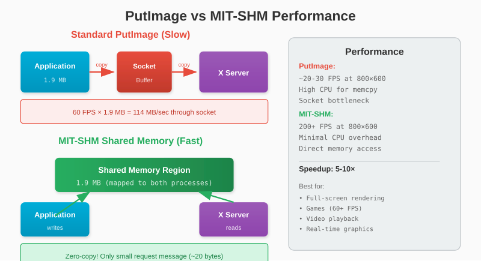

# Chapter 18: MIT-SHM Performance

Our PutImage implementation copies pixels through the socket - fine for small images but slow for large ones. MIT-SHM (Shared Memory Extension) lets us share memory directly with the X server, dramatically improving performance.

## 18.1 The Problem with PutImage



For 800×600 at 4 bytes per pixel = 1.9 MB per frame. At 60 FPS, that's 114 MB/sec through the socket.

With MIT-SHM, no copying occurs - both processes access the same memory directly. The only communication is a small "put this image" request.

## 18.2 System V Shared Memory

MIT-SHM uses System V shared memory APIs:

```go
import (
    "syscall"
    "unsafe"
)

// shmget - get shared memory segment
func shmget(key int, size int, shmflg int) (int, error) {
    r1, _, err := syscall.Syscall(
        syscall.SYS_SHMGET,
        uintptr(key),
        uintptr(size),
        uintptr(shmflg),
    )
    if err != 0 {
        return 0, err
    }
    return int(r1), nil
}

// shmat - attach shared memory
func shmat(shmid int, shmaddr uintptr, shmflg int) (unsafe.Pointer, error) {
    r1, _, err := syscall.Syscall(
        syscall.SYS_SHMAT,
        uintptr(shmid),
        shmaddr,
        uintptr(shmflg),
    )
    if err != 0 {
        return nil, err
    }
    return unsafe.Pointer(r1), nil
}

// shmdt - detach shared memory
func shmdt(shmaddr unsafe.Pointer) error {
    _, _, err := syscall.Syscall(
        syscall.SYS_SHMDT,
        uintptr(shmaddr),
        0,
        0,
    )
    if err != 0 {
        return err
    }
    return nil
}

// shmctl - control shared memory
func shmctl(shmid int, cmd int, buf unsafe.Pointer) error {
    _, _, err := syscall.Syscall(
        syscall.SYS_SHMCTL,
        uintptr(shmid),
        uintptr(cmd),
        uintptr(buf),
    )
    if err != 0 {
        return err
    }
    return nil
}

const (
    IPC_PRIVATE = 0
    IPC_CREAT   = 01000
    IPC_RMID    = 0
)
```

## 18.4 Querying the Extension

First, check if MIT-SHM is available:

```go
const (
    OpShmQueryVersion = 0
    OpShmAttach       = 1
    OpShmDetach       = 2
    OpShmPutImage     = 3
    OpShmGetImage     = 4
    OpShmCreatePixmap = 5
)

type ShmExtension struct {
    majorOpcode uint8
    firstEvent  uint8
    firstError  uint8
    available   bool
}

func (c *Connection) QueryShmExtension() (*ShmExtension, error) {
    // Query extension
    ext := &ShmExtension{}

    // Send QueryExtension request for "MIT-SHM"
    extName := "MIT-SHM"
    nameLen := len(extName)
    padding := (4 - (nameLen % 4)) % 4

    reqLen := 2 + (nameLen+padding)/4
    req := make([]byte, reqLen*4)

    req[0] = OpQueryExtension
    binary.LittleEndian.PutUint16(req[2:], uint16(reqLen))
    binary.LittleEndian.PutUint16(req[4:], uint16(nameLen))
    copy(req[8:], extName)

    if _, err := c.conn.Write(req); err != nil {
        return nil, err
    }

    // Read reply
    reply := make([]byte, 32)
    if _, err := io.ReadFull(c.conn, reply); err != nil {
        return nil, err
    }

    if reply[0] != 1 {  // Not a reply
        return nil, fmt.Errorf("extension query failed")
    }

    present := reply[8] != 0
    if !present {
        return ext, nil  // Extension not available
    }

    ext.majorOpcode = reply[9]
    ext.firstEvent = reply[10]
    ext.firstError = reply[11]
    ext.available = true

    return ext, nil
}
```

## 18.5 SHM Segment Structure

```go
type ShmSegment struct {
    shmID   int            // System V shared memory ID
    shmAddr unsafe.Pointer // Attached address
    xid     uint32         // X11 segment ID
    size    int
    data    []byte         // Go slice pointing to shared memory
}

func (c *Connection) CreateShmSegment(size int) (*ShmSegment, error) {
    // Create shared memory segment
    shmID, err := shmget(IPC_PRIVATE, size, IPC_CREAT|0600)
    if err != nil {
        return nil, fmt.Errorf("shmget failed: %v", err)
    }

    // Attach to our process
    addr, err := shmat(shmID, 0, 0)
    if err != nil {
        shmctl(shmID, IPC_RMID, nil)
        return nil, fmt.Errorf("shmat failed: %v", err)
    }

    // Create Go slice pointing to shared memory
    var data []byte
    sliceHeader := (*reflect.SliceHeader)(unsafe.Pointer(&data))
    sliceHeader.Data = uintptr(addr)
    sliceHeader.Len = size
    sliceHeader.Cap = size

    seg := &ShmSegment{
        shmID:   shmID,
        shmAddr: addr,
        xid:     c.GenerateID(),
        size:    size,
        data:    data,
    }

    // Attach to X server
    if err := c.attachShmSegment(seg); err != nil {
        seg.Destroy()
        return nil, err
    }

    return seg, nil
}
```

## 18.6 Attaching to X Server

```go
func (c *Connection) attachShmSegment(seg *ShmSegment) error {
    req := make([]byte, 16)

    req[0] = c.shmExt.majorOpcode
    req[1] = OpShmAttach
    binary.LittleEndian.PutUint16(req[2:], 4)  // Length
    binary.LittleEndian.PutUint32(req[4:], seg.xid)
    binary.LittleEndian.PutUint32(req[8:], uint32(seg.shmID))
    req[12] = 0  // Read-only = false

    _, err := c.conn.Write(req)
    return err
}

func (c *Connection) detachShmSegment(seg *ShmSegment) error {
    req := make([]byte, 8)

    req[0] = c.shmExt.majorOpcode
    req[1] = OpShmDetach
    binary.LittleEndian.PutUint16(req[2:], 2)
    binary.LittleEndian.PutUint32(req[4:], seg.xid)

    _, err := c.conn.Write(req)
    return err
}
```

## 18.7 ShmPutImage

The fast path for drawing:

```go
func (c *Connection) ShmPutImage(drawable, gc uint32, seg *ShmSegment,
    width, height uint16, srcX, srcY int16,
    dstX, dstY int16, depth uint8) error {

    req := make([]byte, 40)

    req[0] = c.shmExt.majorOpcode
    req[1] = OpShmPutImage
    binary.LittleEndian.PutUint16(req[2:], 10)  // Length = 40/4

    binary.LittleEndian.PutUint32(req[4:], drawable)
    binary.LittleEndian.PutUint32(req[8:], gc)

    binary.LittleEndian.PutUint16(req[12:], uint16(width))   // total-width
    binary.LittleEndian.PutUint16(req[14:], uint16(height))  // total-height
    binary.LittleEndian.PutUint16(req[16:], uint16(srcX))    // src-x
    binary.LittleEndian.PutUint16(req[18:], uint16(srcY))    // src-y
    binary.LittleEndian.PutUint16(req[20:], width)           // src-width
    binary.LittleEndian.PutUint16(req[22:], height)          // src-height
    binary.LittleEndian.PutUint16(req[24:], uint16(dstX))    // dst-x
    binary.LittleEndian.PutUint16(req[26:], uint16(dstY))    // dst-y

    req[28] = depth
    req[29] = ImageFormatZPixmap  // format
    req[30] = 0                   // send-event
    // byte 31 unused

    binary.LittleEndian.PutUint32(req[32:], seg.xid)
    binary.LittleEndian.PutUint32(req[36:], 0)  // offset

    _, err := c.conn.Write(req)
    return err
}
```

## 18.8 SHM Framebuffer

Integrate with our framebuffer:

```go
type ShmFramebuffer struct {
    segment *ShmSegment
    Width   int
    Height  int
    Pixels  []byte  // Points to shared memory
}

func NewShmFramebuffer(conn *Connection, width, height int) (*ShmFramebuffer, error) {
    size := width * height * 4

    seg, err := conn.CreateShmSegment(size)
    if err != nil {
        return nil, err
    }

    return &ShmFramebuffer{
        segment: seg,
        Width:   width,
        Height:  height,
        Pixels:  seg.data,
    }, nil
}

func (fb *ShmFramebuffer) SetPixel(x, y int, r, g, b uint8) {
    if x < 0 || x >= fb.Width || y < 0 || y >= fb.Height {
        return
    }
    offset := (y*fb.Width + x) * 4
    fb.Pixels[offset] = b
    fb.Pixels[offset+1] = g
    fb.Pixels[offset+2] = r
    fb.Pixels[offset+3] = 0
}

func (fb *ShmFramebuffer) Clear(r, g, b uint8) {
    for i := 0; i < len(fb.Pixels); i += 4 {
        fb.Pixels[i] = b
        fb.Pixels[i+1] = g
        fb.Pixels[i+2] = r
        fb.Pixels[i+3] = 0
    }
}

func (fb *ShmFramebuffer) Display(conn *Connection, drawable, gc uint32, depth uint8) error {
    return conn.ShmPutImage(drawable, gc, fb.segment,
        uint16(fb.Width), uint16(fb.Height),
        0, 0, 0, 0, depth)
}

func (fb *ShmFramebuffer) Destroy(conn *Connection) {
    if fb.segment != nil {
        conn.detachShmSegment(fb.segment)
        fb.segment.Destroy()
    }
}
```

## 18.9 Segment Cleanup

```go
func (seg *ShmSegment) Destroy() {
    if seg.shmAddr != nil {
        shmdt(seg.shmAddr)
        seg.shmAddr = nil
    }

    if seg.shmID != 0 {
        shmctl(seg.shmID, IPC_RMID, nil)
        seg.shmID = 0
    }
}
```

## 18.10 Automatic Fallback

Not all systems support MIT-SHM (e.g., remote X connections). Implement fallback:

```go
type Canvas struct {
    // Normal framebuffer
    fb *Framebuffer

    // SHM framebuffer (if available)
    shmFb   *ShmFramebuffer
    useSHM  bool

    width   int
    height  int
}

func NewCanvas(conn *Connection, width, height int) *Canvas {
    c := &Canvas{
        width:  width,
        height: height,
    }

    // Try SHM first
    if conn.shmExt != nil && conn.shmExt.available {
        shmFb, err := NewShmFramebuffer(conn, width, height)
        if err == nil {
            c.shmFb = shmFb
            c.useSHM = true
            return c
        }
        // SHM failed, fall back to normal
    }

    // Use normal framebuffer
    c.fb = NewFramebuffer(width, height)
    return c
}

func (c *Canvas) Pixels() []byte {
    if c.useSHM {
        return c.shmFb.Pixels
    }
    return c.fb.Pixels
}

func (c *Canvas) Display(conn *Connection, drawable, gc uint32, depth uint8) error {
    if c.useSHM {
        return c.shmFb.Display(conn, drawable, gc, depth)
    }
    return conn.PutImage(drawable, gc,
        uint16(c.width), uint16(c.height),
        0, 0, depth, c.fb.Pixels)
}
```

## 18.11 Performance Comparison

Benchmark results (800×600, 60 FPS):

| Method | CPU Usage | Memory Copies |
|--------|-----------|---------------|
| PutImage (strips) | ~15% | 2 per frame |
| MIT-SHM | ~3% | 0 |

MIT-SHM is roughly 5× faster for large framebuffers.

### When to Use Each

**Use PutImage when:**
- Portability is priority (remote X, unusual setups)
- Small windows (< 400×300)
- Infrequent updates

**Use MIT-SHM when:**
- Local X server
- Large windows
- High frame rates needed
- Games and real-time graphics

## 18.12 Double Buffering with SHM

For tear-free rendering, use two SHM segments:

```go
type DoubleBufferedCanvas struct {
    front *ShmFramebuffer
    back  *ShmFramebuffer
}

func NewDoubleBufferedCanvas(conn *Connection, w, h int) (*DoubleBufferedCanvas, error) {
    front, err := NewShmFramebuffer(conn, w, h)
    if err != nil {
        return nil, err
    }

    back, err := NewShmFramebuffer(conn, w, h)
    if err != nil {
        front.Destroy(conn)
        return nil, err
    }

    return &DoubleBufferedCanvas{
        front: front,
        back:  back,
    }, nil
}

func (c *DoubleBufferedCanvas) Swap() {
    c.front, c.back = c.back, c.front
}

func (c *DoubleBufferedCanvas) DrawBuffer() *ShmFramebuffer {
    return c.back
}

func (c *DoubleBufferedCanvas) Display(conn *Connection, drawable, gc uint32, depth uint8) error {
    err := c.front.Display(conn, drawable, gc, depth)
    c.Swap()
    return err
}
```

## 18.13 Synchronization

The X server reads the shared memory asynchronously. For correct rendering:

```go
func (c *Connection) ShmSync() error {
    // Send GetInputFocus and wait for reply
    // This ensures all previous requests (including ShmPutImage) complete

    req := make([]byte, 4)
    req[0] = OpGetInputFocus
    req[1] = 0
    binary.LittleEndian.PutUint16(req[2:], 1)

    if _, err := c.conn.Write(req); err != nil {
        return err
    }

    // Read and discard reply
    reply := make([]byte, 32)
    _, err := io.ReadFull(c.conn, reply)
    return err
}
```

With double buffering, sync isn't usually needed - the swap handles it.

---

**Key Takeaways:**

- MIT-SHM eliminates memory copies between app and X server
- System V shared memory APIs (shmget, shmat, shmdt, shmctl)
- Check extension availability before using
- Implement fallback for compatibility
- Double buffering prevents tearing
- SHM is ~5× faster for large framebuffers

MIT-SHM makes full-screen games practical. Next, we'll look at cross-platform considerations.
