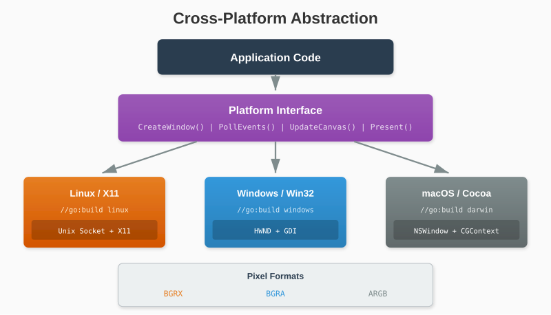

# Chapter 19: Cross-Platform Considerations

Our library works on X11, but what about macOS and Windows? This chapter explores platform abstraction and portability strategies.



## 19.1 Platform Differences

| Feature | X11 (Linux) | Win32 (Windows) | Cocoa (macOS) |
|---------|-------------|-----------------|---------------|
| Window System | X Server | HWND | NSWindow |
| Graphics | PutImage/SHM | GDI/Direct2D | Core Graphics |
| Events | XEvent | MSG | NSEvent |
| Connection | Unix Socket | N/A (in-process) | N/A |

The concepts are similar, but the APIs differ completely.

## 19.2 Abstraction Strategy

Define platform-independent interfaces:

```go
// platform.go
package glow

// Platform abstracts OS-specific functionality
type Platform interface {
    // Window management
    CreateWindow(title string, width, height int) (WindowHandle, error)
    DestroyWindow(handle WindowHandle)
    SetWindowTitle(handle WindowHandle, title string)

    // Event handling
    PollEvents() []Event

    // Graphics
    CreateCanvas(handle WindowHandle, width, height int) (CanvasHandle, error)
    UpdateCanvas(canvas CanvasHandle, pixels []byte)
    Present(canvas CanvasHandle) error

    // Cleanup
    Shutdown()
}

type WindowHandle interface{}
type CanvasHandle interface{}
```

## 19.3 Build Tags

Go's build tags select platform-specific code:

```go
// platform_linux.go
//go:build linux

package glow

type linuxPlatform struct {
    conn *x11.Connection
}

func NewPlatform() Platform {
    return &linuxPlatform{}
}
```

```go
// platform_windows.go
//go:build windows

package glow

type windowsPlatform struct {
    // Win32 handles
}

func NewPlatform() Platform {
    return &windowsPlatform{}
}
```

```go
// platform_darwin.go
//go:build darwin

package glow

type darwinPlatform struct {
    // Cocoa objects
}

func NewPlatform() Platform {
    return &darwinPlatform{}
}
```

## 19.4 Windows Implementation Sketch

Windows uses the Win32 API:

```go
//go:build windows

package glow

import (
    "syscall"
    "unsafe"
)

var (
    user32          = syscall.NewLazyDLL("user32.dll")
    gdi32           = syscall.NewLazyDLL("gdi32.dll")
    kernel32        = syscall.NewLazyDLL("kernel32.dll")

    procCreateWindowExW    = user32.NewProc("CreateWindowExW")
    procDefWindowProcW     = user32.NewProc("DefWindowProcW")
    procDispatchMessageW   = user32.NewProc("DispatchMessageW")
    procGetMessageW        = user32.NewProc("GetMessageW")
    procPeekMessageW       = user32.NewProc("PeekMessageW")
    procRegisterClassExW   = user32.NewProc("RegisterClassExW")
    procTranslateMessage   = user32.NewProc("TranslateMessage")

    procCreateCompatibleDC = gdi32.NewProc("CreateCompatibleDC")
    procCreateDIBSection   = gdi32.NewProc("CreateDIBSection")
    procBitBlt             = gdi32.NewProc("BitBlt")
)

type windowsWindow struct {
    hwnd    syscall.Handle
    hdc     syscall.Handle
    memDC   syscall.Handle
    bitmap  syscall.Handle
    pixels  []byte
    width   int
    height  int
}
```

### Window Creation (Windows)

```go
func (p *windowsPlatform) CreateWindow(title string, width, height int) (WindowHandle, error) {
    // Register window class
    className := syscall.StringToUTF16Ptr("GlowWindow")

    wc := &WNDCLASSEXW{
        cbSize:        uint32(unsafe.Sizeof(WNDCLASSEXW{})),
        style:         CS_HREDRAW | CS_VREDRAW,
        lpfnWndProc:   syscall.NewCallback(windowProc),
        hInstance:     getModuleHandle(),
        lpszClassName: className,
    }
    registerClassEx(wc)

    // Create window
    hwnd, _ := createWindowEx(
        0,
        className,
        syscall.StringToUTF16Ptr(title),
        WS_OVERLAPPEDWINDOW|WS_VISIBLE,
        CW_USEDEFAULT, CW_USEDEFAULT,
        int32(width), int32(height),
        0, 0, getModuleHandle(), nil,
    )

    // Create DIB section for pixel buffer
    hdc := getDC(hwnd)
    memDC := createCompatibleDC(hdc)

    bmi := &BITMAPINFO{
        bmiHeader: BITMAPINFOHEADER{
            biSize:        uint32(unsafe.Sizeof(BITMAPINFOHEADER{})),
            biWidth:       int32(width),
            biHeight:      -int32(height),  // Top-down
            biPlanes:      1,
            biBitCount:    32,
            biCompression: BI_RGB,
        },
    }

    var pixelPtr unsafe.Pointer
    bitmap := createDIBSection(memDC, bmi, DIB_RGB_COLORS, &pixelPtr, 0, 0)
    selectObject(memDC, bitmap)

    // Create Go slice pointing to pixel data
    var pixels []byte
    sh := (*reflect.SliceHeader)(unsafe.Pointer(&pixels))
    sh.Data = uintptr(pixelPtr)
    sh.Len = width * height * 4
    sh.Cap = sh.Len

    return &windowsWindow{
        hwnd:   hwnd,
        hdc:    hdc,
        memDC:  memDC,
        bitmap: bitmap,
        pixels: pixels,
        width:  width,
        height: height,
    }, nil
}
```

### Drawing (Windows)

```go
func (w *windowsWindow) Present() error {
    // BitBlt from memory DC to window DC
    bitBlt(w.hdc, 0, 0, int32(w.width), int32(w.height),
           w.memDC, 0, 0, SRCCOPY)
    return nil
}
```

## 19.5 macOS Implementation Sketch

macOS requires Objective-C interop via cgo:

```go
//go:build darwin

package glow

/*
#cgo CFLAGS: -x objective-c
#cgo LDFLAGS: -framework Cocoa

#import <Cocoa/Cocoa.h>

void* createWindow(const char* title, int width, int height);
void* createBitmapContext(int width, int height);
void updateWindow(void* window, void* context);
int pollEvents(void* window);
*/
import "C"

import "unsafe"

type darwinWindow struct {
    nsWindow unsafe.Pointer
    context  unsafe.Pointer
    width    int
    height   int
}

func (p *darwinPlatform) CreateWindow(title string, width, height int) (WindowHandle, error) {
    cTitle := C.CString(title)
    defer C.free(unsafe.Pointer(cTitle))

    nsWindow := C.createWindow(cTitle, C.int(width), C.int(height))
    context := C.createBitmapContext(C.int(width), C.int(height))

    return &darwinWindow{
        nsWindow: nsWindow,
        context:  context,
        width:    width,
        height:   height,
    }, nil
}
```

### Objective-C Bridge

```objc
// platform_darwin.m
#import <Cocoa/Cocoa.h>

void* createWindow(const char* title, int width, int height) {
    @autoreleasepool {
        NSRect frame = NSMakeRect(100, 100, width, height);
        NSWindow* window = [[NSWindow alloc]
            initWithContentRect:frame
            styleMask:NSWindowStyleMaskTitled |
                      NSWindowStyleMaskClosable |
                      NSWindowStyleMaskResizable
            backing:NSBackingStoreBuffered
            defer:NO];

        [window setTitle:[NSString stringWithUTF8String:title]];
        [window makeKeyAndOrderFront:nil];

        return (__bridge_retained void*)window;
    }
}

void* createBitmapContext(int width, int height) {
    CGColorSpaceRef colorSpace = CGColorSpaceCreateDeviceRGB();
    CGContextRef context = CGBitmapContextCreate(
        NULL,            // Let system allocate
        width, height,
        8,               // Bits per component
        width * 4,       // Bytes per row
        colorSpace,
        kCGImageAlphaPremultipliedFirst | kCGBitmapByteOrder32Little
    );
    CGColorSpaceRelease(colorSpace);
    return context;
}
```

## 19.6 Unified Window Type

Hide platform details behind a consistent API:

```go
// window.go
package glow

type Window struct {
    platform Platform
    handle   WindowHandle
    canvas   *Canvas
    width    int
    height   int
    open     bool
}

func NewWindow(title string, width, height int) (*Window, error) {
    platform := NewPlatform()

    handle, err := platform.CreateWindow(title, width, height)
    if err != nil {
        return nil, err
    }

    canvasHandle, err := platform.CreateCanvas(handle, width, height)
    if err != nil {
        platform.DestroyWindow(handle)
        return nil, err
    }

    return &Window{
        platform: platform,
        handle:   handle,
        canvas:   newCanvasFromHandle(canvasHandle, width, height),
        width:    width,
        height:   height,
        open:     true,
    }, nil
}

func (w *Window) Close() {
    if !w.open {
        return
    }
    w.open = false
    w.platform.DestroyWindow(w.handle)
}

func (w *Window) IsOpen() bool {
    return w.open
}

func (w *Window) Canvas() *Canvas {
    return w.canvas
}

func (w *Window) Display() error {
    return w.platform.Present(w.canvas.handle)
}

func (w *Window) PollEvent() Event {
    events := w.platform.PollEvents()
    if len(events) > 0 {
        return events[0]
    }
    return nil
}
```

## 19.7 Event Translation

Each platform has different event structures. Translate to common types:

```go
// events.go (platform-independent)

type Event interface {
    isEvent()
}

type KeyEvent struct {
    Key     Key
    Pressed bool
    Shift   bool
    Ctrl    bool
    Alt     bool
}

// events_linux.go
func translateX11Event(xe x11.Event) Event {
    switch e := xe.(type) {
    case x11.KeyEvent:
        return KeyEvent{
            Key:     translateX11Key(e.Keycode),
            Pressed: e.EventType == x11.EventKeyPress,
            Shift:   e.State&x11.ShiftMask != 0,
            // ...
        }
    }
    return nil
}

// events_windows.go
func translateWin32Event(msg *MSG) Event {
    switch msg.message {
    case WM_KEYDOWN:
        return KeyEvent{
            Key:     translateVirtualKey(msg.wParam),
            Pressed: true,
            // ...
        }
    }
    return nil
}
```

## 19.8 Key Code Translation

Each platform uses different key codes:

```go
// keys_linux.go
func translateX11Key(code uint8) Key {
    switch code {
    case 9:
        return KeyEscape
    case 36:
        return KeyEnter
    // ...
    }
    return KeyUnknown
}

// keys_windows.go
func translateVirtualKey(vk uintptr) Key {
    switch vk {
    case VK_ESCAPE:
        return KeyEscape
    case VK_RETURN:
        return KeyEnter
    // ...
    }
    return KeyUnknown
}

// keys_darwin.go
func translateMacKey(code uint16) Key {
    switch code {
    case 53:  // kVK_Escape
        return KeyEscape
    case 36:  // kVK_Return
        return KeyEnter
    // ...
    }
    return KeyUnknown
}
```

## 19.9 Pixel Format Differences

Different platforms expect different pixel layouts:

| Platform | Format | Byte Order |
|----------|--------|------------|
| X11 | BGRX | Little-endian |
| Windows | BGRA | Little-endian |
| macOS | ARGB | Big-endian (premultiplied) |

Abstract this in the Canvas:

```go
type Canvas struct {
    pixels []byte
    width  int
    height int
    format PixelFormat
}

type PixelFormat int

const (
    FormatBGRX PixelFormat = iota  // X11
    FormatBGRA                      // Windows
    FormatARGB                      // macOS
)

func (c *Canvas) SetPixel(x, y int, color Color) {
    if x < 0 || x >= c.width || y < 0 || y >= c.height {
        return
    }

    offset := (y*c.width + x) * 4

    switch c.format {
    case FormatBGRX:
        c.pixels[offset] = color.B
        c.pixels[offset+1] = color.G
        c.pixels[offset+2] = color.R
        c.pixels[offset+3] = 0

    case FormatBGRA:
        c.pixels[offset] = color.B
        c.pixels[offset+1] = color.G
        c.pixels[offset+2] = color.R
        c.pixels[offset+3] = color.A

    case FormatARGB:
        // Premultiplied alpha
        alpha := float64(color.A) / 255.0
        c.pixels[offset] = color.A
        c.pixels[offset+1] = uint8(float64(color.R) * alpha)
        c.pixels[offset+2] = uint8(float64(color.G) * alpha)
        c.pixels[offset+3] = uint8(float64(color.B) * alpha)
    }
}
```

## 19.10 Wayland Considerations

Modern Linux increasingly uses Wayland instead of X11. Options:

1. **XWayland**: X11 compatibility layer (our code works)
2. **Native Wayland**: Requires libwayland client code
3. **Both**: Detect and use available backend

```go
// platform_linux.go

func NewPlatform() Platform {
    // Check for Wayland
    if os.Getenv("WAYLAND_DISPLAY") != "" {
        // Try native Wayland first
        if wayland, err := newWaylandPlatform(); err == nil {
            return wayland
        }
    }

    // Fall back to X11 (works on XWayland too)
    if x11, err := newX11Platform(); err == nil {
        return x11
    }

    panic("no display server available")
}
```

## 19.11 Testing Across Platforms

### Continuous Integration

```yaml
# .github/workflows/test.yml
name: Tests

on: [push, pull_request]

jobs:
  test-linux:
    runs-on: ubuntu-latest
    steps:
      - uses: actions/checkout@v3
      - uses: actions/setup-go@v4
        with:
          go-version: '1.21'
      - name: Install X11 dev
        run: sudo apt-get install -y xvfb libx11-dev
      - name: Test
        run: xvfb-run go test ./...

  test-windows:
    runs-on: windows-latest
    steps:
      - uses: actions/checkout@v3
      - uses: actions/setup-go@v4
      - name: Test
        run: go test ./...

  test-macos:
    runs-on: macos-latest
    steps:
      - uses: actions/checkout@v3
      - uses: actions/setup-go@v4
      - name: Test
        run: go test ./...
```

### Virtual Framebuffer Testing

For headless testing:

```go
// platform_test.go
//go:build testing

package glow

type testPlatform struct {
    windows map[WindowHandle]*testWindow
    events  []Event
}

func NewPlatform() Platform {
    return &testPlatform{
        windows: make(map[WindowHandle]*testWindow),
    }
}

func (p *testPlatform) CreateWindow(title string, w, h int) (WindowHandle, error) {
    tw := &testWindow{
        title:  title,
        width:  w,
        height: h,
        pixels: make([]byte, w*h*4),
    }
    p.windows[tw] = tw
    return tw, nil
}

// Inject test events
func (p *testPlatform) InjectEvent(e Event) {
    p.events = append(p.events, e)
}
```

## 19.12 File Structure


---

**Key Takeaways:**

- Define platform-independent interfaces
- Use build tags to select implementations
- Each platform has unique windowing, graphics, and event APIs
- Pixel formats differ between platforms
- Event and key codes need translation tables
- CI testing ensures cross-platform correctness
- Wayland is the future on Linux but XWayland provides compatibility

Cross-platform support multiplies your audience. With this foundation, the library can run anywhere.
