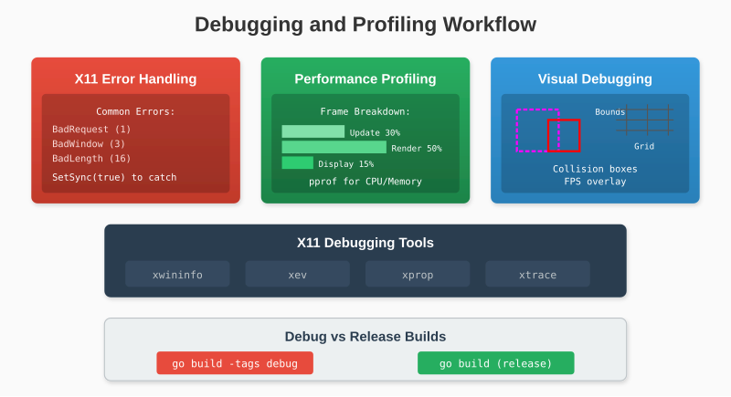

# Chapter 20: Debugging and Profiling

Graphics programming has unique debugging challenges. This chapter covers tools and techniques for finding bugs and optimizing performance.



## 20.1 Common X11 Errors

### Error Codes

When X11 rejects a request, it sends an error event:

```go
type ErrorEvent struct {
    ErrorCode   uint8
    SequenceNum uint16
    BadValue    uint32
    MinorOpcode uint16
    MajorOpcode uint8
}
```

Common error codes:

| Code | Name | Meaning |
|------|------|---------|
| 1 | BadRequest | Invalid request |
| 2 | BadValue | Invalid parameter value |
| 3 | BadWindow | Invalid window ID |
| 4 | BadPixmap | Invalid pixmap ID |
| 8 | BadMatch | Incompatible arguments |
| 9 | BadDrawable | Invalid drawable |
| 10 | BadAccess | Permission denied |
| 11 | BadAlloc | Out of resources |
| 14 | BadIDChoice | Invalid resource ID |
| 16 | BadLength | Request too large |

### Decoding Errors

```go
func decodeError(e ErrorEvent) string {
    opcodeNames := map[uint8]string{
        1:  "CreateWindow",
        2:  "ChangeWindowAttributes",
        55: "CreateGC",
        60: "FreeGC",
        72: "PutImage",
        // ...
    }

    errorNames := map[uint8]string{
        1:  "BadRequest",
        2:  "BadValue",
        3:  "BadWindow",
        16: "BadLength",
        // ...
    }

    opName := opcodeNames[e.MajorOpcode]
    errName := errorNames[e.ErrorCode]

    return fmt.Sprintf("%s error in %s: bad value 0x%X",
        errName, opName, e.BadValue)
}
```

### The BadLength Trap

We encountered this with PutImage:

```
BadLength error in PutImage: bad value 0x0
```

This meant our request exceeded the 262KB limit. The fix was splitting into strips.

## 20.2 Synchronous Mode

X11 normally buffers requests asynchronously. For debugging, force synchronous operation:

```go
func (c *Connection) SetSync(sync bool) {
    c.synchronous = sync
}

func (c *Connection) Write(data []byte) error {
    _, err := c.conn.Write(data)
    if err != nil {
        return err
    }

    if c.synchronous {
        return c.Sync()
    }
    return nil
}

func (c *Connection) Sync() error {
    // GetInputFocus generates a reply
    req := make([]byte, 4)
    req[0] = OpGetInputFocus
    binary.LittleEndian.PutUint16(req[2:], 1)

    if _, err := c.conn.Write(req); err != nil {
        return err
    }

    // Read reply - any errors pending will be delivered first
    reply := make([]byte, 32)
    if _, err := io.ReadFull(c.conn, reply); err != nil {
        return err
    }

    if reply[0] == 0 {  // Error
        return parseError(reply)
    }

    return nil
}
```

Use during development:

```go
conn, _ := x11.Connect()
conn.SetSync(true)  // Catch errors immediately
```

## 20.3 Request Logging

Log all X11 requests for debugging:

```go
type LoggingConnection struct {
    *Connection
    logger *log.Logger
}

func (c *LoggingConnection) Write(data []byte) error {
    opcode := data[0]
    length := binary.LittleEndian.Uint16(data[2:]) * 4

    c.logger.Printf("X11 Request: opcode=%d (%s) length=%d",
        opcode, opcodeName(opcode), length)

    if opcode == OpPutImage {
        width := binary.LittleEndian.Uint16(data[12:])
        height := binary.LittleEndian.Uint16(data[14:])
        c.logger.Printf("  PutImage: %dx%d", width, height)
    }

    return c.Connection.Write(data)
}
```

## 20.4 Visual Debugging

### Boundary Boxes

Draw rectangles around objects to see their bounds:

```go
func debugDrawBounds(canvas *Canvas, x, y, w, h int) {
    canvas.DrawRectOutline(x, y, w, h, RGB(255, 0, 255))  // Magenta
}

// In game loop
player.Draw(canvas)
debugDrawBounds(canvas, player.X, player.Y, player.Width, player.Height)
```

### Collision Visualization

```go
func debugDrawCollision(canvas *Canvas, a, b *Rect, colliding bool) {
    color := RGB(0, 255, 0)  // Green = no collision
    if colliding {
        color = RGB(255, 0, 0)  // Red = collision
    }

    canvas.DrawRectOutline(a.X, a.Y, a.W, a.H, color)
    canvas.DrawRectOutline(b.X, b.Y, b.W, b.H, color)
}
```

### Grid Overlay

```go
func debugDrawGrid(canvas *Canvas, cellSize int) {
    color := RGB(50, 50, 50)

    for x := 0; x < canvas.Width(); x += cellSize {
        canvas.DrawLine(x, 0, x, canvas.Height(), color)
    }
    for y := 0; y < canvas.Height(); y += cellSize {
        canvas.DrawLine(0, y, canvas.Width(), y, color)
    }
}
```

## 20.5 Performance Metrics

### Frame Time Tracking

```go
type FrameTimer struct {
    times     []time.Duration
    index     int
    lastFrame time.Time
}

func NewFrameTimer(samples int) *FrameTimer {
    return &FrameTimer{
        times:     make([]time.Duration, samples),
        lastFrame: time.Now(),
    }
}

func (ft *FrameTimer) Tick() {
    now := time.Now()
    ft.times[ft.index] = now.Sub(ft.lastFrame)
    ft.index = (ft.index + 1) % len(ft.times)
    ft.lastFrame = now
}

func (ft *FrameTimer) AverageMS() float64 {
    var total time.Duration
    for _, t := range ft.times {
        total += t
    }
    return float64(total.Milliseconds()) / float64(len(ft.times))
}

func (ft *FrameTimer) FPS() float64 {
    avg := ft.AverageMS()
    if avg == 0 {
        return 0
    }
    return 1000.0 / avg
}
```

### Displaying Stats

```go
func drawDebugOverlay(canvas *Canvas, font *BitmapFont, ft *FrameTimer) {
    // Semi-transparent background
    canvas.DrawRect(5, 5, 150, 60, RGBA(0, 0, 0, 180))

    // Stats
    fps := fmt.Sprintf("FPS: %.1f", ft.FPS())
    ms := fmt.Sprintf("Frame: %.2fms", ft.AverageMS())

    font.DrawString(canvas, fps, 10, 10)
    font.DrawString(canvas, ms, 10, 25)
}
```

## 20.6 Memory Profiling

### Go's Built-in Profiler

```go
import _ "net/http/pprof"
import "net/http"

func main() {
    // Start pprof server
    go func() {
        http.ListenAndServe("localhost:6060", nil)
    }()

    // ... game code
}
```

Access at `http://localhost:6060/debug/pprof/`

### Tracking Allocations

```go
func trackAllocs(label string) func() {
    var before runtime.MemStats
    runtime.ReadMemStats(&before)

    return func() {
        var after runtime.MemStats
        runtime.ReadMemStats(&after)

        allocs := after.TotalAlloc - before.TotalAlloc
        fmt.Printf("%s: %d bytes allocated\n", label, allocs)
    }
}

// Usage
func gameLoop() {
    done := trackAllocs("frame")
    defer done()

    // ... frame code
}
```

### Reducing Allocations

Common culprits:

```go
// BAD: Allocates every frame
func (p *Particle) Update(dt float64) {
    velocity := []float64{p.VX * dt, p.VY * dt}  // Slice allocation!
    p.X += velocity[0]
    p.Y += velocity[1]
}

// GOOD: No allocations
func (p *Particle) Update(dt float64) {
    p.X += p.VX * dt
    p.Y += p.VY * dt
}
```

```go
// BAD: String formatting allocates
func draw() {
    text := fmt.Sprintf("Score: %d", score)  // Allocates!
    font.DrawString(canvas, text, 10, 10)
}

// GOOD: Pre-format or cache
var scoreText = "Score: "
var scoreBuffer [20]byte

func draw() {
    n := copy(scoreBuffer[:], scoreText)
    n += strconv.AppendInt(scoreBuffer[n:n], int64(score), 10)
    font.DrawString(canvas, string(scoreBuffer[:n]), 10, 10)
}
```

## 20.7 CPU Profiling

### Using pprof

```bash
go tool pprof http://localhost:6060/debug/pprof/profile?seconds=30
```

Then in pprof:
```
(pprof) top
(pprof) list functionName
(pprof) web  # Opens flame graph
```

### Manual Timing

```go
func timeFunction(name string, fn func()) {
    start := time.Now()
    fn()
    elapsed := time.Since(start)
    fmt.Printf("%s: %v\n", name, elapsed)
}

// Usage
timeFunction("render", func() {
    canvas.Clear(Black)
    game.Draw(canvas)
})
```

### Frame Breakdown

```go
type FrameProfile struct {
    Events   time.Duration
    Update   time.Duration
    Render   time.Duration
    Display  time.Duration
}

func (fp *FrameProfile) String() string {
    total := fp.Events + fp.Update + fp.Render + fp.Display
    return fmt.Sprintf("Events: %v (%.1f%%)\n"+
        "Update: %v (%.1f%%)\n"+
        "Render: %v (%.1f%%)\n"+
        "Display: %v (%.1f%%)",
        fp.Events, 100*float64(fp.Events)/float64(total),
        fp.Update, 100*float64(fp.Update)/float64(total),
        fp.Render, 100*float64(fp.Render)/float64(total),
        fp.Display, 100*float64(fp.Display)/float64(total))
}
```

## 20.8 Common Performance Issues

### Issue: Slow Clear

```go
// Slow: Iterates pixel by pixel
func (fb *Framebuffer) Clear(r, g, b uint8) {
    for i := 0; i < len(fb.Pixels); i += 4 {
        fb.Pixels[i] = b
        fb.Pixels[i+1] = g
        fb.Pixels[i+2] = r
        fb.Pixels[i+3] = 0
    }
}

// Fast: Uses copy doubling
func (fb *Framebuffer) Clear(r, g, b uint8) {
    fb.Pixels[0] = b
    fb.Pixels[1] = g
    fb.Pixels[2] = r
    fb.Pixels[3] = 0

    for filled := 4; filled < len(fb.Pixels); filled *= 2 {
        copy(fb.Pixels[filled:], fb.Pixels[:filled])
    }
}
```

### Issue: Too Many Draw Calls

```go
// Slow: SetPixel per particle
for _, p := range particles {
    canvas.SetPixel(int(p.X), int(p.Y), p.Color)
}

// Faster: Direct pixel array access
pixels := canvas.Pixels()
for _, p := range particles {
    x, y := int(p.X), int(p.Y)
    if x >= 0 && x < width && y >= 0 && y < height {
        offset := (y*width + x) * 4
        pixels[offset] = p.Color.B
        pixels[offset+1] = p.Color.G
        pixels[offset+2] = p.Color.R
    }
}
```

### Issue: Unnecessary Bounds Checks

```go
// Slow: Bounds check every pixel
for y := 0; y < height; y++ {
    for x := 0; x < width; x++ {
        canvas.SetPixel(x, y, color)  // Includes bounds check
    }
}

// Fast: Check once, direct access
if width <= canvas.Width() && height <= canvas.Height() {
    pixels := canvas.Pixels()
    for y := 0; y < height; y++ {
        offset := y * canvas.Width() * 4
        for x := 0; x < width; x++ {
            pixels[offset] = color.B
            pixels[offset+1] = color.G
            pixels[offset+2] = color.R
            offset += 4
        }
    }
}
```

## 20.9 Debugging Tools

### xwininfo

```bash
xwininfo -name "My Game"
```

Shows window geometry, depth, visual info.

### xev

```bash
xev -id 0x12345678
```

Displays all events for a window.

### xprop

```bash
xprop -name "My Game"
```

Shows window properties (title, protocols, etc.).

### xtrace

```bash
xtrace ./mygame
```

Logs all X11 protocol traffic.

## 20.10 Debug Build vs Release

```go
// debug.go
//go:build debug

package glow

const DebugMode = true

func debugLog(format string, args ...interface{}) {
    log.Printf("[DEBUG] "+format, args...)
}
```

```go
// debug_release.go
//go:build !debug

package glow

const DebugMode = false

func debugLog(format string, args ...interface{}) {
    // No-op in release
}
```

Build with debug:
```bash
go build -tags debug
```

---

**Key Takeaways:**

- X11 errors include opcode and bad value for diagnosis
- Synchronous mode catches errors immediately
- Visual debugging shows bounds and collisions
- Frame timing identifies performance bottlenecks
- Go's pprof helps find CPU and memory issues
- Direct pixel access beats SetPixel for bulk operations
- Build tags enable debug-only code

With these debugging tools, you can find and fix issues efficiently.
