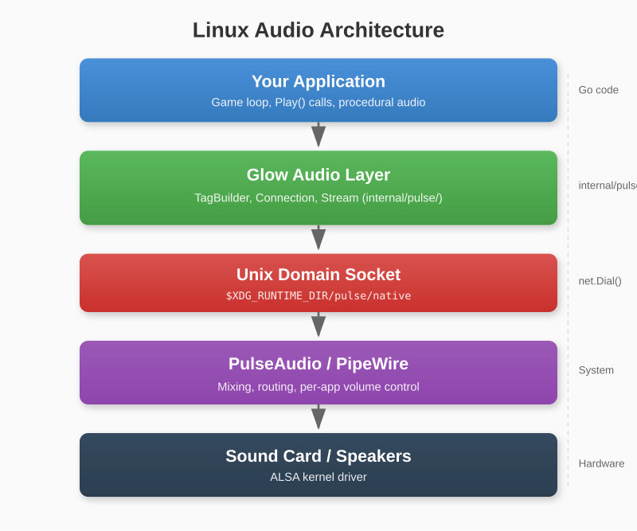
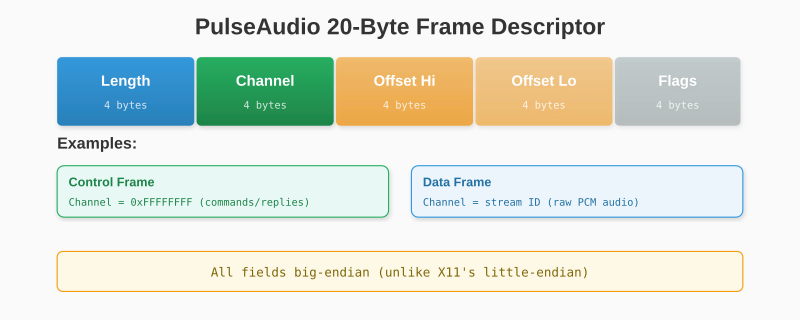
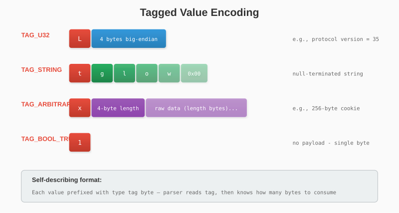
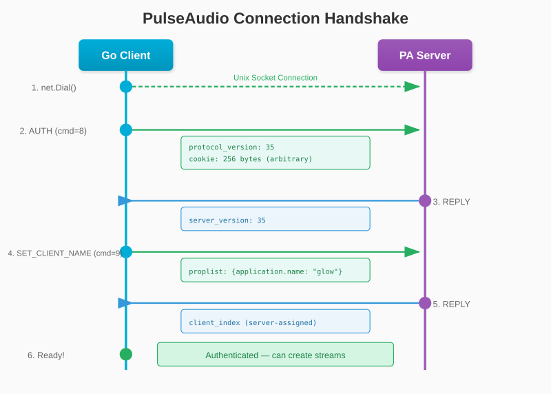
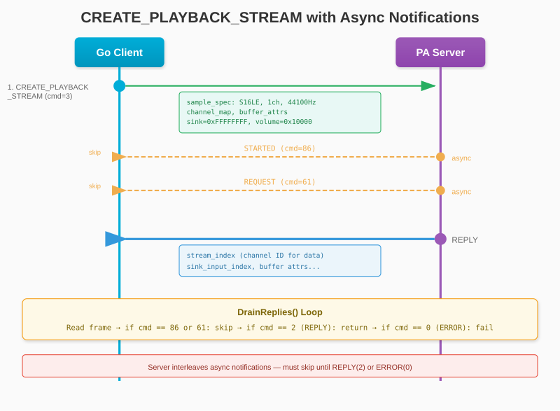
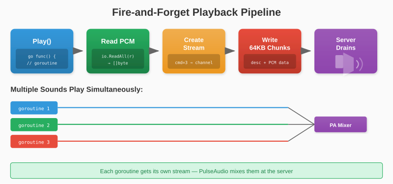
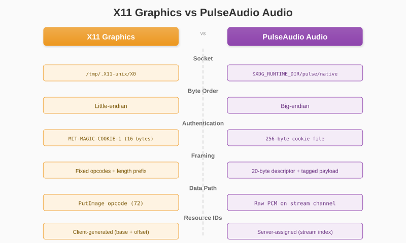

# Chapter 21: Audio — PulseAudio Native Protocol

In the previous chapters we built graphics using X11's binary protocol over Unix sockets. Now we apply the exact same technique to audio, implementing the PulseAudio native protocol to play sound — pure Go, zero dependencies, no CGo.

## 21.1 Audio on Linux

Linux audio has a layered architecture:

1. **ALSA** (kernel): Hardware driver interface
2. **PulseAudio** or **PipeWire** (user-space): Mixing, routing, per-application volume
3. **Applications**: Connect to the user-space server



Most modern Linux systems run PipeWire, which exposes a PulseAudio-compatible Unix socket. By implementing the PulseAudio native protocol, we cover both.

### Why Not ALSA Directly?

ALSA requires complex ioctl calls to configure PCM hardware parameters (sample format, buffer size, period size). It also provides exclusive device access — only one application can use the sound card at a time without a mixing server.

### Why Not an External Library?

Libraries like `oto` or `portaudio` use CGo to call C libraries (`libasound2`, `libpulse`). This:

- Breaks Glow's zero-dependency philosophy
- Requires `-dev` packages at build time
- Complicates cross-compilation

The PulseAudio native protocol is straightforward enough to implement directly.

## 21.2 PulseAudio Protocol Overview

### Connection

The PulseAudio server listens on a Unix domain socket:

```
$XDG_RUNTIME_DIR/pulse/native
```

Typically `/run/user/1000/pulse/native`. This is analogous to X11's `/tmp/.X11-unix/X0`.

### Authentication

Instead of X11's `.Xauthority` file, PulseAudio uses a 256-byte cookie:

| Search Order | Path |
|---|---|
| 1 | `$PULSE_COOKIE` |
| 2 | `~/.config/pulse/cookie` |
| 3 | `~/.pulse-cookie` |

PipeWire accepts a zero-filled cookie (anonymous authentication), so we fall back to zeros if no cookie file is found.

### Byte Order

Unlike X11 (little-endian), the PulseAudio protocol uses **big-endian** for all multi-byte values. This is an important distinction.

### Frame Structure

Every message has a 20-byte descriptor header followed by the payload:

```
Descriptor (20 bytes):
┌──────────┬──────────┬───────────┬───────────┬──────────┐
│  Length   │ Channel  │ Offset Hi │ Offset Lo │  Flags   │
│  4 bytes  │ 4 bytes  │  4 bytes  │  4 bytes  │ 4 bytes  │
└──────────┴──────────┴───────────┴───────────┴──────────┘

Payload (Length bytes):
[tagged values or raw PCM data]
```



- **Channel = 0xFFFFFFFF**: Control message (commands and replies)
- **Channel = stream ID**: Raw PCM audio data

### Tagged Protocol

Control messages use a tagged format. Each value starts with a single-byte type tag:

```go
const (
    TagU32        = 'L'  // 4-byte big-endian uint32
    TagS64        = 'R'  // 8-byte big-endian int64
    TagString     = 't'  // null-terminated string
    TagStringNull = 'N'  // null/empty marker
    TagBoolTrue   = '1'  // no payload
    TagBoolFalse  = '0'  // no payload
    TagArbitrary  = 'x'  // 4-byte length + raw data
    TagSampleSpec = 'a'  // format(1) + channels(1) + rate(4)
    TagChannelMap = 'm'  // channels(1) + position bytes
    TagCVolume    = 'v'  // channels(1) + 4 bytes per channel
    TagPropList   = 'P'  // key-value pairs, terminated by TagStringNull
)
```



This is more structured than X11's flat binary format, making it easier to extend.

## 21.3 Implementation

### File Structure

```
glow/
├── audio.go                 # Public API
└── internal/pulse/
    ├── protocol.go          # Constants, TagBuilder, TagParser
    ├── auth.go              # Cookie reading
    ├── conn.go              # Socket, handshake
    └── stream.go            # Playback streams
```

### TagBuilder and TagParser

We need a way to build and parse tagged payloads. The `TagBuilder` appends tagged values:

```go
type TagBuilder struct {
    buf []byte
}

func (tb *TagBuilder) AddU32(v uint32) {
    tb.buf = append(tb.buf, TagU32)
    b := make([]byte, 4)
    binary.BigEndian.PutUint32(b, v)
    tb.buf = append(tb.buf, b...)
}

func (tb *TagBuilder) AddString(s string) {
    tb.buf = append(tb.buf, TagString)
    tb.buf = append(tb.buf, []byte(s)...)
    tb.buf = append(tb.buf, 0) // null terminator
}

func (tb *TagBuilder) AddArbitrary(data []byte) {
    tb.buf = append(tb.buf, TagArbitrary)
    b := make([]byte, 4)
    binary.BigEndian.PutUint32(b, uint32(len(data)))
    tb.buf = append(tb.buf, b...)
    tb.buf = append(tb.buf, data...)
}
```

The `TagParser` reads values back from server replies with type checking:

```go
type TagParser struct {
    data []byte
    pos  int
}

func (tp *TagParser) ReadU32() (uint32, error) {
    if tp.data[tp.pos] != TagU32 {
        return 0, fmt.Errorf("expected TAG_U32, got 0x%02x", tp.data[tp.pos])
    }
    tp.pos++
    v := binary.BigEndian.Uint32(tp.data[tp.pos:])
    tp.pos += 4
    return v, nil
}
```

### Connection Handshake



The handshake consists of two commands:

**AUTH (command 8)**: Send our protocol version and cookie, receive the server's version.

```go
func (c *Connection) auth() error {
    cookie := ReadCookie()

    tb := NewTagBuilder()
    tb.AddU32(ProtocolVersion) // 35
    tb.AddArbitrary(cookie)    // 256 bytes

    frame := BuildCommand(CmdAuth, tag, tb.Bytes())
    c.conn.Write(frame)

    // Parse reply: server protocol version
    cmd, _, tp, _ := c.readReply()
    c.serverVersion, _ = tp.ReadU32()
    return nil
}
```

**SET_CLIENT_NAME (command 9)**: Identify ourselves to the server.

```go
tb := NewTagBuilder()
tb.AddPropList(map[string]string{
    "application.name": "glow",
})
frame := BuildCommand(CmdSetClientName, tag, tb.Bytes())
```

### Creating Playback Streams



**CREATE_PLAYBACK_STREAM (command 3)** is the most complex command. It requires:

1. **Sample spec**: Format (S16LE), channels (1), sample rate (44100)
2. **Channel map**: Which speaker each channel maps to
3. **Sink**: `0xFFFFFFFF` for the default output device
4. **Buffer attributes**: `maxlength=-1` (server default), `corked=false` (start immediately), `tlength=-1`, `prebuf=0` (immediate playback — no buffering delay), `minreq=-1`
5. **Volume**: `0x10000` (PA_VOLUME_NORM = 100%)
6. **Version-conditional fields**: Boolean flags added in protocol versions 12-21

The server responds with `PA_COMMAND_REPLY` (2), but may also interleave async notifications like `PA_COMMAND_REQUEST` (61) and `PA_COMMAND_STARTED` (86) which must be skipped.

The reply gives us a **stream index** — this is the channel ID we use to send PCM data.

### Writing Audio Data

Once we have a stream, sending audio is simple. We construct a descriptor with the stream's channel ID and send raw PCM bytes:

```go
func (s *Stream) WriteAll(data []byte) error {
    return s.conn.WriteData(s.channel, data)
}

func (c *Connection) WriteData(channel uint32, data []byte) error {
    for len(data) > 0 {
        chunk := data
        if len(chunk) > 65536 {
            chunk = data[:65536]
        }
        data = data[len(chunk):]

        desc := BuildDescriptor(uint32(len(chunk)), channel)
        c.conn.Write(desc)
        c.conn.Write(chunk)
    }
    return nil
}
```

The server drains the buffer and plays the audio. No explicit close or drain command is needed for short sound effects.

## 21.4 Public API

The public API mirrors the oto/v2 pattern for easy migration:

```go
// AudioContext manages a PulseAudio connection
type AudioContext struct { ... }

func NewAudioContext(sampleRate, channels, bitDepth int) (*AudioContext, error)
func (ctx *AudioContext) NewPlayer(r io.Reader) *AudioPlayer
func (ctx *AudioContext) Close()

// AudioPlayer plays PCM data from an io.Reader
type AudioPlayer struct { ... }

func (p *AudioPlayer) Play()
```

### Usage

```go
ctx, err := glow.NewAudioContext(44100, 1, 2) // 44.1kHz, mono, 16-bit
if err != nil {
    log.Fatal(err)
}
defer ctx.Close()

// Play a sound effect (fire-and-forget)
player := ctx.NewPlayer(bytes.NewReader(pcmData))
player.Play()
```

### How Play() Works

Each call to `Play()`:

1. Spawns a goroutine
2. Reads all PCM data from the `io.Reader`
3. Creates a new playback stream via `CREATE_PLAYBACK_STREAM`
4. Writes the PCM data in 64KB chunks
5. Returns immediately — the server drains the audio

Multiple sounds can play simultaneously because each gets its own stream with its own channel ID. The PulseAudio server mixes them together.



### Concurrency

The `Connection` struct uses a mutex to serialise access. When two goroutines call `Play()` at the same time, their stream creation and data writes are interleaved safely.

## 21.5 Comparing X11 and PulseAudio

| Aspect | X11 Graphics | PulseAudio Audio |
|---|---|---|
| **Socket** | `/tmp/.X11-unix/X0` | `$XDG_RUNTIME_DIR/pulse/native` |
| **Byte order** | Little-endian | Big-endian |
| **Auth** | MIT-MAGIC-COOKIE-1 (`.Xauthority`) | 256-byte cookie |
| **Framing** | Fixed-size opcodes + length | 20-byte descriptor + tagged payload |
| **Data path** | `PutImage` opcode | Raw data on stream channel |
| **Multiplexing** | Single connection, sequential | Single connection, multiple channels |
| **Resource model** | Window/GC IDs (client-generated) | Stream IDs (server-assigned) |



The most significant difference is the tagged protocol. X11 uses positional binary encoding — you must know the exact layout of each request. PulseAudio uses tagged values, which are self-describing and more forgiving of version differences.

## 21.6 Procedural Sound Effects

Since Glow works with raw PCM data, you can generate sounds procedurally without any audio files:

```go
const sampleRate = 44100

func generateShoot() []byte {
    duration := 0.1
    samples := int(float64(sampleRate) * duration)
    buf := make([]byte, samples*2) // 16-bit mono

    for i := 0; i < samples; i++ {
        t := float64(i) / float64(sampleRate)
        progress := float64(i) / float64(samples)

        // Descending frequency sweep
        freq := 800.0 - 400.0*progress
        val := math.Sin(2 * math.Pi * freq * t)

        // Exponential decay envelope
        env := (1.0 - progress) * (1.0 - progress)

        sample := int16(val * env * 8000)
        buf[i*2] = byte(sample)        // low byte
        buf[i*2+1] = byte(sample >> 8) // high byte (little-endian S16LE)
    }
    return buf
}
```


This creates a 100ms descending chirp — perfect for a laser or shooting sound effect. The PCM data is in S16LE format (16-bit signed, little-endian), matching the `SampleS16LE` format we request from PulseAudio.

Useful techniques for procedural audio:
- **Frequency sweep**: Vary frequency over time (lasers, power-ups)
- **LFSR noise**: Linear-feedback shift register for explosions
- **Envelope shaping**: Attack-decay-sustain-release for natural sounds
- **Mixing**: Combine sine waves at different frequencies for richness
- **Arpeggios**: Sequence of notes for musical cues

## 21.7 Summary

We added audio to Glow using the same principles as graphics:

1. **Find the socket** — environment variables, then standard paths
2. **Authenticate** — send a cookie, receive the server version
3. **Identify** — set our client name
4. **Create resources** — playback streams with sample specs
5. **Send data** — raw PCM bytes on the stream's channel

The result is a zero-dependency audio system that works on PulseAudio and PipeWire, with an API simple enough to migrate from oto/v2 by changing a few lines.

In the next chapter, we'll reflect on everything we've built and explore where to go from here.
