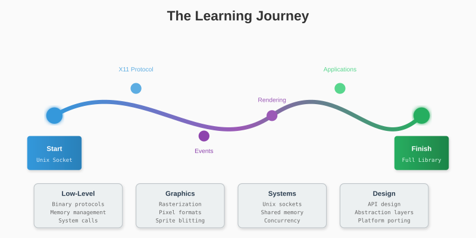
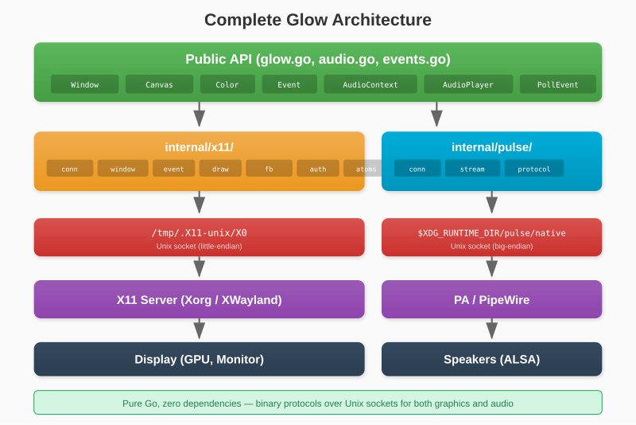

# Chapter 22: What's Next

You've built a graphics library from scratch. Let's reflect on what you've learned and explore paths forward.



## 22.1 What You've Built



Starting from nothing but Go and a Unix socket, you created:

- **X11 Connection**: Handshake, authentication, protocol handling
- **Window Management**: Creation, properties, events
- **Input System**: Keyboard and mouse with non-blocking polling
- **Software Renderer**: Framebuffer with drawing primitives
- **Audio System**: PulseAudio native protocol for sound playback
- **Public API**: Clean, SDL-like interface
- **Applications**: Pong, Paint, Particles

This isn't just a toy. It's a working graphics library suitable for 2D games and applications.

## 22.2 Skills Acquired

### Low-Level Programming
- Binary protocol parsing
- Direct memory manipulation
- System call interfaces
- Resource management

### Graphics Programming
- Rasterization algorithms (Bresenham, midpoint circle)
- Pixel formats and color spaces
- Double buffering and v-sync concepts
- Sprite animation and blitting

### Systems Programming
- Unix sockets and IPC
- Shared memory (MIT-SHM)
- Goroutines for concurrent I/O
- Platform abstraction

### Software Design
- API design for usability
- Separation of public and internal packages
- Graceful degradation (SHM fallback)

## 22.3 Possible Extensions

### Audio

Already built into Glow via the PulseAudio native protocol (see Chapter 21). Pure Go, zero dependencies:

```go
ctx, _ := glow.NewAudioContext(44100, 1, 2)
player := ctx.NewPlayer(bytes.NewReader(pcmData))
player.Play() // fire-and-forget
```

### Gamepad Support

Linux's joystick API (`/dev/input/js*`):

```go
type Gamepad struct {
    Axes    [8]int16
    Buttons [16]bool
}

func OpenGamepad(index int) (*Gamepad, error)
func (g *Gamepad) Poll() error
```

### Networking

For multiplayer games:

```go
type NetworkPeer interface {
    Send(data []byte) error
    Receive() ([]byte, error)
    Close()
}
```

### Physics Engine

Simple 2D physics:

```go
type Body struct {
    Position Vec2
    Velocity Vec2
    Mass     float64
}

type World struct {
    Bodies  []*Body
    Gravity Vec2
}

func (w *World) Step(dt float64)
```

### Tile Maps

For level-based games:

```go
type TileMap struct {
    Tiles     [][]int
    TileSize  int
    TileSheet *SpriteSheet
}

func (tm *TileMap) Draw(canvas *Canvas, scrollX, scrollY int)
func (tm *TileMap) GetTile(worldX, worldY int) int
func (tm *TileMap) IsSolid(x, y int) bool
```

### Scene Graph

For complex UIs and game objects:

```go
type Node interface {
    Update(dt float64)
    Draw(canvas *Canvas)
    AddChild(child Node)
    RemoveChild(child Node)
}
```

## 22.4 Performance Path

If you need more performance:

### 1. OpenGL/Vulkan

Hardware-accelerated rendering:

```go
// Use GLX to create OpenGL context on X11
gl.Clear(gl.COLOR_BUFFER_BIT)
gl.DrawArrays(gl.TRIANGLES, 0, 3)
glx.SwapBuffers(display, window)
```

### 2. GPU Compute

For particle systems and image processing:

```go
// CUDA or OpenCL for parallel computation
kernel.SetArg(0, particleBuffer)
kernel.SetArg(1, float32(dt))
queue.EnqueueNDRangeKernel(kernel, nil, globalSize, localSize)
```

### 3. SIMD

CPU vector instructions for bulk operations:

```go
// Use Go's experimental SIMD or assembly
// Process 4 or 8 pixels at once
```

## 22.5 Learning Resources

### X11 Protocol
- X Window System Protocol (X.Org Foundation)
- Xlib Programming Manual (O'Reilly)
- XCB tutorial (freedesktop.org)

### Graphics Programming
- "Computer Graphics: Principles and Practice" (Foley et al.)
- "Real-Time Rendering" (Akenine-Möller et al.)
- "Game Programming Patterns" (Robert Nystrom)

### Go
- "The Go Programming Language" (Donovan & Kernighan)
- Effective Go (golang.org)
- Go by Example (gobyexample.com)

## 22.6 Similar Projects

Study these for inspiration:

- **SDL2** (C): The gold standard for cross-platform multimedia
- **raylib** (C): Simple, elegant game library
- **SFML** (C++): Feature-rich multimedia library
- **Ebiten** (Go): Production-ready 2D game engine
- **Pixel** (Go): 2D game library for Go

## 22.7 Community and Contribution

### Open Source Your Work

Share your library on GitHub:
- Clear documentation
- Working examples
- Contribution guidelines
- Permissive license (MIT/BSD)

### Learn from Feedback

Real users find real bugs. Embrace issues and PRs.

### Write About It

Blog posts, tutorials, and talks spread knowledge and attract contributors.

## 22.8 Final Thoughts

You started this journey asking "How do pixels get to the screen?" Now you know.

The path from socket bytes to visible graphics involves:
1. Protocol negotiation
2. Resource creation
3. Event handling
4. Pixel manipulation
5. Memory transfer

Each layer has elegance and quirks. Understanding them makes you a better programmer, regardless of what you build next.

Whether you continue developing this library, switch to a production engine, or explore GPU programming, you now have the foundation to understand what's happening beneath the abstractions.

Build something cool.

---

**The End**

Thank you for reading. Now go make something.
